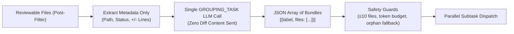

# Open Code Review — Architecture & Mechanics (Leaf)

> **Status:** research-phase deep leaf.  
> **Parent document:** [open-code-review.md](../open-code-review.md).  
> **Source:** Alibaba Group (`alibaba/open-code-review` via GitHub & AACR-Bench).

This document captures the implementation mechanics, algorithms, and schemas of Alibaba's Open Code Review (OCR) system. Use this reference when adapting its mechanics into `.agents/` rules, reviewer lenses, and prompt templates.

---

## 1. The Six-Gate File Selection Algorithm

OCR executes a 6-gate deterministic filter in `internal/agent/selection.go` before any LLM call is scheduled. Diffs that fail any gate are rejected immediately with a structured reason:

| Gate | Name | Mechanism | Override Rule |
|---|---|---|---|
| **Gate 1** | `binary` | Sniffs content for null bytes or git binary diff flags | Hard drop; never reviewable |
| **Gate 2** | `secret_exclude` | Matches against `default_secret_patterns.json` (`.env.*`, `*.pem`, `*.key`, `auth.json`, `credentials.json`, etc.) | Hard drop; cannot be overridden by `include` rules |
| **Gate 3** | `user_exclude` | Matches repo or user-configured glob patterns | User-configured exclusions take precedence over includes |
| **Gate 4** | `user_include` | Matches repo or user-configured glob patterns | **Bypasses Gates 5 & 6**; file is kept immediately |
| **Gate 5** | `unsupported_ext` | Checks against `supported_file_types.json` extension allowlist | Excluded if extension is missing |
| **Gate 6** | `default_path` | Matches built-in test paths (`**/*_test.go`, `**/*.test.{ts,tsx,js}`, `**/__tests__/**`) | Excluded by default unless saved by Gate 4 (`user_include`) |

### Post-Gate Ceilings

After surviving all six gates, two deterministic checks occur:
- **`deleted`**: If the target path is `/dev/null` (file deletion), it is skipped as there is no new code to inspect.
- **`too_large`**: If a single file diff exceeds **80% of `max_tokens`**, it is dropped to avoid context truncation.
- **`provider_directory`**: Monolithic noisy folders (`vendor/`, `node_modules/`, `target/`) are dropped before git diff generation.

---

## 2. Semantic File Grouping Algorithm

Rather than reviewing files in complete isolation (missing cross-file interactions) or dumping an entire pull request into a single prompt (diluting attention), OCR uses a lightweight semantic clustering step in `grouping.go`.



### Protocol & Guards

- **Diff-Free Input**: The grouping call receives only file paths, change status (`ADDED`, `MODIFIED`, `DELETED`, `RENAMED`), and line delta counts. Diff content is never passed during grouping, costing negligible tokens.
- **Max Files Guard**: Groups exceeding `maxFilesPerGroup = 10` are automatically split into sub-chunks.
- **Token Budget Guard**: If the combined diff size of a group exceeds the prompt limit, it splits back into single-file groups.
- **Orphan Guard**: Any file omitted by the model in the grouping response automatically receives its own single-file group.
- **Degraded Fallback**: If the grouping LLM call fails, times out, or emits invalid JSON, the orchestrator logs a warning and gracefully falls back to one-file-per-group dispatch.

---

## 3. Threshold-Gated Multi-Phase Execution

Each group subtask is processed across up to two phases. Planning is strictly threshold-gated:

```go
// OCR Planning Gate Heuristic
if maxFileChanged >= PlanModeLineThreshold { 
    // PlanModeLineThreshold = 50 (catches a single large rewrite)
    runPlanPhase() 
} else if fileCount >= 2 && totalChangedLines >= PlanModeGroupLineThreshold { 
    // PlanModeGroupLineThreshold = 100 (catches multi-file cumulative complexity)
    runPlanPhase() 
} else {
    runMainTaskDirectly()
}
```

### Phase 1: Read-Only Planning
- **Tool Invariant**: Active tool-calling is disabled. The model cannot mutate state or invoke tools.
- **Tool Awareness**: Read-only tools (`code_search`, `file_read_diff`, `file_find`) are embedded as plain-text descriptions so the planner knows what information can be fetched in Phase 2.
- **Output**: A prioritized checklist and risk hypothesis, injected directly into Phase 2 as `{{plan_guidance}}`.

### Phase 2: Main Review Loop
- Full tool access enabled: `code_comment`, `file_read`, `file_read_diff`, `file_find`, `code_search`, `task_done`.
- Bounded loop: terminates on `task_done`, `MAX_TOOL_REQUEST_TIMES` (default 100), 3 consecutive empty tool rounds, or unrecoverable context exhaustion.

---

## 4. Snippet-Anchored Line Resolution

Asking language models for raw line numbers yields frequent off-by-one errors and hallucinated line offsets. OCR replaces line-number prompting with **snippet anchoring**.

### `code_comment` Input Schema

```json
{
  "name": "code_comment",
  "input": {
    "path": "src/services/payment.ts",
    "comments": [
      {
        "content": "Transaction is committed without checking rollback errors on failure path.",
        "existing_code": "tx = db.begin()\nerr := tx.process()\nreturn err",
        "suggestion_code": "tx = db.begin()\nif err := tx.process(); err != nil {\n    tx.rollback()\n    return err\n}",
        "thinking": "Model reasoning trace explaining the root defect"
      }
    ]
  }
}
```

### Dynamic Sliding Window Matching

To calculate precise new-file line ranges, the deterministic pipeline processes `existing_code` through a cascade:

1. **Hunk New-Side Search**: Evaluates consecutive context + added (`+`) lines. If found, outputs new-file line coordinates.
2. **Hunk Old-Side Search**: Evaluates consecutive context + deleted (`-`) lines. If found, outputs old-file line coordinates.
3. **Full File Content Scan**: Scans the post-change file snapshot line by line (`resolveFromFileContent`).
4. **Re-Location Fallback**: If matching fails on complex reformatted code, prompts a dedicated `RE_LOCATION_TASK` micro-call to find the snippet.
5. **Zero-Line Fallback**: If text matching cannot resolve the anchor, emits the comment with `start_line: 0` so findings are never lost.

> **Normalization Rule**: Matching is whitespace-insensitive and strips diff markers (`+`, `-`), preventing formatting quirks from breaking line calculations.

---

## 5. Anti-Context-Bleed Invariant

When reviewing diffs, agents require auxiliary context (imports, type definitions, callers). However, unconstrained review agents frequently complain about legacy issues in those context files, generating noisy pull-request comments.

OCR enforces this invariant structurally:

> **Invariant:** Tools like `file_read`, `file_read_diff`, `file_find`, and `code_search` exist solely to clarify the diff under review. Findings spotted in external files are strictly ignored. A review comment MUST anchor to code modified in the active changeset.

---

## 6. Hierarchical Rule Resolution

OCR avoids generic "review everything" instructions by mapping specific file glob patterns to specialized rule sheets:

```
Priority 1: CLI override (--rule)
Priority 2: Repo config (<repo>/.opencodereview/rule.json)
Priority 3: Global config (~/.opencodereview/rule.json)
Priority 4: Embedded system defaults (system_rules.json)
```

### System Rule Mapping Samples

| Glob Pattern | Target Rule Sheet | Focus Areas |
|---|---|---|
| `**/*.go` | `go.md` | Goroutine leaks, unhandled error returns, nil pointer dereferences, mutex locking |
| `**/*.java` | `java.md` | NPE checks, Spring transactional boundaries, stream resource leaks, thread safety |
| `**/*{mapper,dao}*.xml` | `mapper_dao_xml.md` | Dynamic SQL injection, parameter binding, tag termination |
| `.github/workflows/**/*.{yaml,yml}` | `github_workflows.md` | Untrusted `github.event` in bash, action SHA pinning, permission minimality |
| `**/package.json` | `package_json.md` | Strict version pinning, known vulnerable dependencies, scripts injection |
| `*` (fallback) | `default.md` | Boundary conditions, exception safety, SQL/XSS vulnerabilities, resource cleanup |

---

## 7. Three-Zone Context Compression (`llmloop`)

In extended review sessions with multiple tool calls, conversation buffers risk exceeding context limits. OCR uses three-zone partitioning in `internal/llmloop/compression.go`:

1. **System Zone**: Pinned invariant system prompt, tools schema, and resolved file rules. Never compressed or truncated.
2. **History Zone**: Prior tool calls and outputs. Compressed asynchronously into structured summaries (files inspected, hypotheses confirmed/rejected) when threshold warnings fire.
3. **Active Zone**: Current turn messages and pending tool calls. Preserved verbatim with full fidelity.
