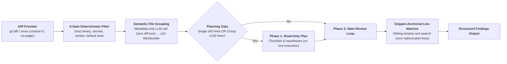

# Open Code Review — Research Map & Backlog

> **Status:** research-phase (not battle-tested).  
> **Source:** Alibaba Group (`alibaba/open-code-review`, AACR-Bench dataset).  
> **Audience:** skill authors, reviewers, maintainers of `.agents/` workflows.  
> **Language:** English-first (agent-searchable wiki).

Analysis of Alibaba's Open Code Review (OCR) architecture, its production benchmarks, and a prioritized backlog for porting its core innovations into our `.agents/` harness under **Option A (Pure In-Harness)**.

| Attribute | Detail |
|---|---|
| **Origin** | Internal AI review engine serving tens of thousands of Alibaba engineers over 2+ years |
| **Benchmark** | AACR-Bench: 50 repos, 200 real PRs, 10 languages, 80+ senior reviewers, 1,505 ground-truth issues |
| **Key Result** | Higher precision & F1 than general-purpose agents using **~1/9th of the tokens** |
| **Primary Trade-off** | **Precision over Recall**: Deliberately minimizes noise and false positives to prevent review fatigue |

Deep architectural mechanics (6-gate filter, sliding window matcher, memory zones): [details/architecture-and-mechanics.md](./details/architecture-and-mechanics.md).

---

## High-Level Architecture

OCR separates deterministic engineering from LLM semantic reasoning:

---

## Coverage Matrix vs. Our `.agents/` Setup

Legend: **Strong** = first-class rule/skill · **Partial** = present but unlabeled or informal · **Gap** = missing or unhandled.

| OCR Concept | What It Solves | Current Repo State | Coverage | In-Harness Action |
|---|---|---|---|---|
| **Anti-Context-Bleed Invariant** | Prevents agents from complaining about legacy/untouched code read during context inspection | `reviewer` lenses inspect context freely; no explicit boundary constraint | **Gap** | Add hard stop to `reviewer/SKILL.md` forbidding comments on unchanged files. |
| **Snippet-Anchored Line Resolution** | Eliminates LLM line-number hallucinations and offset drift across diffs | Reviewers output estimated line numbers or full files | **Gap** | Mandate verbatim `existing_code` snippet quotes + deterministic context matching. |
| **Threshold-Gated Review Planning** | Skips redundant planning for small diffs; enforces read-only checklist for large changes | `grooming.md` handles planning, but lacks change-size line thresholds for reviews | **Partial** | Introduce 50-line file / 100-line group heuristic in `/review` orchestrator. |
| **Semantic Bundle Grouping** | Prevents PR-wide context dilution without losing cross-file contract awareness | Reviews run either monolithically on git diff or per-file ad-hoc | **Gap** | Pre-cluster changed files using metadata (paths + status + +/- stats) before review. |
| **Glob-Targeted Micro-Rulesets** | Replaces generic "find bugs" prompts with file-specific defect checklists | `reviewer` has cross-cutting sub-lenses (`security`, `design-rigor`), but lacks file-glob routing | **Partial** | Create file-pattern rule matrix (Go, Java, XML, CI workflows, package files). |
| **Deterministic Pre-Filtering** | Drops secrets, binaries, generated code, and test noise before spending tokens | `git-safety.md` forbids staging secrets; no dedicated diff pre-filter for reviews | **Partial** | Wire secret-pattern and vendor exclusion into the `/review` command preflight. |
| **Evaluator Separation** | Reviewer acts as independent judge rather than patch generator | `rules/self-grounded-verification.md` & `reviewer` Gate 1 author bias | **Strong** | Maintain existing two-step verification and author-bias delegation gates. |

---

## The 6 Concepts to Steal (Operational Summary)

### 1. The Anti-Context-Bleed Invariant
When an agent uses tools like `grep_search` or `view_file` to trace callers, it frequently spots legacy smells in untouched files and reports them. In a pull request, this creates noise and angers authors. **Rule**: Context tools are read-only sensors. All review findings must be grounded in lines modified within the active diff.

### 2. Snippet-Anchored Review Findings
Prompting an LLM for `start_line` and `end_line` produces frequent off-by-one errors. Instead, the review output contract requires:
- `existing_code`: verbatim snippet from the diff.
- `suggestion_code`: concrete replacement snippet.
- `content`: explanation of the defect.
Line numbers are resolved by matching the snippet against the diff hunk.

### 3. Metadata-Only Semantic Bundling
Never feed an entire 30-file pull request into a single review prompt. Extract only the metadata (`path`, `status`, `+lines/-lines`) and run a single fast clustering pass to create semantic groups of &le; 10 files (e.g. `service + repository + dto`). Each bundle is reviewed independently.

### 4. Threshold-Gated Planning (50/100 Rule)
Trivial changes (a 5-line bug fix) do not need an elaborate review plan. Gate the planning phase:
- Single file changed lines &ge; 50 &rarr; trigger read-only checklist plan.
- Multi-file group changed lines &ge; 100 &rarr; trigger read-only checklist plan.
- Otherwise &rarr; jump straight to direct review.

### 5. Glob-Targeted Micro-Rulesets
Generic review prompts miss domain-specific failure modes. Wire file globs to focused checklist rules:
- `**/*.go` &rarr; Goroutine leaks, unhandled errors, nil pointers.
- `.github/workflows/**` &rarr; Script injection via `github.event`, unpinned actions.
- `**/*mapper*.xml` &rarr; Dynamic SQL parameter concatenation.

### 6. Three-Zone Context Compaction
For deep reviews, partition the conversation into:
1. *System Zone* (pinned rules and schemas; never pruned).
2. *History Zone* (past tool results; aggressively summarized into key facts).
3. *Active Zone* (current turn; full fidelity).

---

## Prioritized In-Harness Backlog (Option A)

Tasks to implement in `.agents/` without external CLI dependencies:

1. **Backlog Item 1 — Invariant & Contract Patch** ([`skills/reviewer/SKILL.md`](../../skills/reviewer/SKILL.md)):
   - Add **Gate 4 (Anti-Context-Bleed)**: Prohibit reporting findings outside the diff.
   - Update the findings schema to require verbatim `existing_code` anchors.
2. **Backlog Item 2 — Review Command Orchestration** ([`commands/review.prompt.md`](../../commands/review.prompt.md)):
   - Implement metadata-only file grouping before dispatching lenses.
   - Apply the 50/100 changed-line threshold before running deep multi-perspective passes.
3. **Backlog Item 3 — Glob-Targeted Review Rules** ([`skills/reviewer/references/`](../../skills/reviewer/references/)):
   - Add a file-pattern checklist table linking specific file globs (CI workflows, lockfiles, backend handlers) to concrete defect patterns.
