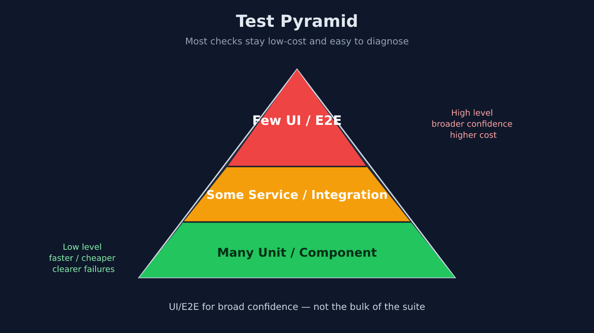
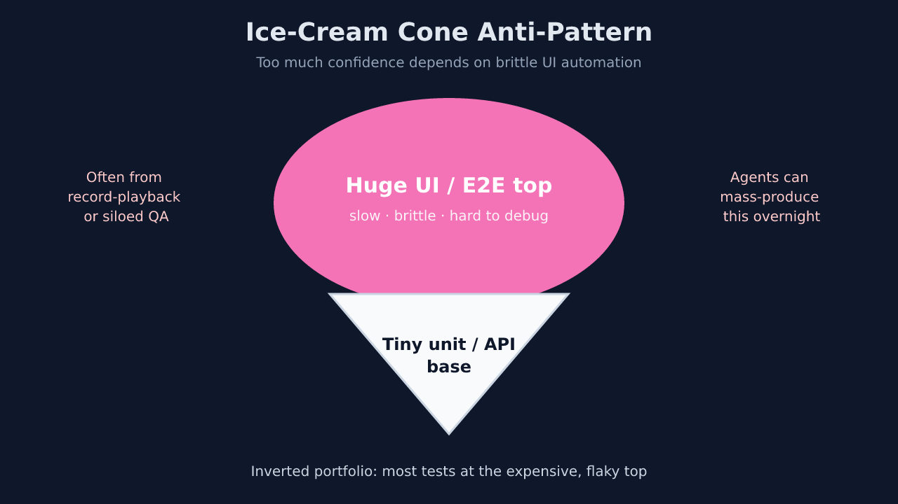
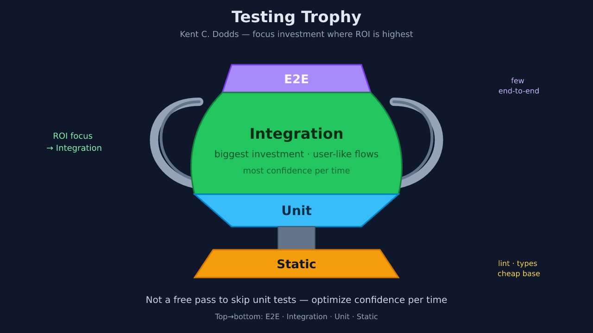
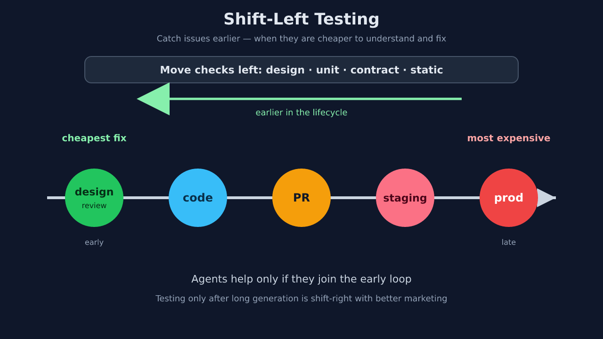
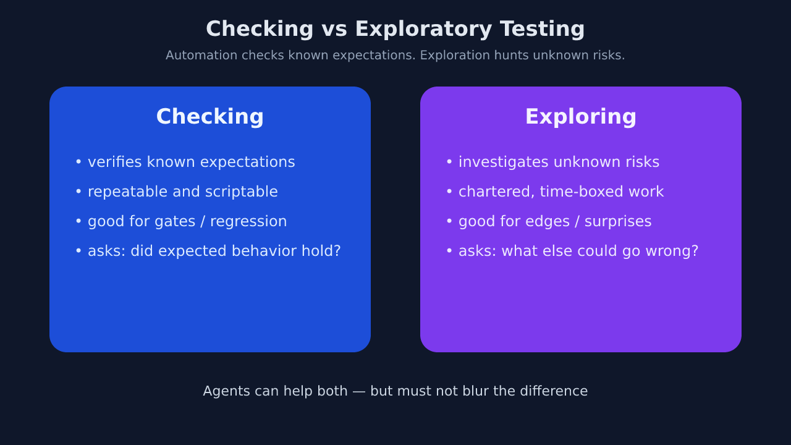
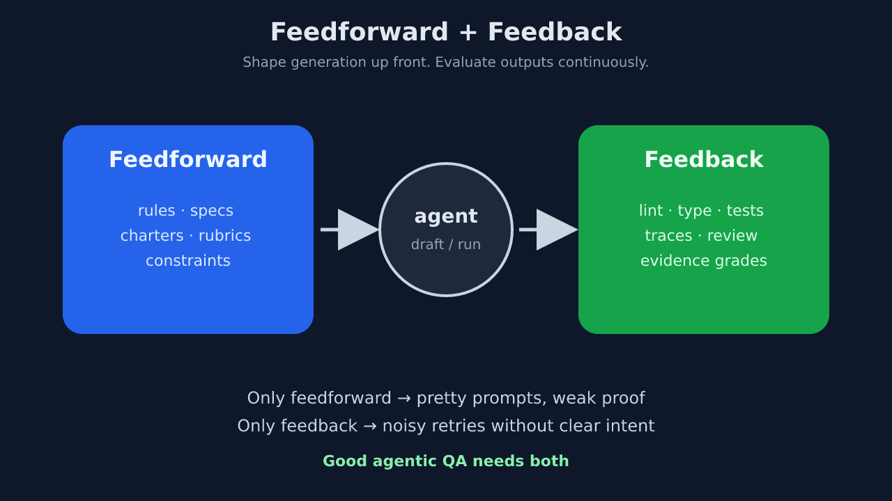
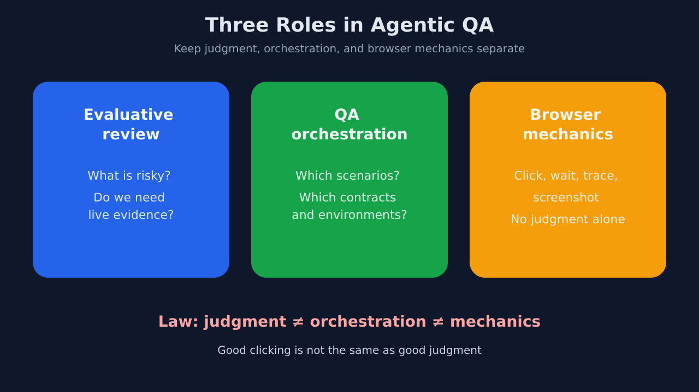
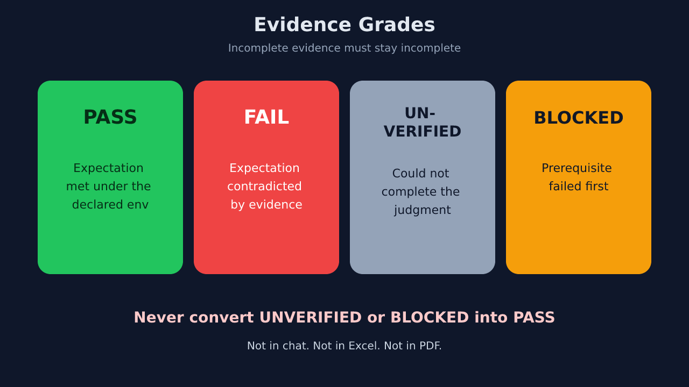
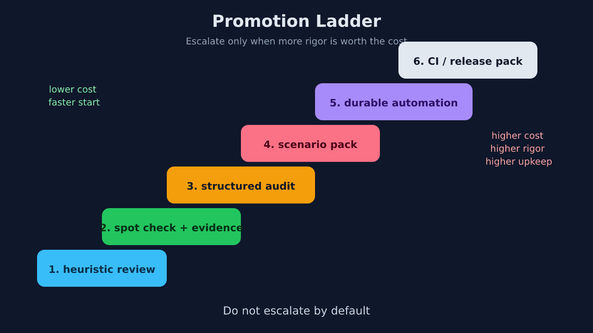

# Agentic QA / QC
## Part 3 — Foundation First, Skills Second

**Follow-up to Parts 1 & 2**

---

# What this talk is trying to fix

Many agentic QA decks jump from:

- “AI can test now”
- straight to tool demos
- then to a big conclusion

**This version adds the missing bridge:**
- brief intros to classical QA ideas
- visuals for the mental model
- reference links for later reading

---

# Recap

| Part | Landed |
|---|---|
| **1** | AI as junior; rules & skills; quality gates |
| **2** | Quality *layers*; tool fit; Sonar as governance |

**This part answers:**

> If agents can also test, audit, and report — how do we keep QA honest?

---

# Goals

- Ground agentic QA in **pre-agentic automation practice**
- Explain external concepts in **plain language first**
- Show what is **actually new** in the agent era
- Install a **mental model**: roles, evidence, promotion
- Treat skill packs as **draft implementations**, not gospel

---

# Why agents make QA more important

Agents:

- generate change faster
- sound confident when wrong
- can drive browsers and produce polished screenshots

Without a model, teams get **agent theater**:
- nice demos
- weak contracts
- inflated confidence

---

# Before “agentic QA”

QA automation already had decades of lessons.

It existed to:
- shorten feedback loops
- preserve regression memory
- make refactors safer
- push defect detection earlier

**Agents do not reset this history.**
They inherit it.

---

# What is a test pyramid?

A classic portfolio idea:

- **many** low-level tests
- **some** service/integration tests
- **few** UI/E2E tests

Why?
Because lower-level checks are usually:
- faster
- cheaper
- less flaky
- easier to diagnose

---

<!-- _class: illustration -->
# Test pyramid — illustration

---

# Test pyramid: quick reading

**Why it matters:**
A high-level failure should usually teach you what lower-level test was missing.

**Good first references:**
- Fowler: https://martinfowler.com/bliki/TestPyramid.html
- Ham Vocke: https://martinfowler.com/articles/practical-test-pyramid.html

**Takeaway:**
Use UI/E2E for broad confidence, not as the main bulk of the suite.

---

# What is the ice-cream cone?

The **anti-pattern** version of the pyramid:

- too many GUI / E2E tests
- too few unit / API checks

This often happens when teams:
- overuse record-playback tools
- keep automation far from development
- test behavior only through the browser

---

<!-- _class: illustration -->
# Ice-cream cone — illustration

---

# Why the ice-cream cone hurts

If most confidence depends on GUI automation, the suite becomes:

- slow
- brittle
- hard to debug
- expensive to maintain

**Agent danger:**
Agents can mass-produce this anti-pattern very quickly by generating endless E2E scripts.

---

# What is the testing trophy?

A frontend-oriented reminder from Kent C. Dodds:

- static analysis matters a lot
- integration tests that resemble real use often pay off well
- not everything should be over-isolated into tiny tests

It is **not** “ignore unit tests.”
It is about **confidence per time spent**.

---

<!-- _class: illustration -->
# Testing trophy — illustration

---

# Testing trophy: quick reading

**Useful references:**
- Testing Trophy: https://kentcdodds.com/blog/the-testing-trophy-and-testing-classifications
- “Resemble the way your software is used”: https://kentcdodds.com/blog/write-tests

**Shared truth across pyramid / trophy / honeycomb:**
> Optimize for reliable confidence, not coverage theater.

---

# What is shift-left?

**Shift-left** means catching problems earlier:

- during design
- during coding
- in PR checks
- before late-stage UAT or release testing

Earlier detection is usually cheaper and clearer.
Agents help only if they join this earlier loop — not if they test only at the end.

---

<!-- _class: illustration -->
# Shift-left — illustration

---

# Shift-left: quick reading

**Useful references:**
- Continuous Delivery foundation: https://continuousdelivery.com/
- Martin Fowler on continuous integration basics: https://martinfowler.com/articles/continuousIntegration.html

**Local translation for teams:**
If an agent spends 40 minutes generating code and only “tests” at the end, that is not shift-left. It is shift-right with better marketing.

---

# Checking vs exploratory testing

A crucial distinction:

- **checking** = verify known expectations
- **exploring** = investigate unknown risks

Automation is strong at checking.
Exploration stays essential because real systems still surprise us.

---

<!-- _class: illustration -->
# Checking vs exploratory — illustration

---

# Why exploratory testing still matters

Even mature teams keep chartered, time-boxed exploration because scripts cannot invent every odd path.

**This is where agents can genuinely help:**
- expand a test charter
- vary data and flows
- capture traces faster
- summarize observations

But they still need a human-owned mission and rubric.

---

# Pre-agentic rules that still bind agents

| Rule | Still true? |
|---|---|
| Test behavior, not implementation details | Yes |
| Prefer stable, user-facing queries | Yes |
| Require deterministic env + fixtures | Yes |
| Quarantine flakes | Yes |
| Separate checking from exploring | Yes |
| Trace testing to business risk | Yes |

**Agentic QA adds power, not immunity.**

---

# So what actually changed?

| Pre-agentic | Agentic addition |
|---|---|
| Humans write most tests | Agents can draft |
| CI scripts run fixed suites | Agents can run bounded audits |
| Exploration is mostly manual | Agents can expand charters |
| Feedback comes after code | Sensors can sit inside coding loop |

The foundation stays. The loop gets more dynamic.

---

# Feedforward + feedback

A useful modern framing:

- **feedforward** = shape generation upfront
- **feedback** = evaluate outputs continuously

For QA this means:
- charters, rules, rubrics, constraints
- plus lint, tests, traces, review, evidence grades

---

<!-- _class: illustration -->
# Feedforward + feedback — illustration

---

# Why this loop matters

Bad agentic QA usually overweights one side:

- **only feedforward** → pretty prompts, weak proof
- **only feedback** → noisy retries without clear intent

Good systems need both.

**Suggested external reading:**
- Thoughtworks Technology Radar home: https://www.thoughtworks.com/radar

---

# Mental model: three roles

When people say “AI can test,” they often merge three separate jobs.

1. **Evaluative review** — What is risky? Do we need live evidence?
2. **QA orchestration** — Which scenarios, contracts, and environments make the result defensible?
3. **Browser mechanics** — Click, wait, trace, screenshot.

---

<!-- _class: illustration -->
# Three roles — illustration

---

# Why separate the roles?

Because good clicking is not the same thing as good judgment.

A browser driver can:
- navigate pages
- capture screenshots
- retry interactions

It **cannot by itself** decide:
- which risk matters most
- what counts as a trustworthy pass
- what should become durable automation

---

# Mental model: evidence grades

If agentic QA has one non-negotiable rule, it is this:

- **pass** = expectation met
- **fail** = expectation contradicted
- **unverified** = judgment incomplete
- **blocked** = prerequisite failed first

---

<!-- _class: illustration -->
# Evidence grades — illustration

---

# Why evidence grades matter

Without grade discipline, teams start laundering results:

- “unverified” becomes “probably okay”
- “blocked” becomes “not a problem”
- stakeholder summaries drift away from machine truth

**Never map unverified or blocked to pass.**
Not in chat. Not in Excel. Not in PDF.

---

# Mental model: promotion ladder

Not every useful audit should become permanent automation.

Promote work only when the path is:
- important enough
- stable enough
- repeatable enough
- worth maintaining

---

<!-- _class: illustration -->
# Promotion ladder — illustration

---

# Read the ladder correctly

The ladder is:

1. heuristic review
2. spot check + evidence
3. structured browser audit
4. scenario pack
5. durable automation
6. CI / release pack

**Rule:** do not escalate by default.
Higher rigor also means higher upkeep.

---

# What agents are genuinely good at

- Expanding scenario variants from a clear charter
- Driving repetitive paths and collecting traces
- Drafting first-pass tests from unambiguous AC
- Summarizing failures with repro steps
- Running local gates in a RED → GREEN loop
- Producing audience-shaped narratives **after** projection gates

---

# What agents are bad at

- Owning release risk appetite
- Inventing business rules under ambiguity
- Guaranteeing non-flaky automation without env discipline
- Self-grading their own work without bias
- Replacing unit/API layers with more E2E
- Staying safe under broad permissions

---

# Do not trust skills blindly

A skill pack is:
- a workflow guess
- a materialization of ideas
- an operational experiment

It is **not** proof of maturity.

Judge reality instead:
- scenario quality
- evidence quality
- flake discipline
- safety boundaries
- ease of operation without heroics

---

# Local skills in this repo

Illustrative mapping only:

| Concept | Example slice |
|---|---|
| Evaluative review | `reviewer` + black-box lens |
| QA orchestration | `web-qa-audit` |
| Browser mechanics | browser automation skill |
| Stakeholder projection | reporting path in `web-qa-audit` |

**Useful experiments, not battle-tested industry standard.**

---

# Practical follow-up

This deck stays on the **mental model**.

The operational how-to now lives separately in:

- `.agents/docs/playbook/agentic-qa-browser-playbook.md`

Use that when the team is ready to run real browser audits.

---

# What the playbook covers

- MCP setup for browser control in Kilo
- How QA should work with the agent on browser-driving tasks
- How to write **auditable input files** with scenarios + rubrics
- How to turn browser evidence into the target report template
- How to reduce QA bottlenecks from the **dev side** too

---

# Key takeaways

1. **Foundation first** — pyramid, shift-left, flakes, exploratory split
2. **Agents change who drafts and runs; not the cost curve**
3. **Separate judgment, orchestration, and mechanics**
4. **Evidence grades are non-negotiable**
5. **Materialize selectively**
6. **Operational playbooks should be separate from theory decks**

---

<!-- _class: lead -->

# Questions?

**Operational next step:**
Read `.agents/docs/playbook/agentic-qa-browser-playbook.md` and pilot it on the next 3–5 risky PRs.

**Deep reading remains here:**
- `.agents/docs/agentic-qa/INDEX.md`
- `.agents/docs/agentic-qa/pre-agentic-foundation.md`
- `.agents/docs/agentic-qa/agentic-practices.md`
- `.agents/docs/agentic-qa/trust-and-evidence.md`
