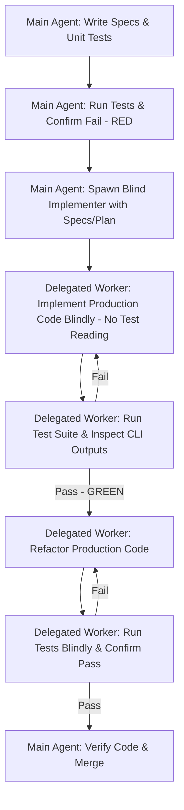

# Rule: Test-Driven Development (TDD) Enforcement & Context Isolation

This rule applies to **all non-trivial logic implementations, service additions, validators, and refactoring tasks**. It enforces a strict Red-Green-Refactor loop paired with **Clean-Room Context Isolation** to ensure code correctness, modularity, and high design quality.

---

## 🧪 Why Test-Driven Development & Context Isolation?

*   **Eliminates Implementation Bias**: When the same agent writes both the test and the code, it naturally tends to write code that satisfies only the test cases it imagined, often missing edge cases or hardcoding shortcuts (cheating the tests).
*   **Forces Clear Contracts**: Separation of concerns forces the test-writing agent to define robust, unambiguous interfaces and requirements first, as the implementer cannot ask questions or peek at test details.
*   **Prevents Code Swelling**: Ensures implementation is minimal, focused, and verified step-by-step.

---

## 🚪 The Clean-Room TDD Protocol (Separation of Roles)

To eliminate bias, TDD must be executed by two distinct contexts:

### 1. The Test Writer (Main Agent)
*   **Role**: Define the requirements, interface signatures, and write the test cases.
*   **Actions**:
    1. Define interface specifications (signatures, type definitions, structs, API contracts).
    2. Write the unit test file (e.g., `src/auth/jwt.test.ts` or `tests/test_auth.py`). Cover happy paths, boundary conditions, and failure states.
    3. Run the test command and verify it fails (confirming the **RED** state).
    4. **DO NOT write any production implementation code.**
    5. Delegate the implementation to a fresh **implementation worker/agent** (using an isolated delegated context when available) or instruct the user to start a new session for implementation.

### 2. The Blind Implementer (Delegated Worker or New Session)
*   **Role**: Implement the production code blindly to satisfy requirements until the tests pass.
*   **Constraints**:
    *   **NO reading of the test files**: The implementer must never open, view, or read the unit test files. They must write the code based *only* on the interface specs, requirements, and plan provided in the delegation package.
    *   **Blind Execution**: The implementer runs the test command blindly (e.g., `npm test -- src/auth/jwt.test.ts`).
    *   **Diagnostic Loop**: If tests fail, the implementer must diagnose issues using only the test runner's failure output (error messages, assertion diffs, stack traces), *never* by looking at the test file.
    *   **Green & Refactor**: Write minimal code to pass the tests (**GREEN**), then refactor for quality (**REFACTOR**), re-running tests blindly to ensure no regressions.
    *   **Deadlock Escalation**: If the implementation fully aligns with requirements and specs, but the tests repeatedly fail, the delegated implementer must halt and report a suspected buggy test/spec mismatch in their final report (Section 3) instead of looping indefinitely.

---

## 🔁 The Red-Green-Refactor Protocol Steps



### Phase 1: Define Interface & Write Test (RED) - *Main Agent*
*   Create the interface definitions (signatures, enums, interfaces, type stubs).
*   Write the unit test file. Specify multiple test cases covering happy path, boundary conditions, and error states.
*   Run the test command. **Confirm the tests fail** (or fail to run due to missing implementation).

### Phase 2: Write Minimum Implementation (GREEN) - *Delegated Worker*
*   Write the *minimum* amount of code required to make the test cases pass, without knowing the test code's implementation details.
*   Do not add speculative features. Keep it simple (KISS).
*   Run the test command blindly and **confirm all tests pass**.

### Phase 3: Clean up & Refactor (REFACTOR) - *Delegated Worker*
*   Clean up variable names, nesting, and structure to comply with `rules/code-quality.md`.
*   Rerun the tests blindly to verify that no refactoring introduced regressions.

---

## 📋 Clean-Room TDD Delegation Template

When delegating implementation to an isolated worker/agent, the Main Agent **must** use this prompt template to enforce context isolation and align with the standard 5-section delegated-output template:

```markdown
You are acting as a Clean-Room TDD Implementation Agent.

## Objective
Implement the production code for [Module/Feature Name] to satisfy the requirements and pass the unit tests blindly.

## Interface & Specification
- Target File to Create/Modify: [e.g., src/auth/jwt.ts]
- Signature / Type Contract:
  ```<language>
  [Paste signatures, contracts, type definitions here]
  ```
- Functional Requirements:
  1. [Requirement 1]
  2. [Requirement 2]
  3. [Requirement 3]

## Allowed Actions
- READ: [List requirements docs, source files, config files - EXCLUDING the unit test files and test helper files, e.g., src/auth/jwt.test.ts]
- WRITE: [The specific target file, e.g., src/auth/jwt.ts]
- RUN: [The specific test execution command, e.g., npm test -- src/auth/jwt.test.ts]
- **CRITICAL CONSTRAINT**: Do NOT read, view, or open the test file ([e.g. src/auth/jwt.test.ts]). You must run the tests blindly and use only the test runner's stdout/stderr output to resolve failures.

## Output Format
Return your findings in exactly this format:

### 1. Objective Recap
One sentence restating the interface/file you implemented.

### 2. Findings
#### Changes Made
File-by-file list of what was changed and why.

#### Verification Proof
Output of the test runner command showing all tests passing.

### 3. Obstacles Encountered
List any: setup issues · workarounds used · commands that needed special flags
· dependencies or imports that caused problems · environment quirks.
*Note: If you suspect a buggy test or spec mismatch prevents tests from passing despite correct implementation, explain the details here and stop.*
Write NONE if the task was clean.

### 4. Confidence & Caveats
Rate your confidence (High / Medium / Low) and list any assumptions made.

### 5. Done Signal
Write exactly: TASK_COMPLETE
```

---

## ⚡ Execution Gates & Exceptions

*   **Strict Gate**: Any new logical component (parsers, validators, mathematical algorithms, data processing units, state managers) **MUST** use this protocol.
*   **Verification Gate**:
    *   **Logic Review**: The Main Agent must review the delegated implementation to ensure no hardcoded test values (e.g. constant returns matching specific test assertions) are present, validating that the code implements general logic.
    *   **Transcript Audit**: To verify compliance with the context-isolation protocol, the Main Agent **MUST** inspect whatever conversation or execution logs the environment provides for the delegated worker. Scan the log to verify that the worker did not run file viewing, reading, or search commands targeting unit test files.
*   **Exceptions**: You may bypass TDD and Context Isolation only for:
    *   Pure CSS / design changes.
    *   Static configuration or JSON file edits.
    *   Pure markdown documentation tasks.
    *   Simple typos or rename-only operations.
