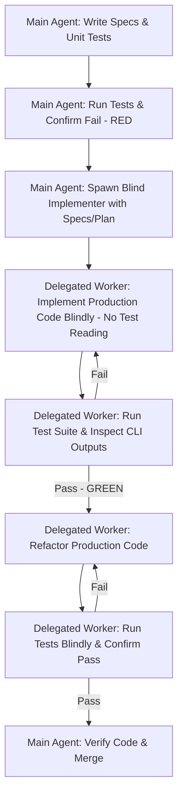

# Rule: Test-Driven Development (TDD) Enforcement & Context Isolation

This rule governs verification for logic implementations, service additions, validators, and refactoring. Select evidence by behavior, consequence of failure, and expected maintenance value—not the number of functions or a blanket coverage target. TDD is a verification technique, not permission to persist its scaffolding.

## Test Selection and Persistence

- **Default maintained tests:** End-to-end behavior tests protecting meaningful user-visible outcomes, and important unit tests protecting critical logic. Both must detect a concrete consequential regression and justify ongoing review and maintenance cost. A test framework or filename does not establish value.
- **Critical units:** Examples include authorization decisions, financial calculations, data-integrity invariants, and consequential state transitions. State the failure being protected against; do not label every parser, validator, adapter, or helper critical merely because it contains logic.
- **Other tests:** Leaf-unit tests, exploratory assertions, one-off harnesses, and agent-authored check scripts require explicit approval to become maintained repository artifacts. Retain fixtures/helpers only when necessary for a permitted maintained test, not as standalone scaffolding. Approval to implement, run verification, or commit is not blanket approval to retain extra tests. An explicitly requested maintained suite may authorize its agreed scope; approval under time pressure does not authorize future suites.
- **Temporary verification:** Keep internal checks in an approved temporary directory outside the repository. Use existing checks, sample inputs, or direct execution when sufficient. Clean up agent-created scratch files and outputs before handoff; never make the user discover and remove them. Report useful execution evidence without retaining the harness.
- **Durable behavior, not implementation mirroring:** Prefer a small set of meaningful regression checks over exhaustive tests for short-lived helpers. Do not freeze private structure, over-mock the implementation, or generate tests merely to raise coverage or assertion counts.
- **Existing suites:** Run relevant established checks and honor agreed project gates. Do not delete or weaken existing tests, or bypass a gate, without authorization. If a gate requires additional maintained tests outside this boundary, surface the conflict and obtain approval rather than silently expanding the suite.

Choose the test's persistence category before writing it. If maintenance value or criticality is unclear, keep the check temporary or ask before retaining it. This boundary takes precedence over test-writing templates below and skill-specific minimum-suite instructions.

---

## ⚖️ Exemptions & Proportionality (Fast-Path)

For consequential behavior or critical logic, use Red-Green-Refactor when a failing check clarifies the contract. Clean-Room isolation is an available technique when independent implementation is warranted; it is not required for every new component. Its handoff must still follow delegation rules and the persistence boundary above.

**The formal TDD/isolation protocol is WAIVED for the following tasks; the persistence boundary still applies:**
- **Trajectory 3 (Fast-Path / Utility Scripting & Automation)**: single-file tools, shell/bash scripts, dotfiles configurations, CLI glue code, or self-contained scripts (<100 lines).
- **Prototyping & exploratory spikes**: when validating technical feasibility before committing to architecture.
- **Bounded bugfixes ($\le 2$ files)**: where direct execution verification with sample inputs or existing tests is immediate.

For these exempt tasks, use lightweight implementation and verification with sample inputs or existing checks; direct work or bounded execution by a worker may be appropriate. Do NOT impose blind implementer isolation, formal Red-Green loops, or artificial test suites on simple scripts. Fast-path removes unnecessary ceremony, not the option of a sound handoff.

---

## 🧪 Why Test-Driven Development & Context Isolation?

*   **Eliminates Implementation Bias**: When the same agent writes both the test and the code, it naturally tends to write code that satisfies only the test cases it imagined, often missing edge cases or hardcoding shortcuts (cheating the tests).
*   **Forces Clear Contracts**: Separation of concerns forces the test-writing agent to define robust, unambiguous interfaces and requirements first, as the implementer cannot ask questions or peek at test details.
*   **Prevents Code Swelling**: Ensures implementation is minimal, focused, and verified step-by-step.

---

## 🚪 The Clean-Room TDD Protocol (Separation of Roles)

When Clean-Room isolation is selected, separate the test writer and implementer contexts:

### 1. The Test Writer (Main Agent)
*   **Role**: Define the requirements, interface signatures, and write the test cases.
*   **Actions**:
    1. Define interface specifications (signatures, type definitions, structs, API contracts).
    2. Write the selected behavior or critical-unit checks at their authorized location. Other internal checks belong outside the repository. Cover relevant outcomes, boundaries, and failure states rather than every internal branch.
    3. Run the test command and verify it fails (confirming the **RED** state).
    4. **DO NOT write any production implementation code.**
    5. Delegate the implementation to a fresh **implementation worker/agent** (using an isolated delegated context when available) or instruct the user to start a new session for implementation.

### 2. The Blind Implementer (Delegated Worker or New Session)
*   **Role**: Implement the production code blindly to satisfy requirements until the tests pass.
*   **Constraints**:
    *   **NO reading of the test files**: The implementer must never open, view, or read the unit test files. They must write the code based *only* on the interface specs, requirements, and plan provided in the delegation package.
    *   **Blind Execution**: The implementer runs the test command blindly (e.g., `npm test -- src/auth/jwt.test.ts`).
    *   **Diagnostic Loop**: If tests fail, the implementer must diagnose issues using only the test runner's failure output (error messages, assertion diffs, stack traces), *never* by looking at the test file.
    *   **Green & Refactor**: Write minimal code to pass the tests (**GREEN**), then refactor for quality (**REFACTOR**), re-running tests blindly to ensure no regressions.
    *   **Deadlock Escalation**: If the implementation fully aligns with requirements and specs, but the tests repeatedly fail, the delegated implementer must halt and report a suspected buggy test/spec mismatch in their final report (Section 3) instead of looping indefinitely.

---

## 🔁 The Red-Green-Refactor Protocol Steps


```mermaid
graph TD
    A[Main Agent: Write Specs & Unit Tests] --> B[Main Agent: Run Tests & Confirm Fail - RED]
    B --> C[Main Agent: Spawn Blind Implementer with Specs/Plan]
    C --> D[Delegated Worker: Implement Production Code Blindly - No Test Reading]
    D --> E[Delegated Worker: Run Test Suite & Inspect CLI Outputs]
    E -->|Fail| D
    E -->|Pass - GREEN| F[Delegated Worker: Refactor Production Code]
    F --> G[Delegated Worker: Run Tests Blindly & Confirm Pass]
    G -->|Pass| H[Main Agent: Verify Code & Merge]
    G -->|Fail| F
```

### Phase 1: Define Interface & Write Test (RED) - *Main Agent*
*   Create the interface definitions (signatures, enums, interfaces, type stubs).
*   Write the selected checks at their authorized location. Protect meaningful outcomes and consequential boundary/failure cases; do not create permanent leaf-unit suites by default.
*   Run the test command. **Confirm the tests fail** (or fail to run due to missing implementation).

### Phase 2: Write Minimum Implementation (GREEN) - *Delegated Worker*
*   Write the *minimum* amount of code required to make the test cases pass, without knowing the test code's implementation details.
*   Do not add speculative features. Keep it simple (KISS).
*   Run the test command blindly and **confirm all tests pass**.

### Phase 3: Clean up & Refactor (REFACTOR) - *Delegated Worker*
*   Clean up variable names, nesting, and structure to comply with `rules/code-quality.md`.
*   Rerun the tests blindly to verify that no refactoring introduced regressions.

---

## 📋 Clean-Room TDD Delegation Template

When delegating implementation to an isolated worker/agent, the Main Agent **must** use this prompt template to enforce context isolation and align with the standard 5-section delegated-output template:

```markdown
You are acting as a Clean-Room TDD Implementation Agent.

## Objective
Implement the production code for [Module/Feature Name] to satisfy the requirements and pass the unit tests blindly.

## Interface & Specification
- Target File to Create/Modify: [e.g., src/auth/jwt.ts]
- Signature / Type Contract:
  ```<language>
  [Paste signatures, contracts, type definitions here]
  ```
- Functional Requirements:
  1. [Requirement 1]
  2. [Requirement 2]
  3. [Requirement 3]

## Allowed Actions
- READ: [List requirements docs, source files, config files - EXCLUDING the unit test files and test helper files, e.g., src/auth/jwt.test.ts]
- WRITE: [The specific target file, e.g., src/auth/jwt.ts]
- RUN: [The specific test execution command, e.g., npm test -- src/auth/jwt.test.ts]
- **CRITICAL CONSTRAINT**: Do NOT read, view, or open the test file ([e.g. src/auth/jwt.test.ts]). You must run the tests blindly and use only the test runner's stdout/stderr output to resolve failures.

## Output Format
Return your findings in exactly this format:

### 1. Objective Recap
One sentence restating the interface/file you implemented.

### 2. Findings
#### Changes Made
File-by-file list of what was changed and why.

#### Verification Proof
Output of the test runner command showing all tests passing.

### 3. Obstacles Encountered
List any: setup issues · workarounds used · commands that needed special flags
· dependencies or imports that caused problems · environment quirks.
*Note: If you suspect a buggy test or spec mismatch prevents tests from passing despite correct implementation, explain the details here and stop.*
Write NONE if the task was clean.

### 4. Confidence & Caveats
Rate your confidence (High / Medium / Low) and list any assumptions made.

### 5. Done Signal
Write exactly: TASK_COMPLETE
```

---

## ⚡ Execution Gates & Exceptions

*   **Selection Gate**: Identify the behavior or critical invariant, proportionate verification, and whether its checks may persist. New logic alone does not mandate a permanent test file or a Clean-Room loop.
*   **Verification Gate**:
    *   **Logic Review**: The Main Agent must review the delegated implementation to ensure no hardcoded test values (e.g. constant returns matching specific test assertions) are present, validating that the code implements general logic.
    *   **Transcript Audit**: To verify compliance with the context-isolation protocol, the Main Agent **MUST** inspect whatever conversation or execution logs the environment provides for the delegated worker. Scan the log to verify that the worker did not run file viewing, reading, or search commands targeting unit test files.
*   **Additional lightweight cases**: Direct verification rather than a formal TDD or isolation loop is also appropriate for:
    *   Pure CSS / design changes.
    *   Static configuration or JSON file edits.
    *   Documentation-only tasks (including Typst and Markdown); executable document logic still needs proportionate verification.
    *   Simple typos or rename-only operations.
