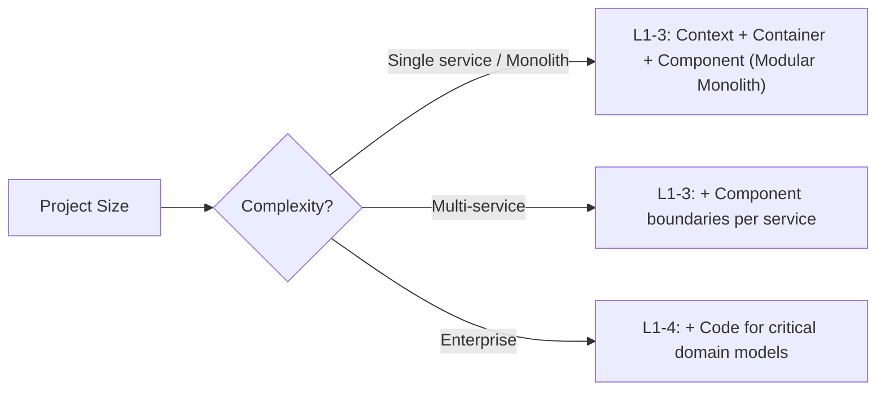

# Architecture Design

Software architecture design across the full lifecycle: design, document, audit, evolve.
Modular-first & illustration-first — prefer clear component boundaries and mermaid diagrams over prose.

Progressive disclosure: this file is the workflow router.
Deep detail lives in `references/`.

| When | Load |
|---|---|
| Selecting an architecture pattern | `references/patterns/INDEX.md` → specific category |
| Modular Monolith & Bounded Context design | `references/patterns/modular-architecture.md` |
| Operational Database Schema Design | Route to `db-design` skill |
| Drawing C4 diagrams | `references/visualization/c4-mermaid-templates.md` |
| Writing an ADR | `references/adr-templates.md` |
| Analyzing tradeoffs or fitness | `references/analysis/fitness-functions.md` |

---

## Gate 1 — Scope Check

Before starting, determine:

| Question | Action |
|---|---|
| Existing architecture docs? | Read first. Audit before rewriting. |
| DB schema design needed? | Compose with `db-design` skill. |
| Code change only, no arch impact? | STOP — skill not needed. |
| Code review request? | Route to `reviewer` instead. |

## Gate 2 — C4 Level Calibration & Modular Boundaries

| Project Size | Default C4 Depth | Architectural Mandate |
|---|---|---|
| Single service / monolith | Level 1–3 (Context + Container + Component) | **Mandatory Component breakdown (C4 L3)**: define Modular Monolith bounded contexts & public module APIs |
| Multi-service / microservices | Level 1–3 (+ Component per service) | Define component boundaries & inter-service contract DTOs per deployable |
| Enterprise / platform | Level 1–4 (all levels) | Define enterprise domain contexts, trust boundaries, & data ownership |

---

## Gate 3 — Illustration Budget

Architecture docs that are walls of text have failed. Minimum diagrams:

| Artifact | Minimum Illustrations |
|---|---|
| Architecture overview | 1× system context + 1× container diagram + 1× component/bounded context diagram |
| Migration plan | 1× current state + 1× target state + 1× transition sequence |
| Data & Schema architecture | 1× component data flow + 1× ER diagram (compose with `db-design`) |
| Security review | 1× trust boundary diagram (STRIDE overlay) |
| ADR | 1× options comparison diagram (optional) |

### Diagram Scoping — One Concern Per Diagram

Each Mermaid diagram must represent **one logical concern**. Mixing multiple concerns (e.g., data flow + deployment topology + component relationships) into a single diagram makes it unreadable and defeats the purpose.

**Hard rules:**

- **One concern per diagram**: A diagram covers one of: system context, container boundaries, component internals, data flow, deployment topology, sequence/interaction, or decision tree — not multiple at once.
- **Scannable heuristic (~10–15 nodes)**: When a diagram approaches ~10–15 nodes, treat it as a signal to review whether it is mixing concerns. This is a heuristic, not a hard node count — a well-bounded diagram with 20 nodes is better than splitting a coherent flow arbitrarily. Use judgment: if nodes belong to different concerns, split; if they belong to the same concern, keep together.
- **Split dense/multi-concern diagrams**: When a single diagram spans multiple concerns or becomes dense, split it into logically scoped sub-diagrams — one per concern.
- **Overview-first navigation**: When a topic is covered by multiple sub-diagrams, provide a concise overview diagram (or a brief prose orientation) that names and links each sub-diagram so readers know where to navigate.
- **Illustration-first is preserved**: Splitting does not reduce the illustration count — it replaces one overloaded diagram with multiple focused ones. The minimum illustration budget from the table above still applies.

**Anti-patterns to reject:**
- A single flowchart that shows both runtime data flow and static component ownership.
- A sequence diagram that also encodes deployment zones as swim-lanes.
- A C4 component diagram that annotates every node with data schema details (those belong in the ER diagram).

---

## Workflow Routing

Match the scenario, load only the matching workflow file.

### Common Scenarios (try these first)

| Scenario | Trigger | Load |
|---|---|---|
| **Greenfield design** | New system, no existing architecture | `references/workflows/greenfield.md` |
| **Brownfield documentation** | Existing system, missing/outdated docs | `references/workflows/brownfield.md` |
| **Architecture audit** | Review existing system, fitness check | `references/workflows/architecture-audit.md` |
| **ADR writing** | Record a significant decision | `references/workflows/adr-writing.md` |
| **Migration planning** | Monolith→micro, cloud migration, DB migration | `references/workflows/migration.md` |

### Specialized Scenarios (if common ones don't match)

| Scenario | Trigger | Load |
|---|---|---|
| **System integration** | Connecting two systems, API gateway, BFF | `references/workflows/integration.md` |
| **Security architecture** | Threat model, trust boundaries, compliance | `references/workflows/security-review.md` |
| **Performance redesign** | Scaling bottleneck, latency SLO breach | `references/workflows/performance-redesign.md` |
| **API design** | New API, contract-first, versioning | `references/workflows/api-design.md` |
| **Data architecture** | Data modeling, pipelines, governance | `references/workflows/data-architecture.md` |

Default when nothing matches: **brownfield documentation**.

---

## Pattern Selection (Modular Monolith Default)

When choosing an architecture pattern:
1. Default to **Modular Monolith** with DDD Bounded Contexts (`references/patterns/modular-architecture.md`) before breaking into premature microservices.
2. Load `references/patterns/INDEX.md` to explore pattern categories.
3. Enforce **Hexagonal Architecture (Ports & Adapters)** for domain components — domain logic must not depend on databases, HTTP frameworks, or third-party SDKs.
4. Enforce **Explicit Contract DTOs** across component interfaces — positional tuples and untyped dictionaries across module boundaries are forbidden.

---

## Hard Rules

- **Modular Monolith default**: Prefer in-process bounded contexts with explicit interfaces over distributed microservices for single applications.
- **Mandatory Component Breakdown (C4 L3)**: Never present a single service as a black box without specifying its internal component boundaries.
- **Illustration-first**: Every architecture section MUST have at least one mermaid diagram.
- **Explicit types over tuples**: Inter-component interfaces must use explicit DTO types.
- **Evidence over aspiration**: Document what IS, mark aspirational targets as "Target State".

### Artifact Level Calibration

The hard rules and illustration budget scale to the artifact being produced or reviewed:

| Artifact | What the rules require | What is out of scope |
|---|---|---|
| **Canonical architecture doc** | Full C4 L1-L3 (system context + containers + components/bounded contexts), complete illustration budget, all hard rules. | Implementation DDL, code, migration scripts. |
| **Subsystem engineering design doc (TRD)** | Component-level diagrams for the subsystem scope, ER diagram if schema is involved, ADR for decisions, dependency direction. Does NOT need to re-draw system context or container diagrams if the canonical architecture doc already has them — reference it instead. | Full C4 L1 system context, container diagram, exact module port interfaces (those are implementation), migration DDL. |
| **Delivery spec / migration plan** | Current-state + target-state + transition-sequence diagrams, exit criteria, rollback guidance. | Design rationale, ADR (defer to TRD), component diagrams (defer to TRD). |
| **Code review (PR)** | Code implements the design correctly: dependency direction, typed interfaces, no black-box components. | Design-level questions (defer to TRD review). |

**Do not fail a subsystem TRD for not containing a full C4 L1 system context diagram.** If the canonical architecture doc (`docs/architecture.md` or equivalent) already covers system context and containers, a subsystem TRD only needs the component-level diagrams, ER diagrams, and decision records relevant to its scope. The TRD's job is to specify *what* and *why* for the subsystem, not to re-document the entire system topology.

---

## Deliverables

- [ ] Scope check passed (Gate 1)
- [ ] C4 depth calibrated to Level 3 Component boundaries (Gate 2)
- [ ] Illustration budget met (Gate 3)
- [ ] Modular Monolith / Bounded Context breakdown specified
- [ ] Database schema delegated to `db-design` (ER diagram + typed repository DTOs)
- [ ] ADR written for any significant decision made during the process

---

## References

- `references/INDEX.md` — Master index of architecture references
- `references/patterns/modular-architecture.md` — Modular Monoliths, Bounded Contexts, Ports & Adapters
- `references/visualization/c4-mermaid-templates.md` — C4 L1-L3 templates
- `references/adr-templates.md` — ADR templates
- Compose with: `db-design` (operational DB engineering), `code-craft` (implementation), `reviewer` (design-rigor lens)
