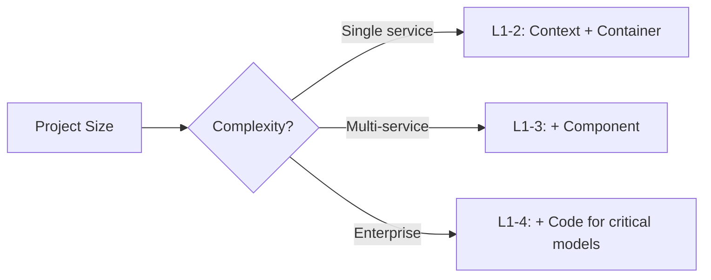

# Architecture Design

Architecture work across the full lifecycle: design, document, audit, evolve.
Illustration-first — prefer mermaid diagrams over prose.

Progressive disclosure: this file is the workflow router.
Deep detail lives in `references/`.

| When | Load |
|---|---|
| Selecting an architecture pattern | `references/patterns/INDEX.md` → specific category |
| Drawing C4 diagrams | `references/visualization/c4-mermaid-templates.md` |
| Writing an ADR | `references/adr-templates.md` |
| Analyzing tradeoffs or fitness | `references/analysis/fitness-functions.md` |

---

## Gate 1 — Scope Check

Before starting, determine:

| Question | Action |
|---|---|
| Existing architecture docs? | Read first. Audit before rewriting. |
| Code change only, no arch impact? | STOP — skill not needed. |
| Code review request? | Route to `reviewer` instead. |

## Gate 2 — C4 Level Calibration

| Project Size | Default C4 Depth | Notes |
|---|---|---|
| Single-service / monolith | Level 1–2 (Context + Container) | Skip Component unless complex |
| Multi-service / microservices | Level 1–3 (+ Component) | One component diagram per critical service |
| Enterprise / platform | Level 1–4 (all levels) | Code level only for critical domain models |

## Gate 3 — Illustration Budget

Architecture docs that are walls of text have failed. Minimum diagrams:

| Artifact | Minimum Illustrations |
|---|---|
| Architecture overview | 1× system context + 1× container diagram |
| Migration plan | 1× current state + 1× target state + 1× transition sequence |
| Data architecture | 1× data flow + 1× ownership table |
| Security review | 1× trust boundary diagram (STRIDE overlay) |
| ADR | 1× options comparison diagram (optional) |

---

## Workflow Routing

Match the scenario, load only the matching workflow file.

### Common Scenarios (try these first)

| Scenario | Trigger | Load |
|---|---|---|
| **Greenfield design** | New system, no existing architecture | `references/workflows/greenfield.md` |
| **Brownfield documentation** | Existing system, missing/outdated docs | `references/workflows/brownfield.md` |
| **Architecture audit** | Review existing system, fitness check | `references/workflows/architecture-audit.md` |
| **ADR writing** | Record a significant decision | `references/workflows/adr-writing.md` |
| **Migration planning** | Monolith→micro, cloud migration, DB migration | `references/workflows/migration.md` |

### Specialized Scenarios (if common ones don't match)

| Scenario | Trigger | Load |
|---|---|---|
| **System integration** | Connecting two systems, API gateway, BFF | `references/workflows/integration.md` |
| **Security architecture** | Threat model, trust boundaries, compliance | `references/workflows/security-review.md` |
| **Performance redesign** | Scaling bottleneck, latency SLO breach | `references/workflows/performance-redesign.md` |
| **API design** | New API, contract-first, versioning | `references/workflows/api-design.md` |
| **Data architecture** | Data modeling, pipelines, governance | `references/workflows/data-architecture.md` |

Default when nothing matches: **brownfield documentation**.

---

## Pattern Selection (cross-cutting)

When any workflow requires choosing an architecture pattern:

1. Load `references/patterns/INDEX.md`
2. Search by category or concern keyword
3. Load only the matching category file
4. Each pattern: mermaid diagram + compact table (use/skip/tradeoffs)
5. For deeper analysis on a pattern, load the deep-dive section within the same file

---

## Hard Rules

- **Illustration-first**: Every architecture section MUST have at least one mermaid diagram. Walls-of-text architecture docs are a failure mode.
- **Evidence over aspiration**: Document what IS, not what you wish it were. Mark aspirational targets as "Target State" with a separate diagram.
- **Mermaid default**: Use mermaid for all diagrams unless the project uses Structurizr/D2.
- **Mark unknowns**: Do not invent services, components, or data flows. Mark `[UNKNOWN]`.
- **Link domain terms**: Reference `GLOSSARY.md` when present.
- **Ask before overwriting**: If architecture docs exist and differ substantially, audit first.

---

## Deliverables

- [ ] Scope check passed (Gate 1)
- [ ] C4 depth calibrated (Gate 2)
- [ ] Illustration budget met (Gate 3)
- [ ] Scenario-specific workflow completed
- [ ] All diagrams render correctly in mermaid
- [ ] Architecture anti-patterns checked
- [ ] ADR written for any significant decision made during the process

## Stop Conditions

- **Not architecture work**: Code change with no structural impact → STOP, no skill needed.
- **Existing docs are current**: Audit against workflow sections; report gaps, don't overwrite.
- **Project too simple**: Static sites / simple frontends → minimal doc (responsibility split + data flow only).
- **Unknowns block progress**: Mark `[UNKNOWN]`, deliver partial, ask for input.

## Anti-Patterns

| Temptation | Why Wrong | Correct Path |
|---|---|---|
| Skip diagrams, just write prose | Prose-only arch docs are unreadable and unmaintainable | Gate 3 — minimum illustration budget |
| Document aspirational architecture | Creates drift between docs and reality | Evidence-first; separate "Current State" and "Target State" |
| Copy a framework template verbatim | Empty sections signal cargo-cult documentation | Fill only relevant sections; delete empty ones |
| Use only ASCII art | ASCII is universal but mermaid is searchable, renderable, diffable | Mermaid default; ASCII only as fallback |
| Skip ADR for "obvious" decisions | Nothing is obvious in 6 months | Write an ADR if the decision is costly to reverse |
| Over-engineer a small project | C4 Level 4 for a single-service app is waste | Gate 2 calibrates depth to project size |
| Describe every class and module | Architecture doc ≠ code tour | Describe components and relationships, not internals |
| Generate architecture from directory structure | Code structure reflects implementation, not intent | Infer boundaries from deployable units, not directories |

## Modes of Use

1. **Standalone** — user asks for architecture work directly.
2. **Composed with code-craft** — architecture phase before implementation.
3. **Composed with reviewer** — architecture lens during review (design-rigor sub-lens).
4. **Composed with project-foundation** — architecture docs during project bootstrap.

## References

- `references/INDEX.md` — master index of all reference files
- `references/patterns/` — 33 patterns in 6 searchable categories
- `references/workflows/` — 10 scenario-specific workflows
- `references/visualization/` — C4 mermaid templates
- `references/analysis/` — ATAM, fitness functions, architecture anti-patterns
- `references/adr-templates.md` — ADR templates and lifecycle
- Compose with: `code-craft` (implementation), `reviewer` (design-rigor lens), `project-foundation` (bootstrap), `codebase-exploration` (domain scan), `illustration-craft` (presentation-grade explainers or infographics beyond Mermaid)
