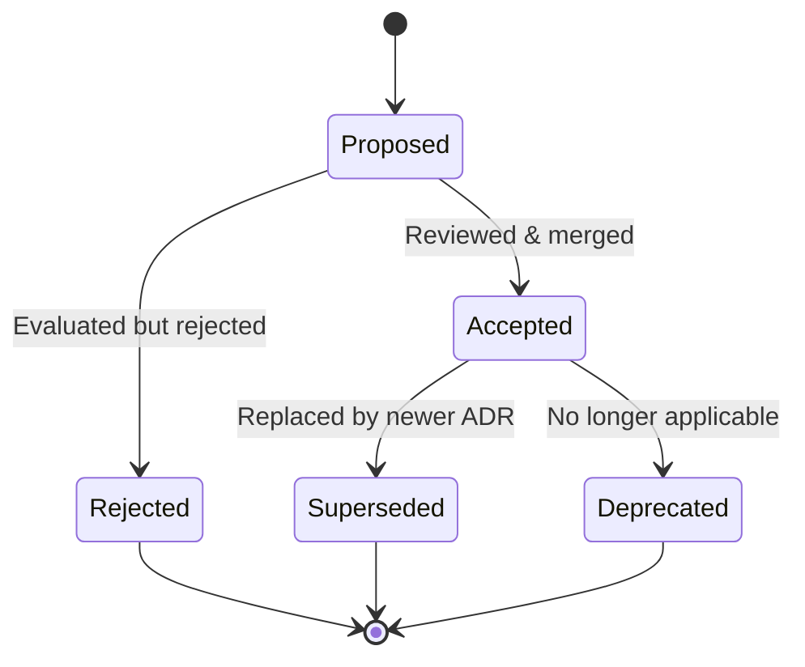

# ADR Templates & Lifecycle

Apply `.agents/rules/phased-delivery.md`: create an ADR only for a consequential,
hard-to-reverse architecture choice with competing options (or when explicitly
requested or regulation/coordination requires it). ADRs capture those decisions.

## When to Write an ADR

- A technology/framework, pattern, data-store, protocol, security-model, or other
  architecture choice only when it is consequential, hard to reverse, and has
  competing options
- An ADR explicitly requested by the user or required for regulation/coordination

## Template A — Nygard (Minimal)

```markdown
# [NUMBER]. [Short Title]

Date: YYYY-MM-DD

## Status

[Proposed | Accepted | Superseded by ADR-XXXX | Deprecated]

## Context

[2-3 sentences: what forces are at play, what problem needs solving]

## Decision

[1-2 sentences: what we decided to do]

## Consequences

[Positive, negative, and neutral consequences of this decision]
```

## Template B — MADR (Detailed)

```markdown
# [Short Title of Problem and Decision]

- Status: [proposed | accepted | rejected | deprecated | superseded by ADR-XXXX]
- Deciders: [list of people involved]
- Date: YYYY-MM-DD

Technical Story: [description or ticket link]

## Context and Problem Statement

[2-3 sentences describing the context and problem]

## Decision Drivers

- [driver 1, e.g., quality attribute or constraint]
- [driver 2]

## Considered Options

1. [Option 1]
2. [Option 2]
3. [Option 3]

## Decision Outcome

Chosen: "[Option 1]", because [justification].

### Positive Consequences

- [e.g., improves performance by 30%]

### Negative Consequences

- [e.g., adds operational overhead]

## Pros and Cons of the Options

### Option 1

- ✅ [argument for]
- ❌ [argument against]

### Option 2

- ✅ [argument for]
- ❌ [argument against]
```

## ADR Lifecycle



| Status | Meaning |
|---|---|
| Proposed | Draft submitted for review (PR) |
| Accepted | Reviewed, agreed, merged |
| Rejected | Evaluated but not adopted (kept for history) |
| Superseded | Replaced by a newer ADR (link to successor) |
| Deprecated | No longer valid or applicable |

## File Conventions

- Location: `docs/architecture/decisions/` or `docs/adr/`
- Naming: `NNNN-short-kebab-title.md` (e.g., `0001-use-postgresql.md`)
- Index: Maintain `INDEX.md` or auto-generate with `adr-tools` when an ADR collection is used
- Never delete: Mark superseded/deprecated, don't remove

## Tooling

| Tool | Purpose |
|---|---|
| `adr-tools` | CLI for create/list/supersede ADRs |
| `log4brains` | Static site generator for ADR browsing |
| `adr-viewer` | Convert ADR directory to searchable HTML |
