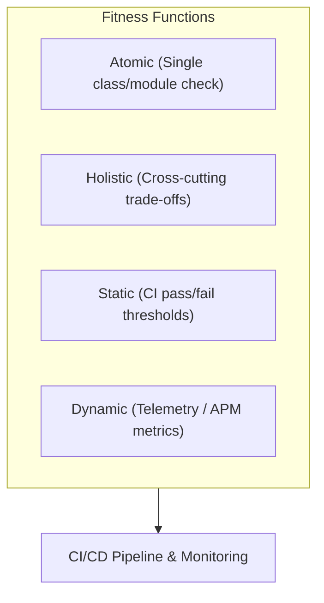
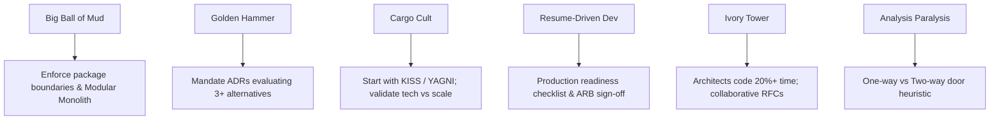

# Architecture Analysis & Fitness Functions

Frameworks and automated mechanisms for evaluating system quality attributes and continuous architecture integrity.

---

## 1. Architectural Fitness Functions

An architectural fitness function is an objective, continuous mechanism to measure architectural integrity.



### Fitness Function Taxonomy

| Dimension | Options | Example Tool |
|---|---|---|
| **Scope** | Atomic vs. Holistic | ArchUnit (atomic) vs. Load Test + APM (holistic) |
| **Execution** | Automated vs. Manual | GitHub Actions vs. Architecture Review Board |
| **Context** | Static vs. Dynamic | Hardcoded complexity limit vs. 14-day moving p95 latency |
| **Trigger** | Commit-time / Build-time / Runtime | Pre-commit hook / CI build / Chaos test |

### Code Structure Fitness Functions (ArchUnit / Dependency-Cruiser)

Enforce layer isolation and package boundaries in unit tests:

```java
// ArchUnit Java Example
@Test
public void domainShouldNotDependOnInfrastructure() {
    noClasses()
        .that().resideInAPackage("..domain..")
        .should().dependOnClassesIn("..infrastructure..")
        .check(importedClasses);
}
```

```javascript
// Dependency-Cruiser JS/TS rule
{
  "forbidden": [{
    "name": "no-domain-to-infra",
    "severity": "error",
    "from": { "path": "^src/domain" },
    "to": { "path": "^src/infrastructure" }
  }]
}
```

### API & Security Fitness Functions (Spectral / OPA)

```yaml
# Spectral OpenAPI lint rule
rules:
  problem-details-format:
    description: Error responses must follow RFC 7807 Problem Details
    given: $.paths..responses[4xx,5xx].content.application/json
    then:
      field: schema.$ref
      function: pattern
      functionOptions:
        match: "ProblemDetails"
```

---

## 2. Architecture Analysis Methods

### ATAM (Architecture Tradeoff Analysis Method)

Evaluates architectural decisions against quality attribute scenarios.


**Key Concepts:**
- **Sensitivity Point**: A decision impacting a single quality attribute (e.g. choice of encryption algorithm affects security).
- **Tradeoff Point**: A decision impacting multiple attributes in opposing ways (e.g. adding encryption proxy improves security but reduces latency performance).
- **Risk / Non-Risk**: Decisions that jeopardize vs. fulfill system goals.

---

## 3. Architecture Anti-Patterns & Mitigations



| Anti-Pattern | Symptoms | Mitigation |
|---|---|---|
| **Big Ball of Mud** | No boundaries, tight coupling, global state | Enforce package rules with ArchUnit/Dependency-Cruiser |
| **Golden Hammer** | Forcing familiar tech on every problem | Require ADR evaluating 3 alternatives with tradeoffs |
| **Cargo Cult** | Blind adoption of Google/Netflix tech stack | Match architecture to current scale (KISS/YAGNI) |
| **Resume-Driven Dev** | Bleeding-edge tools to pad resumes | Enforce production readiness checklist before adoption |
| **Ivory Tower** | Specs disconnected from developer reality | Architects must code 20-30% time & review PRs |
| **Analysis Paralysis** | Overthinking decisions indefinitely | Bezos 2-way door rule: reversible decisions = 70% info |
