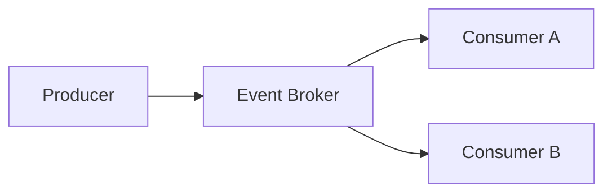
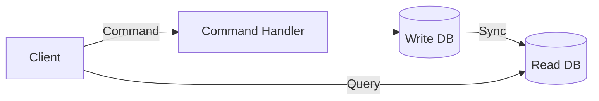
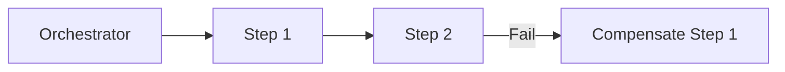
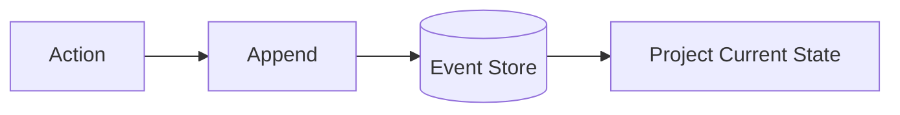
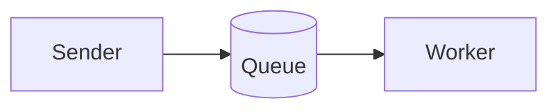
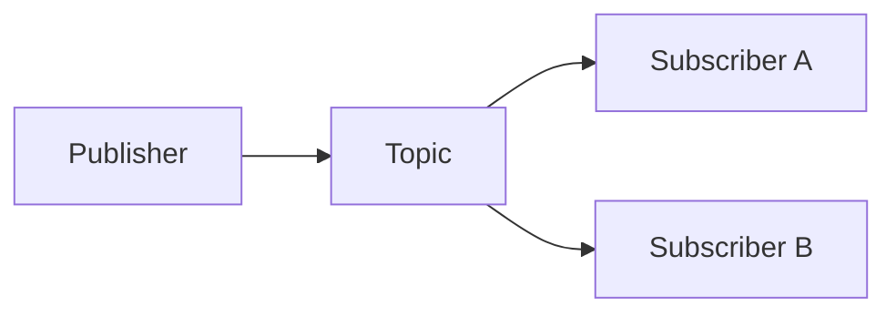
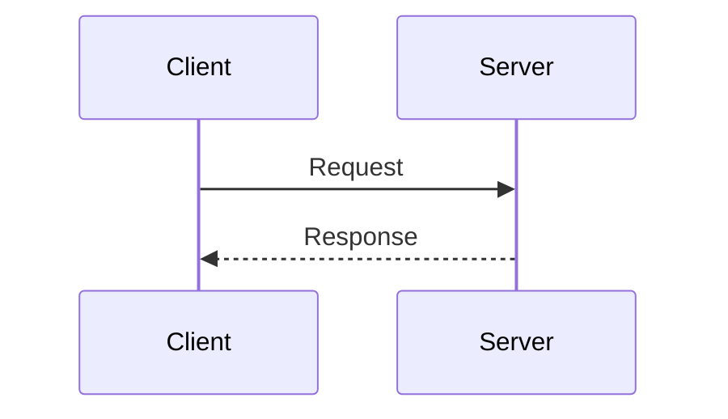

# Communication Patterns

Patterns for inter-service and inter-component communication.
Search tags with `rg` or `grep` in this file.

---

### Event-Driven Architecture
<!-- tags: eda, event-driven, event-broker, async, decoupled -->

| Aspect | Detail |
|---|---|
| **Use when** | Decoupling services via asynchronous state changes is required |
| **Skip when** | Simple synchronous workflows with immediate response needs fit better |
| **Tradeoffs** | ✅ High scalability & loose coupling · ❌ Eventual consistency & complexity |
| **Key decision** | Broker selection (Kafka vs RabbitMQ) and event schema governance |
| **Composes with** | CQRS, Event Sourcing, Pub/Sub |

---

### CQRS
<!-- tags: cqrs, command-query, read-write-split, eventual-consistency -->

| Aspect | Detail |
|---|---|
| **Use when** | Read and write workloads have asymmetric scaling or data model needs |
| **Skip when** | Simple CRUD operations where single data model suffices |
| **Tradeoffs** | ✅ Optimized read/write models · ❌ Data synchronization delay & complexity |
| **Key decision** | Synchronization mechanism (CDC, events, or dual-write) |
| **Composes with** | Event Sourcing, Event-Driven Architecture, Saga |

---

### Saga
<!-- tags: saga, distributed-transaction, orchestrator, compensation -->

| Aspect | Detail |
|---|---|
| **Use when** | Managing distributed transactions across multiple microservices |
| **Skip when** | Single ACID database transaction can span all affected data |
| **Tradeoffs** | ✅ Data consistency across services · ❌ Complex rollback logic & state |
| **Key decision** | Orchestration-based vs Choreography-based control |
| **Composes with** | Event-Driven Architecture, Message Bus, CQRS |

---

### Event Sourcing
<!-- tags: event-sourcing, append-only, audit-log, event-store, projections -->

| Aspect | Detail |
|---|---|
| **Use when** | Complete audit history, state replay, or temporal queries are required |
| **Skip when** | Only current state matters and historical mutations can be discarded |
| **Tradeoffs** | ✅ Full audit trail & time travel · ❌ Event schema evolution & storage growth |
| **Key decision** | Snapshotting strategy and event schema versioning |
| **Composes with** | CQRS, Event-Driven Architecture, Pub/Sub |

---

### Message Bus
<!-- tags: message-bus, queue, producer-consumer, point-to-point, worker -->

| Aspect | Detail |
|---|---|
| **Use when** | Offloading point-to-point asynchronous tasks to background workers |
| **Skip when** | Fan-out to multiple subscribers or real-time responses are required |
| **Tradeoffs** | ✅ Load leveling & fault isolation · ❌ Queue depth management & latency |
| **Key decision** | Delivery semantics (at-least-once vs exactly-once) |
| **Composes with** | Saga, Request-Reply, Event-Driven Architecture |

---

### Pub/Sub
<!-- tags: pub-sub, publish-subscribe, topic, fan-out, broadcast -->

| Aspect | Detail |
|---|---|
| **Use when** | Broadcasting messages to dynamic, independent subscribers |
| **Skip when** | Strict point-to-point processing or sequential workflows are needed |
| **Tradeoffs** | ✅ Dynamic subscriber scaling · ❌ No control over subscriber processing |
| **Key decision** | Topic hierarchy design and filtering rules |
| **Composes with** | Event-Driven Architecture, Event Sourcing, Message Bus |

---

### Request-Reply
<!-- tags: request-reply, synchronous, http-rest, grpc, RPC -->

| Aspect | Detail |
|---|---|
| **Use when** | Immediate response is needed before client execution can proceed |
| **Skip when** | Operations are long-running or downstream availability varies |
| **Tradeoffs** | ✅ Simple control flow & latency · ❌ Tight coupling & cascading failures |
| **Key decision** | Protocol choice (gRPC, HTTP/REST, GraphQL) and timeout policies |
| **Composes with** | Circuit Breaker, API Gateway, Message Bus |
