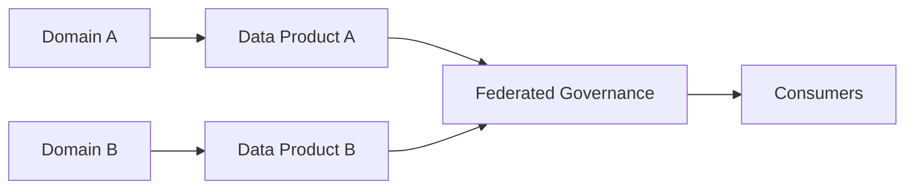
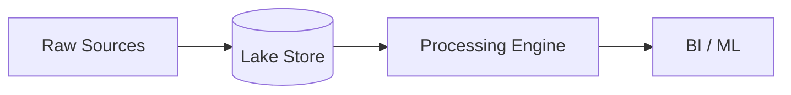
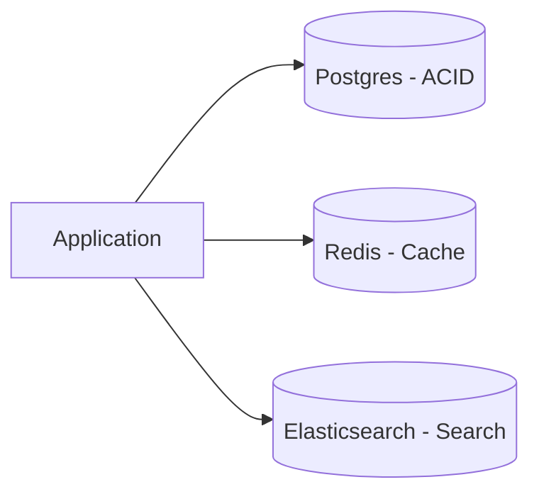
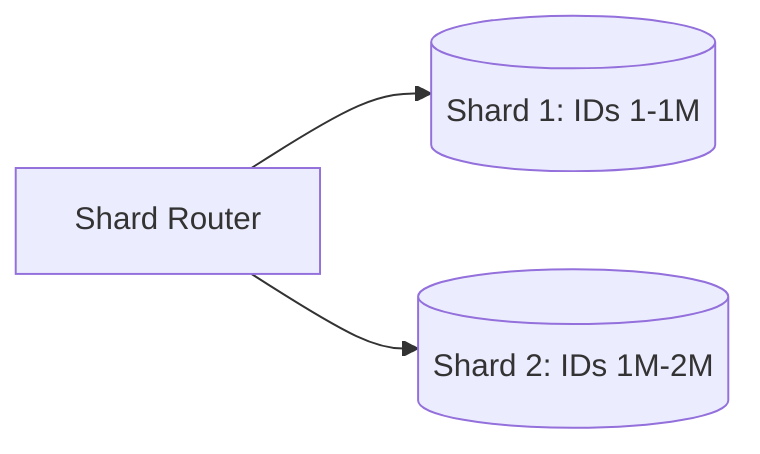
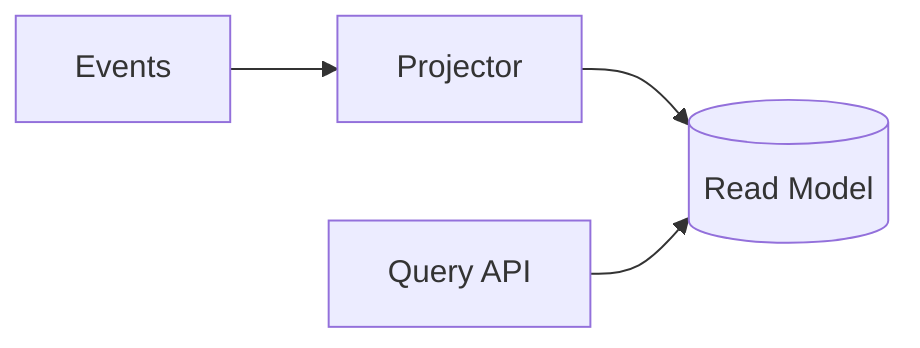

# Data Patterns

Patterns for data storage, distribution, and query optimization.
Search tags with `rg` or `grep` in this file.

---

### Data Mesh
<!-- tags: data-mesh, domain-driven, decentralized, data-product, federated-governance -->

| Aspect | Detail |
|---|---|
| **Use when** | Large organizations need decentralized, domain-owned analytical data |
| **Skip when** | Small teams or centralized data warehouses meet analytical needs |
| **Tradeoffs** | ✅ Autonomous domain scaling · ❌ High governance & operational overhead |
| **Key decision** | Standardized data product contracts & self-serve platform tools |
| **Composes with** | Polyglot Persistence, Data Lake/Lakehouse, Event-Driven Architecture |

---

### Data Lake/Lakehouse
<!-- tags: data-lake, lakehouse, object-storage, parquet, analytics, big-data -->

| Aspect | Detail |
|---|---|
| **Use when** | Storing unstructured, semi-structured, and structured raw data at scale |
| **Skip when** | Transactional ACID operations with low-latency queries are required |
| **Tradeoffs** | ✅ Low storage cost & schema flexibility · ❌ Risk of data swamp & query latency |
| **Key decision** | File formats (Parquet/Iceberg) & compute engine (Spark/Trino) |
| **Composes with** | Data Mesh, Polyglot Persistence, Materialized Views |

---

### Polyglot Persistence
<!-- tags: polyglot-persistence, database-per-service, multi-model, storage-optimization -->

| Aspect | Detail |
|---|---|
| **Use when** | Bounded contexts or query patterns require optimized storage engines |
| **Skip when** | Simple domain data model fits well within a single RDBMS |
| **Tradeoffs** | ✅ Optimal query performance per domain · ❌ Operational complexity & cross-DB consistency |
| **Key decision** | Data synchronization strategy (CDC vs domain events) |
| **Composes with** | CQRS, Database Sharding, Materialized Views |

---

### Database Sharding
<!-- tags: database-sharding, horizontal-partitioning, shard-router, database-scaling -->

| Aspect | Detail |
|---|---|
| **Use when** | Monolithic database exceeds single-node write throughput or capacity |
| **Skip when** | Vertical scaling is viable or complex cross-shard joins are needed |
| **Tradeoffs** | ✅ Unlimited write scale & fault isolation · ❌ Complex cross-shard queries & re-sharding |
| **Key decision** | Sharding key selection (hash vs range partitioning) |
| **Composes with** | Polyglot Persistence, Materialized Views, Read Replicas |

---

### Materialized Views
<!-- tags: materialized-views, read-model, query-optimization, pre-computation, caching -->

| Aspect | Detail |
|---|---|
| **Use when** | Complex joins or aggregations require low-latency query reads |
| **Skip when** | Real-time immediate consistency is mandatory or data updates continuously |
| **Tradeoffs** | ✅ Fast read latency & reduced query compute · ❌ Stale data window & storage cost |
| **Key decision** | View refresh trigger mechanism (on-write, scheduled, or streaming CDC) |
| **Composes with** | CQRS, Event Sourcing, Data Lake/Lakehouse |
