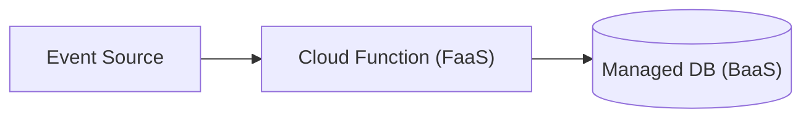
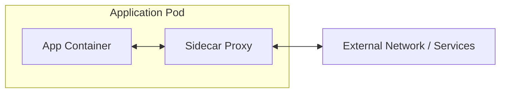
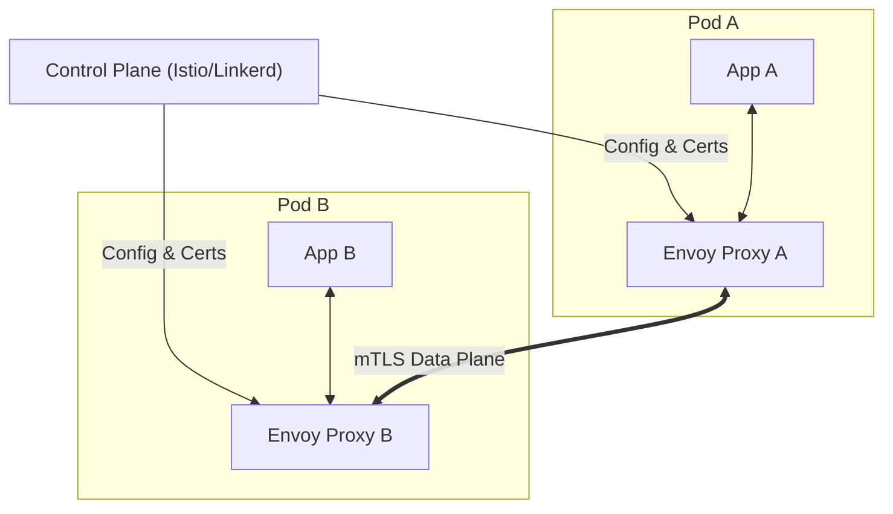

# Deployment Patterns

Patterns for infrastructure topology and service deployment.
Search tags with `rg` or `grep` in this file.

---

### Serverless (FaaS/BaaS)
<!-- tags: serverless, faas, baas, cloud-functions, event-driven, lambda -->

| Aspect | Detail |
|---|---|
| **Use when** | Variable or spiky workloads, event-driven tasks, or rapid MVP deployment without infrastructure management. |
| **Skip when** | Long-running processes, predictable high-volume traffic, or strict low-latency requirements (cold starts). |
| **Tradeoffs** | ✅ Zero server management, auto-scaling · ❌ Cold start latency, vendor lock-in, execution time limits |
| **Key decision** | Compute granularity vs. cold start tolerance and database connection pooling limits. |
| **Composes with** | Event-Driven Architecture, API Gateway, CQRS |

---

### Edge Computing
<!-- tags: edge-computing, cdn, edge-workers, low-latency, geo-distribution -->

| Aspect | Detail |
|---|---|
| **Use when** | High geographical distribution, strict latency targets, or client-tailored content customization. |
| **Skip when** | Heavy compute tasks, large centralized state dependencies, or localized single-region users. |
| **Tradeoffs** | ✅ Sub-millisecond latency, reduced origin load · ❌ Distributed debugging, constrained runtime APIs |
| **Key decision** | What logic runs at edge (auth/routing/caching) vs. central origin (heavy DB/write logic). |
| **Composes with** | Serverless, CDN, API Gateway, CQRS |

---

### Sidecar/Ambassador
<!-- tags: sidecar, ambassador, proxy, container, kubernetes, pod -->

| Aspect | Detail |
|---|---|
| **Use when** | Decoupling cross-cutting concerns (logging, mTLS, rate limiting) from primary application code. |
| **Skip when** | Monolithic deployments, single-container environments, or resource-constrained edge devices. |
| **Tradeoffs** | ✅ Language-agnostic logic reuse, isolated deployment · ❌ Increased pod memory/CPU footprint |
| **Key decision** | Shared process space vs network abstraction depth and lifecycle coordination. |
| **Composes with** | Service Mesh, Microservices, Microsegmentation |

---

### Service Mesh
<!-- tags: service-mesh, envoy, mtls, control-plane, data-plane, istio -->

| Aspect | Detail |
|---|---|
| **Use when** | Managing complex microservice communication (mTLS, telemetry, traffic splitting, circuit breaking). |
| **Skip when** | Small deployments with few services, simple topologies, or team lacking mesh operation capacity. |
| **Tradeoffs** | ✅ Universal zero-trust mTLS, deep observability · ❌ High operational complexity, added hop latency |
| **Key decision** | Data plane proxy selection (Envoy vs eBPF) and control plane scaling model. |
| **Composes with** | Sidecar/Ambassador, Kubernetes, Microservices, API Gateway |
