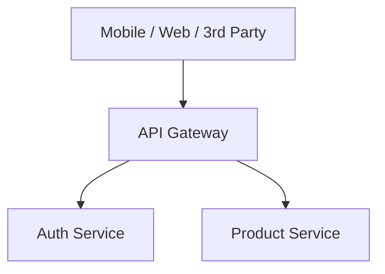
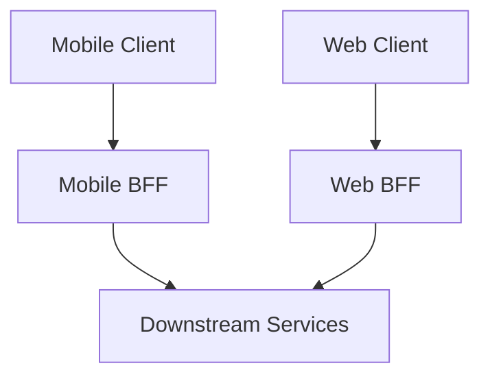
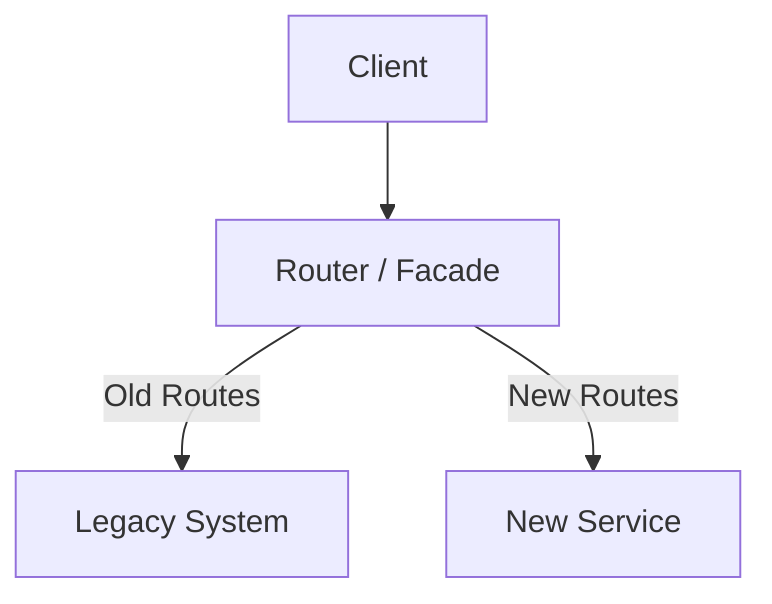
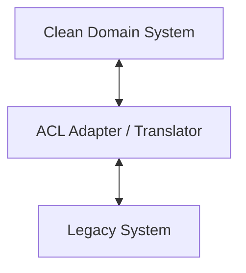

# Integration Patterns

Patterns for system boundaries, API composition, and legacy migration.
Search tags with `rg` or `grep` in this file.

---

### API Gateway
<!-- tags: api-gateway, gateway, entry-point, routing, rate-limiting, auth -->

| Aspect | Detail |
|---|---|
| **Use when** | Single entry point needed for routing, rate limiting, and auth across microservices. |
| **Skip when** | Simple monolith architectures with direct client communication. |
| **Tradeoffs** | ✅ Centralized cross-cutting concerns · ❌ Single point of failure, added latency. |
| **Key decision** | Centralized policy enforcement vs service-level autonomy. |
| **Composes with** | BFF, Rate Limiter, Circuit Breaker, Service Discovery. |

---

### BFF (Backend for Frontend)
<!-- tags: bff, backend-for-frontend, client-specific, API-composition, frontend -->

| Aspect | Detail |
|---|---|
| **Use when** | Different frontends have vastly different UI/data payload requirements. |
| **Skip when** | Single frontend app or uniform UI data requirements across devices. |
| **Tradeoffs** | ✅ Tailored response payloads, team autonomy · ❌ Code duplication across BFFs. |
| **Key decision** | Mobile vs web client optimization versus shared API maintenance. |
| **Composes with** | API Gateway, GraphQL Aggregator, Service Mesh. |

---

### Strangler Fig
<!-- tags: strangler-fig, migration, legacy, facade, routing, incremental-replacement -->

| Aspect | Detail |
|---|---|
| **Use when** | Replacing legacy monolithic systems incrementally without full rewrite. |
| **Skip when** | Legacy system is small enough for a complete greenfield rewrite. |
| **Tradeoffs** | ✅ Low-risk incremental delivery · ❌ Temporary increased infrastructure complexity. |
| **Key decision** | Routing boundary granularity (URL path vs service level). |
| **Composes with** | API Gateway, Anti-Corruption Layer, Feature Flags. |

---

### Anti-Corruption Layer
<!-- tags: anti-corruption-layer, acl, domain-driven-design, adapter, legacy-integration -->

| Aspect | Detail |
|---|---|
| **Use when** | Integrating new domain model with legacy semantics without leaking messy concepts. |
| **Skip when** | Legacy domain model matches new system or legacy is retiring immediately. |
| **Tradeoffs** | ✅ Domain model isolation, clean abstractions · ❌ Translation overhead, boilerplate. |
| **Key decision** | Translation layer placement (adapter within app vs separate middleware). |
| **Composes with** | Strangler Fig, Adapter Pattern, Facade Pattern. |
