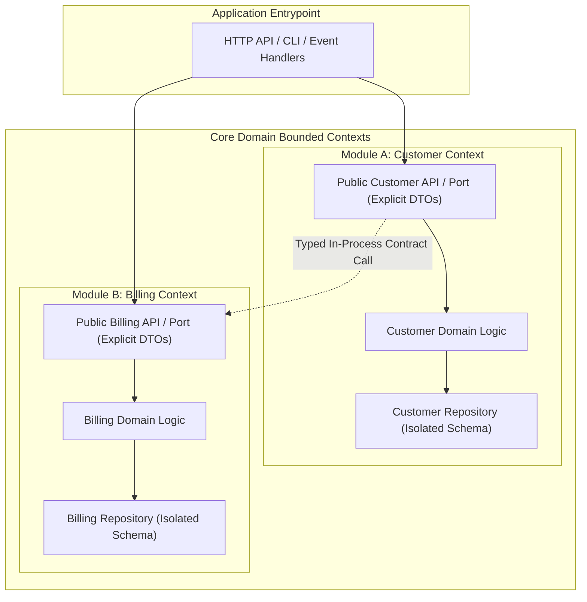

# Modular Architecture & Component Isolation

## 1. The Modular Monolith Pattern

A **Modular Monolith** organizes a single application codebase into independent, loosely coupled domain modules (Bounded Contexts). Each module owns its internal domain logic, data models, and internal packages, exposing ONLY an explicit, strongly-typed public API surface (Ports).



### Core Rules of Modular Monoliths
1. **Strict Encapsulation**: Internal classes, functions, and database models of Module A MUST NOT be imported or accessed directly by Module B. All interaction occurs through Module A's public API / Port.
2. **Database Boundary Isolation**: Domain modules must not execute direct cross-table SQL joins on tables owned by another domain module. Cross-module queries must go through the owner module's repository API.
3. **No Circular Dependencies**: Module A may depend on Module B, but Module B must NEVER depend on Module A. Use domain events (in-process event bus) to break bidirectional dependencies.

---

## 2. Ports & Adapters (Hexagonal / Clean Architecture)

Within each domain module, code is separated into concentric layers with strict dependency direction pointing inward towards the core domain model:

```mermaid
graph TD
    subgraph Primary Adapters / Infrastructure
        HTTP_Controller["HTTP Controller / CLI"]
        DB_Adapter["Postgres ORM / SQL Adapter"]
    end

    subgraph Application / Ports
        In_Port["Use Case Interface (Input Port)"]
        Out_Port["Repository Interface (Output Port)"]
    end

    subgraph Core Domain
        Entity["Domain Entity / Value Object"]
        Rules["Domain Business Rules"]
    end

    HTTP_Controller --> In_Port
    In_Port --> Rules
    Rules --> Entity
    Rules --> Out_Port
    DB_Adapter ..|> Out_Port
```

### Dependency Inversion Principle
- Core Business Logic (`Rules` and `Entity`) has ZERO dependencies on frameworks, ORMs, databases, or HTTP frameworks.
- Outer infrastructure (adapters) implements interfaces (ports) defined by the core domain.

---

## 3. Explicit Interface Contracts (No Tuples or Untyped Dicts)

Inter-module calls and port interfaces MUST use explicit, strongly-typed Data Transfer Objects (DTOs) or Value Objects:

- **FORBIDDEN**: `(id, status, total)` positional tuples or `dict[str, Any]` untyped maps across module boundaries.
- **MANDATORY**: Immutable DTOs (`@dataclass(frozen=True)`, `interface UserDTO`, Go/Rust `struct`).
