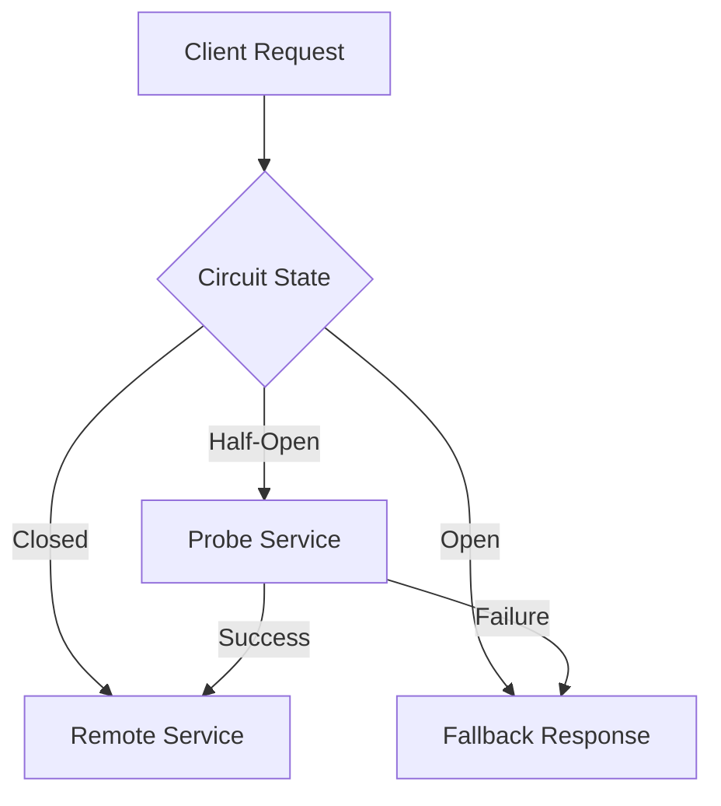
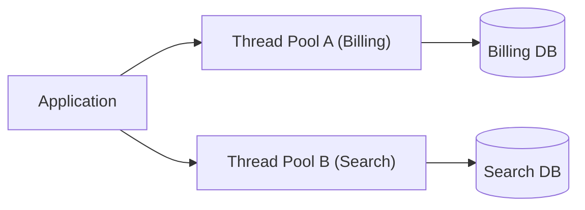
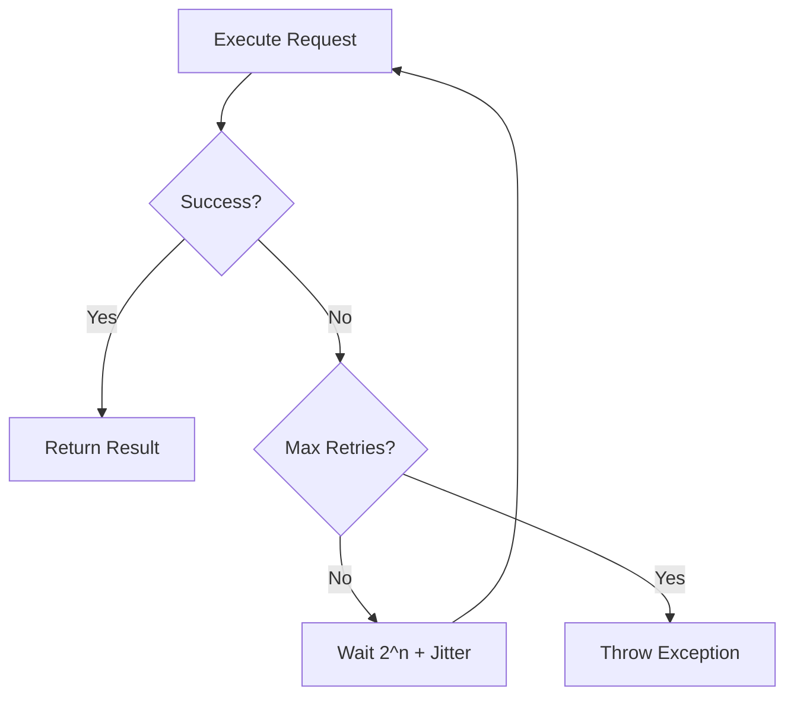
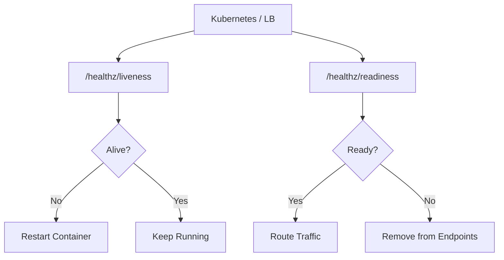
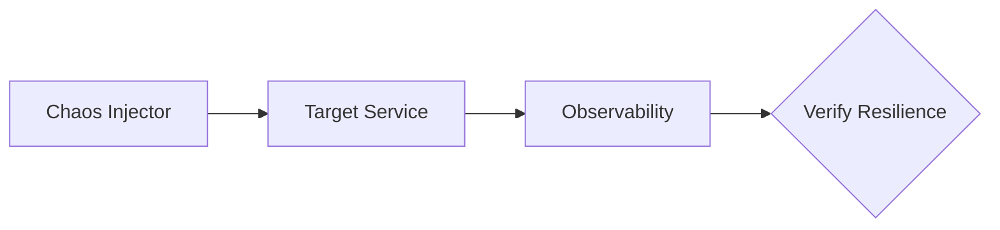

# Resilience Patterns

Patterns for fault tolerance, failure isolation, and system reliability.
Search tags with `rg` or `grep` in this file.

---

### Circuit Breaker
<!-- tags: circuit-breaker, fault-tolerance, cascading-failure, fallback, resilience -->

| Aspect | Detail |
|---|---|
| **Use when** | Calling remote services that can fail, experience latency spikes, or become unavailable. |
| **Skip when** | In-process calls or synchronous critical operations with no viable fallback option. |
| **Tradeoffs** | ✅ Prevents thread pool exhaustion & cascading failures · ❌ Increases code complexity & fallback design overhead |
| **Key decision** | Failure threshold percentage, timeout duration, and reset timeout for half-open state. |
| **Composes with** | Retry with Exponential Backoff, Bulkhead, Health Check. |

---

### Bulkhead
<!-- tags: bulkhead, resource-isolation, fault-isolation, pool-isolation, resilience -->

| Aspect | Detail |
|---|---|
| **Use when** | Isolating critical workloads so failures in one downstream dependency do not starve others. |
| **Skip when** | Simple single-purpose services with uniform low-concurrency workloads and single DB. |
| **Tradeoffs** | ✅ Prevents single service failure from crashing app · ❌ Can lead to resource under-utilization |
| **Key decision** | Pool capacity limits, queue depths, and thread/process isolation boundaries. |
| **Composes with** | Circuit Breaker, Rate Limiting, Timeout Pattern. |

---

### Retry with Exponential Backoff
<!-- tags: retry, exponential-backoff, jitter, transient-failure, resilience -->

| Aspect | Detail |
|---|---|
| **Use when** | Handling temporary network glitches, rate limits, or transient downstream outages. |
| **Skip when** | Non-idempotent operations (e.g., payments) or deterministic 4xx client errors. |
| **Tradeoffs** | ✅ Automatically recovers from transient errors · ❌ Increases latency and risks retry storms |
| **Key decision** | Initial delay, backoff multiplier, maximum retry count, and randomized jitter range. |
| **Composes with** | Circuit Breaker, Rate Limiting, Idempotency Key. |

---

### Health Check
<!-- tags: health-check, liveness, readiness, probes, kubernetes, resilience -->

| Aspect | Detail |
|---|---|
| **Use when** | Orchestrating containers or load balancers to route traffic and restart dead services. |
| **Skip when** | Serverless functions or simple static CLI tools without long-running background daemons. |
| **Tradeoffs** | ✅ Automated traffic routing and instance self-healing · ❌ Misconfigured probes cause cascading restarts |
| **Key decision** | Probe frequency, timeout thresholds, failure count limits, and deep vs light checks. |
| **Composes with** | Circuit Breaker, Service Mesh, Load Balancing. |

---

### Chaos Engineering
<!-- tags: chaos-engineering, fault-injection, chaos-monkey, observability, resilience -->

| Aspect | Detail |
|---|---|
| **Use when** | Validating system resilience, recovery mechanisms, and alert monitoring in staging/production. |
| **Skip when** | Early-stage MVP products without basic monitoring, automated backups, or baseline stability. |
| **Tradeoffs** | ✅ Uncovers hidden failure modes before outages · ❌ Can cause unplanned downtime if blast radius uncontrolled |
| **Key decision** | Blast radius scope, steady-state metrics definition, and automated rollback triggers. |
| **Composes with** | Health Check, Circuit Breaker, Bulkhead, Distributed Tracing. |
