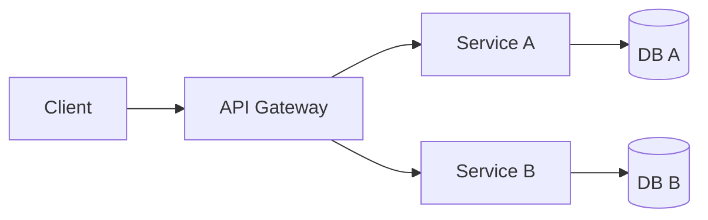
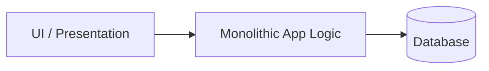
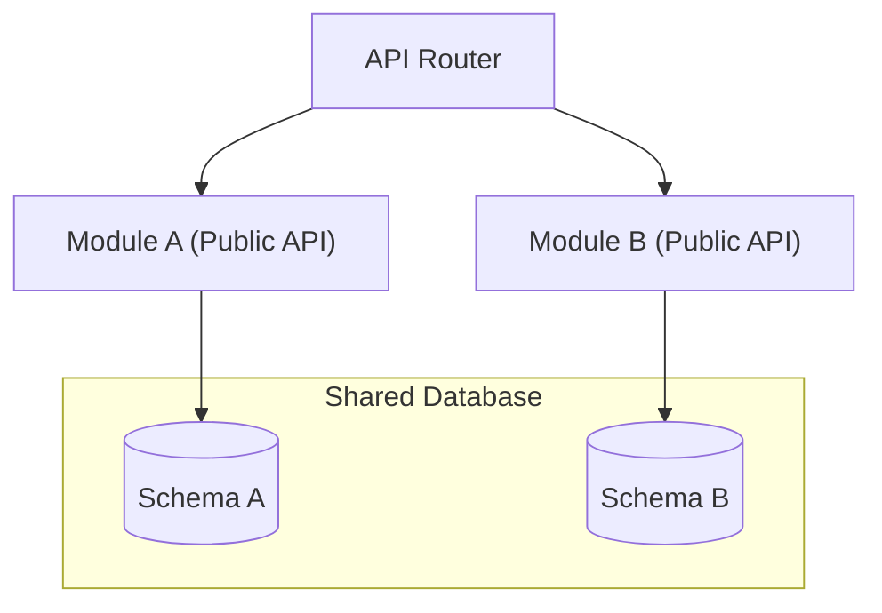
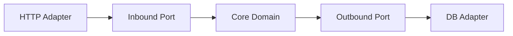
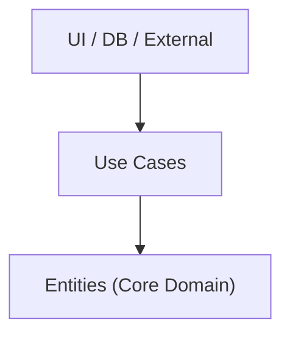
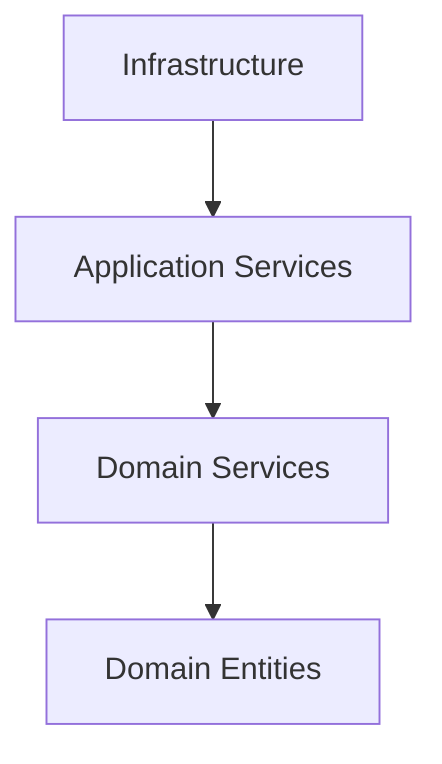
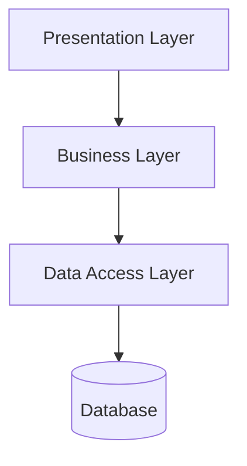
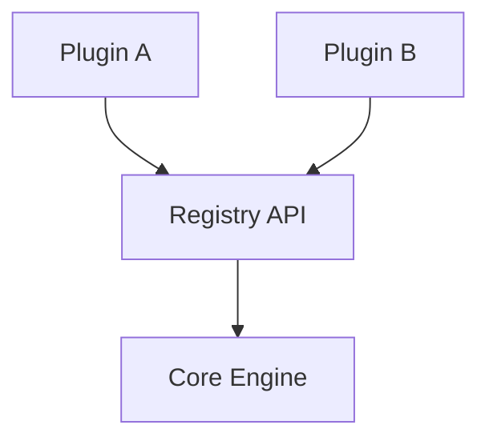

# Structural Patterns

Architecture patterns for system decomposition and component organization.
Search tags with `rg` or `grep` in this file.

---

### Microservices
<!-- tags: microservices, distributed, domain-driven-design, decoupling, service-oriented -->

| Aspect | Detail |
|---|---|
| **Use when** | Independent team scaling, distinct domain boundaries, high availability needs |
| **Skip when** | Small teams, early startup phase, domain boundaries are undefined or fluid |
| **Tradeoffs** | ✅ Independent deployment & scaling · ❌ Network latency, operational complexity |
| **Key decision** | Defining bounded contexts to minimize cross-service synchronous dependencies |
| **Composes with** | API Gateway, Event-Driven Architecture, CQRS, Service Mesh |

---

### Monolith
<!-- tags: monolith, single-deployment, simple, unified-codebase -->

| Aspect | Detail |
|---|---|
| **Use when** | Early-stage projects, small team size, simple domain model, fast iteration speed |
| **Skip when** | Large org requiring team autonomy, conflicting scaling needs per component |
| **Tradeoffs** | ✅ Easy local testing & deployment · ❌ Single failure domain, scaling bottlenecks |
| **Key decision** | Ensuring internal code modularity to prevent spaghetti architecture |
| **Composes with** | Layered Architecture, Clean Architecture, MVC |

---

### Modular Monolith
<!-- tags: modular-monolith, monolith, modules, isolation, clean-boundaries -->

| Aspect | Detail |
|---|---|
| **Use when** | Single deployment efficiency needed, but domain complexity requires separation |
| **Skip when** | Systems requiring distinct physical scaling or separate technology stacks |
| **Tradeoffs** | ✅ Low devops cost with strict domain boundary enforcement · ❌ Shared runtime failures |
| **Key decision** | Restricting cross-module calls to explicit public interfaces and isolated schemas |
| **Composes with** | Domain-Driven Design, Hexagonal Architecture, Event Bus |

---

### Hexagonal Architecture
<!-- tags: hexagonal-architecture, ports-and-adapters, ddd, decoupling, testability -->

| Aspect | Detail |
|---|---|
| **Use when** | Domain logic must be isolated from frameworks, databases, and third-party APIs |
| **Skip when** | Simple CRUD applications where abstraction adds unnecessary boilerplate |
| **Tradeoffs** | ✅ High testability & framework independence · ❌ Extra interfaces and mapping layers |
| **Key decision** | Inverting dependencies so core domain relies only on abstract ports |
| **Composes with** | Domain-Driven Design, Clean Architecture, Dependency Injection |

---

### Clean Architecture
<!-- tags: clean-architecture, dependency-rule, entities, use-cases, uncle-bob -->

| Aspect | Detail |
|---|---|
| **Use when** | Enterprise applications requiring strict separation of business rules and frameworks |
| **Skip when** | Rapid prototyping or low-complexity applications with minimal business logic |
| **Tradeoffs** | ✅ Independent of DB/UI/frameworks · ❌ Verbose boilerplate and data mapping |
| **Key decision** | Enforcing the Dependency Rule: code dependencies point inward only |
| **Composes with** | Hexagonal Architecture, Repository Pattern, CQRS |

---

### Onion Architecture
<!-- tags: onion-architecture, domain-driven-design, dependency-inversion, core-domain -->

| Aspect | Detail |
|---|---|
| **Use when** | Rich object-oriented domain models with complex business rules and workflows |
| **Skip when** | Data-centric CRUD apps with thin or non-existent business logic |
| **Tradeoffs** | ✅ Core domain is completely free of technical concerns · ❌ Learning curve and abstraction overhead |
| **Key decision** | Outer layers depend on inner layers; inner layers define interfaces for outer layers |
| **Composes with** | Domain-Driven Design, Repository Pattern, Unit of Work |

---

### Layered (N-Tier)
<!-- tags: layered, n-tier, tier, traditional, presentation-layer -->

| Aspect | Detail |
|---|---|
| **Use when** | Traditional web apps, enterprise applications with clear separation of concerns |
| **Skip when** | Highly complex domains where top-down layers lead to pass-through boilerplate |
| **Tradeoffs** | ✅ Familiar structure, easy to understand · ❌ Layers can become tightly coupled |
| **Key decision** | Choosing open vs closed layers (whether layers can bypass adjacent lower layers) |
| **Composes with** | Monolith, MVC, Repository Pattern |

---

### Plugin (Microkernel)
<!-- tags: plugin, microkernel, extensibility, core-engine, dynamic-loading -->

| Aspect | Detail |
|---|---|
| **Use when** | Core application functionality needs third-party or runtime feature extensions |
| **Skip when** | Application feature set is static and known ahead of time |
| **Tradeoffs** | ✅ Dynamic extensibility & customizability · ❌ Complex plugin lifecycle & API stability |
| **Key decision** | Designing a stable plugin interface and secure isolation contract |
| **Composes with** | Dependency Injection, Event Broker, Strategy Pattern |
