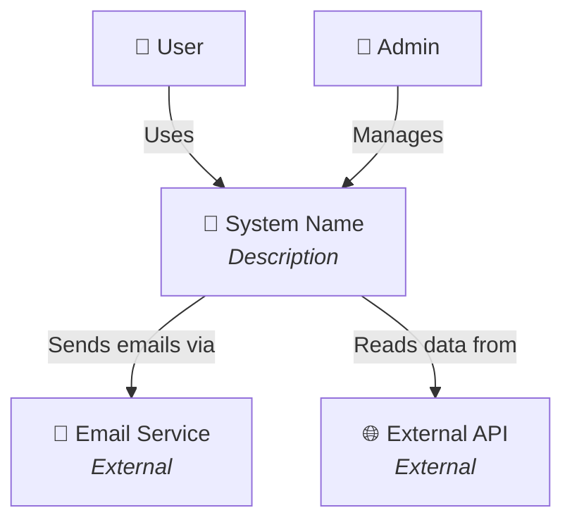
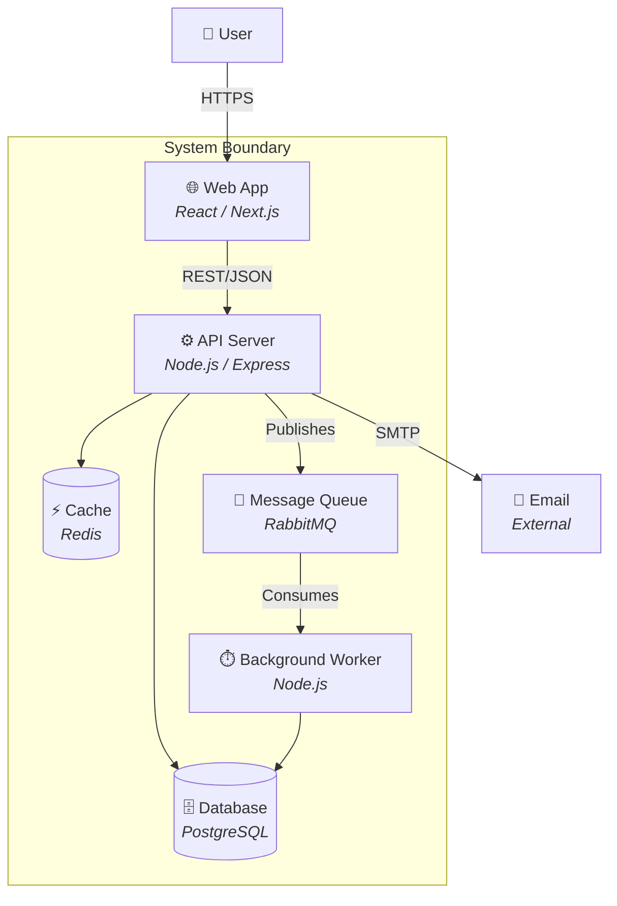
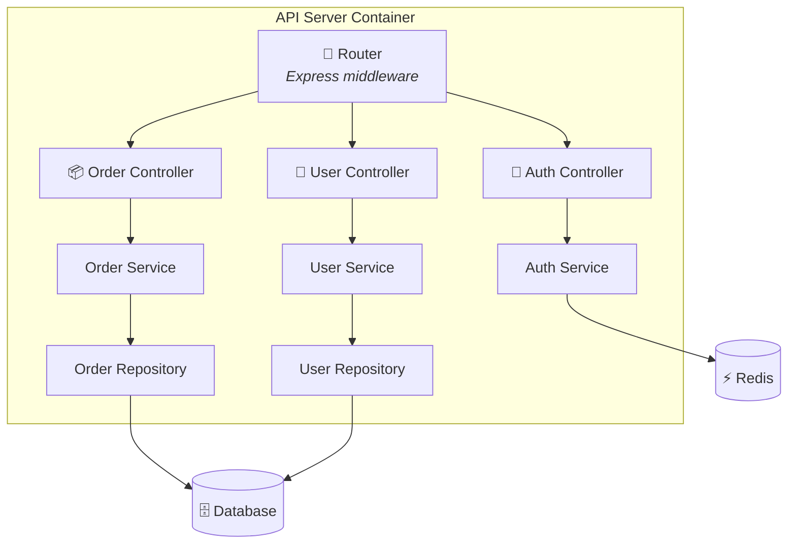
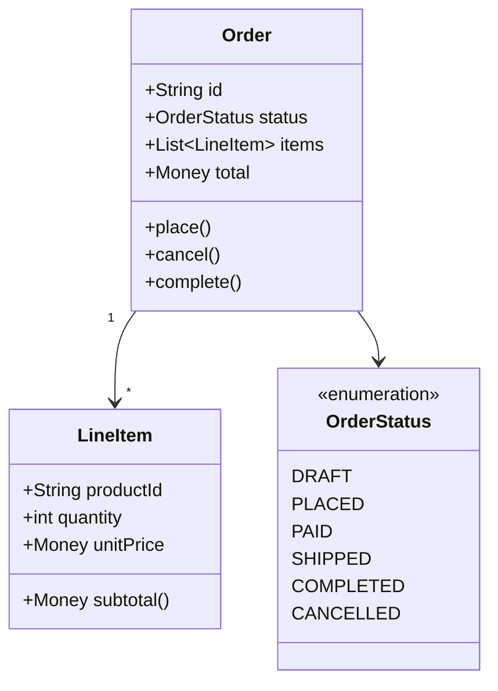
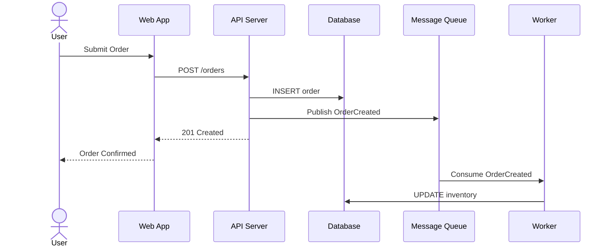
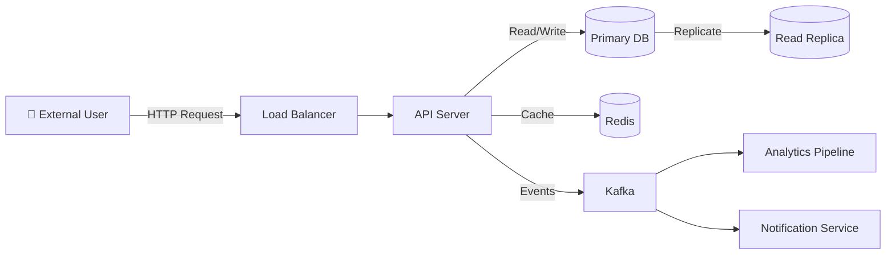
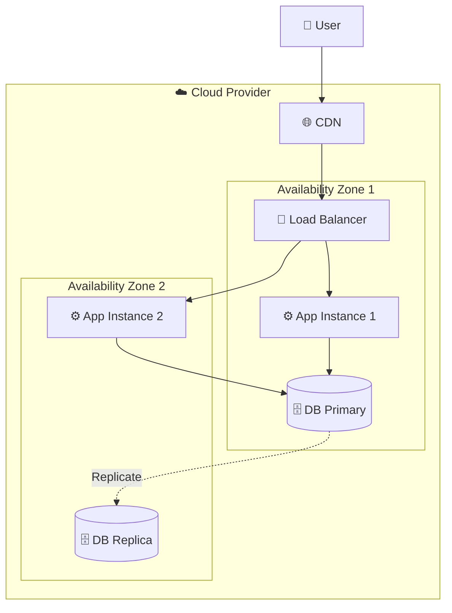

# C4 Mermaid Templates

Ready-to-use C4 diagram templates in mermaid syntax. Copy and adapt.

## Level 1 — System Context

Shows the system in scope and its relationships with users and external systems.

**Guidelines:**
- Include ALL users (human actors) and external systems
- Show high-level relationships only (no protocols)
- Target audience: everyone including non-technical stakeholders

---

## Level 2 — Container Diagram

Shows the deployable units inside the system boundary.

**Guidelines:**
- Show technology choices (framework, language, DB engine)
- Show communication protocols (REST, gRPC, AMQP, SQL)
- One container per deployable unit (not per code module)

---

## Level 3 — Component Diagram

Shows the internal components of a single container.

**Guidelines:**
- One component diagram per critical container (not every container)
- Show internal responsibilities and their dependencies
- Target audience: developers working on this container

---

## Level 4 — Code Diagram (Use Sparingly)

Class/entity relationship diagram for critical domain models only.

**Guidelines:**
- Use ONLY for critical domain models or complex design patterns
- Skip for CRUD entities with no business logic
- Keep to 5-10 classes maximum per diagram

---

## Supplementary Diagram Types

### Sequence Diagram (for flows)

### Data Flow Diagram

### Deployment Diagram

