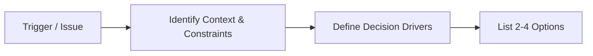
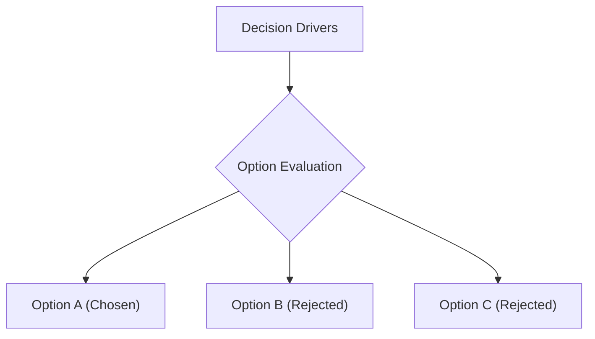
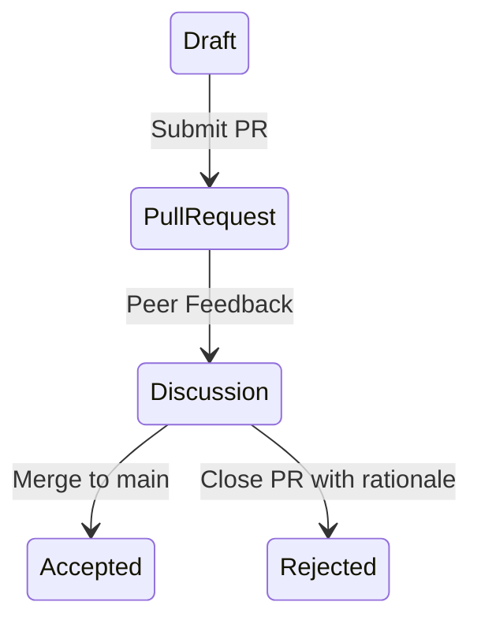

# ADR Writing

## When

Capturing an architecturally significant decision that is costly or difficult to reverse.

---

## Phase 1 — Decision Framing

**Do:**
- Identify the core problem statement and context
- Document key decision drivers (functional requirements, NFRs, team constraints, cost)
- Brainstorm at least 2–4 distinct, realistic options

**Ask:**
- Is this decision architecturally significant (costly to reverse later)?
- What explicit tradeoffs are we accepting?

---

## Phase 2 — Option Analysis & Tradeoffs

Evaluate options against decision drivers:

| Option | Pros | Cons | Cost | Reversibility |
|---|---|---|---|---|
| Option A | ✅ ... | ❌ ... | Low | High |
| Option B | ✅ ... | ❌ ... | High | Low |

---

## Phase 3 — Drafting & Formatting

Choose template format:
- **Minimal**: Nygard format (`../adr-templates.md` Template A) for quick internal decisions
- **Detailed**: MADR format (`../adr-templates.md` Template B) for major architectural shifts

**Mandatory sections:**
1. Title + Status (Proposed / Accepted)
2. Context and Problem Statement
3. Decision Outcome + Rationale
4. Positive and Negative Consequences (explicit tradeoffs)

---

## Phase 4 — Review & Commit

**Do:**
- Submit ADR as a Pull Request in `docs/architecture/decisions/` or `docs/adr/`
- Use kebab-case sequential numbering: `NNNN-short-title.md` (e.g. `0003-adopt-kafka-event-bus.md`)
- Update the ADR `INDEX.md` list

---

## Deliverables

- [ ] Decision context and drivers clearly documented (Phase 1)
- [ ] At least 2–4 options evaluated with pros/cons (Phase 2)
- [ ] ADR written using Nygard or MADR template (Phase 3)
- [ ] Negative consequences and explicit trade-offs stated (Phase 3)
- [ ] ADR committed to repository with proper index link (Phase 4)

## Pitfalls

| Temptation | Mitigation |
|---|---|
| Writing ADRs post-facto to justify past hacks | Write ADRs *during* the decision process, before implementation |
| Omitting negative consequences | Every architectural choice has trade-offs — document them honestly |
| Deleting obsolete ADRs | Mark as `Superseded by ADR-XXXX` or `Deprecated`; retain history |

## Approvers

Tech Lead, Peer Engineers, Domain Architect.
