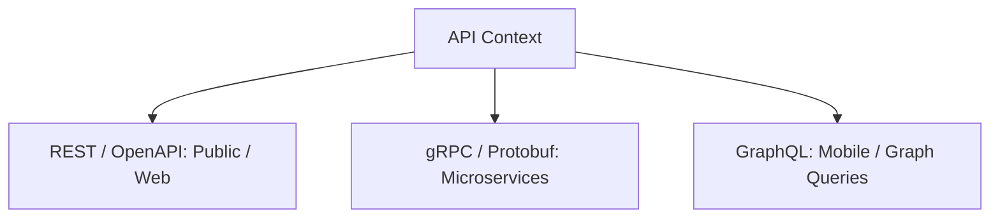
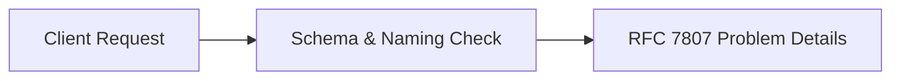
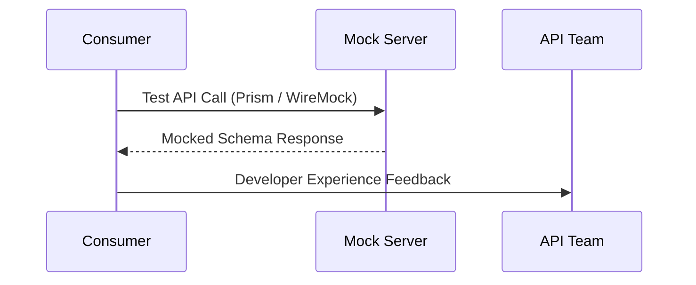
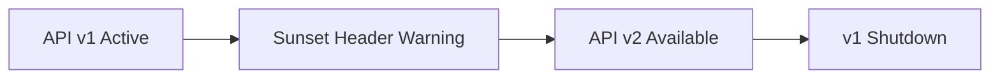

# API Design & Evolution

## When
Triggered when designing new public or internal APIs, adopting contract-first development, or defining API versioning and deprecation strategies. Use this workflow to design scalable, developer-friendly APIs.

---

## Phase 1 — Protocol Selection

**Do:**
- Evaluate REST/OpenAPI, gRPC/Protobuf, or GraphQL based on client constraints and latency targets.
- Document protocol trade-offs and transport choice rationale.
**Ask:**
- What are client bandwidth, low latency, public developer experience, or web/mobile requirements?

---

## Phase 2 — Contract-First Design

**Do:**
- Write machine-readable specifications (OpenAPI 3.1 or Protobuf schemas) before writing code.
- Run Spectral linters to enforce consistency rules across teams.
**Ask:**
- Is the API contract fully specified and linted independently of implementation code?

---

## Phase 3 — Schema & DX Review

**Do:**
- Review schema naming conventions (camelCase/snake_case), cursor pagination, and filtering paradigms.
- Enforce RFC 7807 Problem Details standard for structured, machine-readable error responses.
**Ask:**
- Do error responses strictly follow RFC 7807 formatting with actionable diagnostic detail?

---

## Phase 4 — Mocking & Consumer Feedback

**Do:**
- Launch mock servers (Prism or WireMock) derived directly from the OpenAPI/Protobuf contract.
- Collect early DX feedback from frontend and third-party API consumers.
**Ask:**
- Have client teams successfully built prototypes against mock servers to validate contract ergonomics?

---

## Phase 5 — Versioning & Lifecycle

**Do:**
- Establish explicit versioning rules (URL path `/v1/` or Header `Accept-Version`).
- Define deprecation policies, Sunset response headers, and backward-compatibility breaking rules.
**Ask:**
- Is a formal deprecation timeline with Sunset headers enforced before retiring old versions?

---

## Deliverables
- [ ] Protocol-selection ADR when the choice is consequential, hard-to-reverse, and has competing options
- [ ] Linted OpenAPI 3.1 / Protobuf specification
- [ ] RFC 7807 error format & DX guideline checklist
- [ ] Active mock server instance (Prism / WireMock)
- [ ] API versioning strategy & deprecation lifecycle policy

## Pitfalls
| Temptation | Mitigation |
|---|---|
| Leaking DB schemas | Map internal DB entities to decoupled external DTO contracts |
| Breaking backwards compat | Enforce additive changes only; use deprecation windows for breaking edits |
| Inconsistent error formats | Mandate RFC 7807 Problem Details schema for all error responses |

## Approvers
API Guild Lead, DX Lead, Frontend/Client Leads
