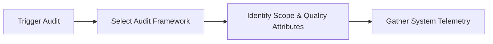
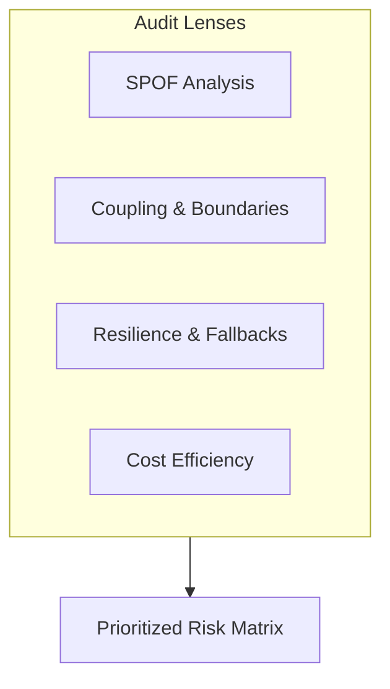
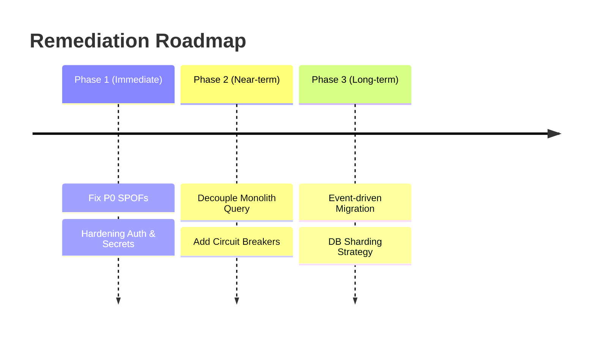

# Architecture Audit

## When

Reviewing an existing system, evaluating scaling/resilience risks, or conducting due diligence.

---

## Phase 1 — Scope & Lens Selection

**Do:**
- Define audit goals (scalability, security, tech debt, compliance, cost)
- Select evaluation framework (AWS Well-Architected, ATAM, arc42 risk assessment)
- Collect telemetry: CPU/memory metrics, error rates, p95/p99 latency, cloud costs

**Ask:**
- What are the single points of failure (SPOFs)?
- Which components breach reliability/latency targets under load?
- Are cloud costs scaling linearly or exponentially relative to user growth?

---

## Phase 2 — System Evaluation

Evaluate against architectural qualities using C4 diagrams and telemetry.

**Do:**
- Trace request flows across service boundaries
- Identify sinkhole layers and pass-through abstractions
- Check for hardcoded credentials, unencrypted data in transit/at rest
- Validate database access patterns (N+1 queries, unindexed searches)

---

## Phase 3 — Risk Scoring & Findings

Categorize findings by severity and impact:

| Risk ID | Component | Issue Description | Severity | Impact | Mitigation Strategy |
|---|---|---|---|---|---|
| R-01 | [Component] | [Single Point of Failure] | CRITICAL | Outage | Add replica + auto-failover |
| R-02 | [Component] | [Unbounded queue / memory leak] | HIGH | Degradation | Add rate limiting / bulkhead |

---

## Phase 4 — Remediation Roadmap

Create an actionable, phased remediation plan:

---

## Deliverables

- [ ] Telemetry & inventory summary (Phase 1)
- [ ] Risk assessment matrix with severity scores (Phase 3)
- [ ] Architectural recommendations with tradeoffs (Phase 3)
- [ ] Phased remediation roadmap (Phase 4)
- [ ] ADRs drafted only for consequential, hard-to-reverse structural recommendations with competing options

## Pitfalls

| Temptation | Mitigation |
|---|---|
| Auditing without empirical metrics | Base findings strictly on runtime telemetry and code evidence |
| Passive report with no backlog connection | Translate findings directly into prioritized tech-debt tickets |
| Focusing only on code, ignoring SRE | Audit operational practices (monitoring, backups, runbooks) |

## Approvers

Chief Architect, Head of Engineering, CISO, SRE Lead.
