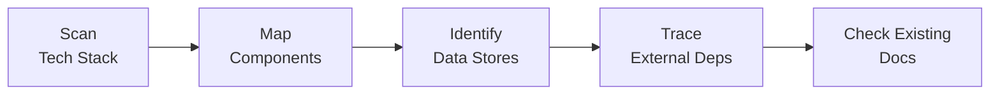
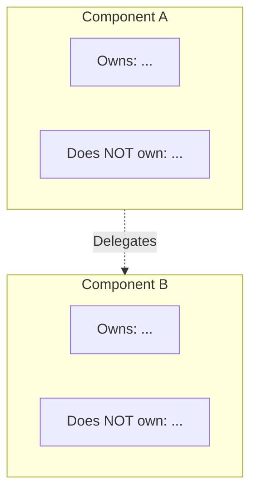
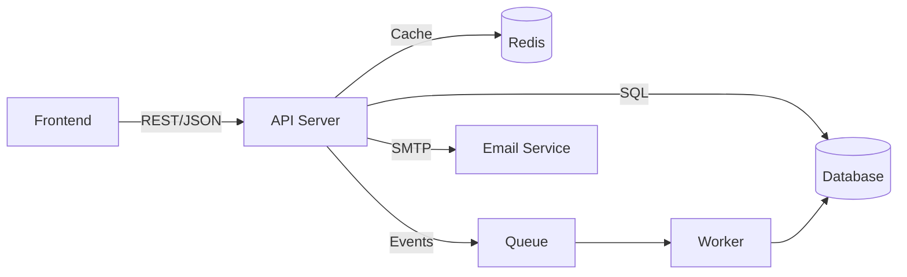

# Brownfield Documentation

## When

Existing system with missing, outdated, or incomplete architecture documentation.
Most common architecture task — default workflow when nothing else matches.

---

## Phase 1 — Codebase Archaeology

**Do:**
- Identify technology stack: language, framework, database, queue, cache, CDN, cloud
- Identify component boundaries: what are the deployable units?
- Identify data stores: databases, caches, object stores, file systems
- Identify external services: third-party APIs the system depends on
- Check for existing docs: architecture doc, README architecture section, ADRs

**Deliverable:** Architecture inventory listing every component, data store, and external service.

---

## Phase 2 — Responsibility Split

For each component, define ownership and boundaries.

**Format per component:**
- **Owns**: Business logic, data validation, etc. (one paragraph)
- **Does NOT own**: Explicit boundaries — what looks like it belongs here but doesn't

---

## Phase 3 — Data Ownership Mapping

For each data entity (from `GLOSSARY.md` or discovered in code):

| Entity | Owned By | Schema Location | Access Pattern |
|---|---|---|---|
| [Entity] | [Service] | [file:line or table name] | [API only / direct DB / event] |

**Key questions:**
- What is the single source of truth for each business entity?
- Where are hidden coupling dependencies across boundaries?
- What parts of the system are untested/unmonitored ("dark code")?

---

## Phase 4 — Data Flow Diagram

Draw how data moves between components. Use mermaid (default) or ASCII.

**Do:**
- Show the primary read path and primary write path
- Label protocols/formats on edges
- If too complex, simplify to the main happy path first

---

## Phase 5 — API Contract Strategy

Document how contracts are defined, synchronized, and validated:

| Aspect | Detail |
|---|---|
| **Format** | OpenAPI 3.x / gRPC protobuf / GraphQL schema / informal |
| **Source of truth** | Backend code / spec file / contract repo |
| **Frontend sync** | Auto-generated types / manual / none |
| **Drift detection** | CI check / manual / none |
| **Breaking change policy** | Versioned / ad-hoc / undefined |

---

## Phase 6 — Non-Goals

Explicitly state what is OUT of scope:

- Infrastructure provisioning
- CI/CD pipeline design
- Mobile app architecture (if separate team)
- Historical migration plans
- Performance SLAs (if covered elsewhere)

---

## Deliverables

- [ ] Architecture inventory (Phase 1)
- [ ] Responsibility split documented (Phase 2)
- [ ] Data ownership table (Phase 3)
- [ ] Data flow diagram in mermaid (Phase 4)
- [ ] API contract strategy (Phase 5)
- [ ] Non-goals section (Phase 6)
- [ ] Final `docs/architecture.md` with all sections

## Pitfalls

| Temptation | Mitigation |
|---|---|
| Document "aspirational" architecture | Describe actual runtime reality; mark targets separately |
| Describe every class and module | Architecture doc ≠ code tour; focus on component boundaries |
| Skip data ownership table | It's the most valuable section — forces clarity on who owns what |
| Use directory structure as architecture | Infer boundaries from deployable units, not directories |
| Generate architecture from code alone | Code reflects implementation, not intent; talk to maintainers |

## Approvers

System Technical Lead, Senior Maintainers, DevOps/SRE Lead.
