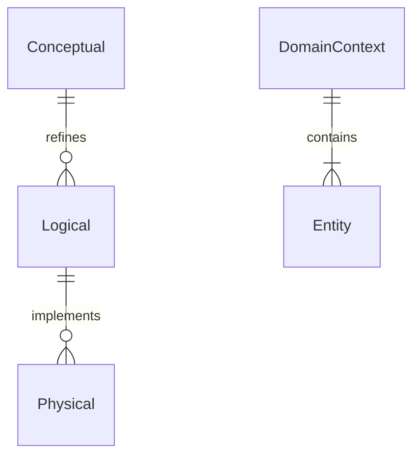
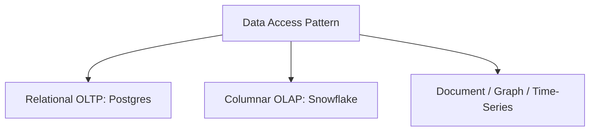
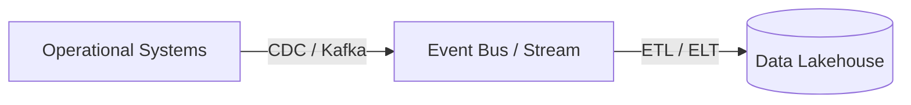
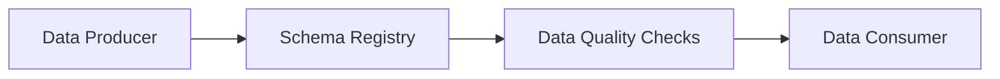
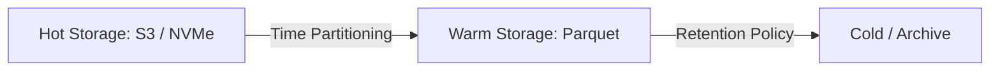

# Data Architecture Design

## When
Triggered when building enterprise data warehouse/lakehouse platforms, implementing real-time streaming systems, or migrating to a domain-driven data mesh. Use this workflow to design scalable data architectures.

---

## Phase 1 — Data Domain Modeling

**Do:**
- Construct conceptual, logical, and physical data models with formal Entity-Relationship diagrams.
- Define domain boundaries, entity key structures, normalization levels, and access patterns.
**Ask:**
- Are entity models aligned with bounded domain contexts and operational read/write requirements?

---

## Phase 2 — Engine & Storage Selection

**Do:**
- Select storage engines (OLTP relational, OLAP columnar, document, graph, time-series) based on access patterns.
- Benchmark write throughput, query latency, and indexing capabilities for candidate engines.
**Ask:**
- Is analytical workload isolated from transactional OLTP engine instances?

---

## Phase 3 — Ingestion & Pipeline Architecture

**Do:**
- Design ETL/ELT pipelines, CDC capture streams, and event stream topologies (e.g., Kafka, Flink).
- Implement idempotent pipeline executions and retryable stateful stream processors.
**Ask:**
- Does pipeline ingestion handle out-of-order data delivery and late-arriving events seamlessly?

---

## Phase 4 — Data Governance

**Do:**
- Enforce data contracts, schema registry enforcement, and lineage tracking (e.g., OpenLineage).
- Integrate automated data quality checks (e.g., Great Expectations) into ingestion pipelines.
**Ask:**
- Are breaking schema evolution changes blocked by a central schema registry prior to pipeline failure?

---

## Phase 5 — Storage Lifecycle

**Do:**
- Configure table partitioning, indexing strategies, and hot/cold tiering lifecycle rules.
- Automate retention policies, data anonymization, and regulatory deletion workflows.
**Ask:**
- Are automated retention, archiving, and deletion policies configured to comply with regulations?

---

## Deliverables
- [ ] Conceptual, logical, and physical ER data models
- [ ] Access-pattern benchmark and a database-engine ADR only when the canonical ADR threshold is met
- [ ] Ingestion pipeline topology spec (CDC, ETL/ELT, streaming)
- [ ] Data contract, lineage, and schema registry configuration
- [ ] Storage lifecycle, partitioning, and compliance retention policy

## Pitfalls
| Temptation | Mitigation |
|---|---|
| Analytics on OLTP | Route analytical queries to dedicated read replicas or OLAP columnar stores |
| Ungoverned data swamp | Enforce schema registries, data contracts, and automated quality gates |
| Uncontrolled schema drift | Gate schema evolution through schema registry compatibility checks |

## Approvers
Chief Data Architect, Data Engineering Manager, Analytics Lead
