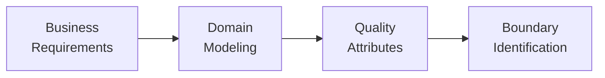
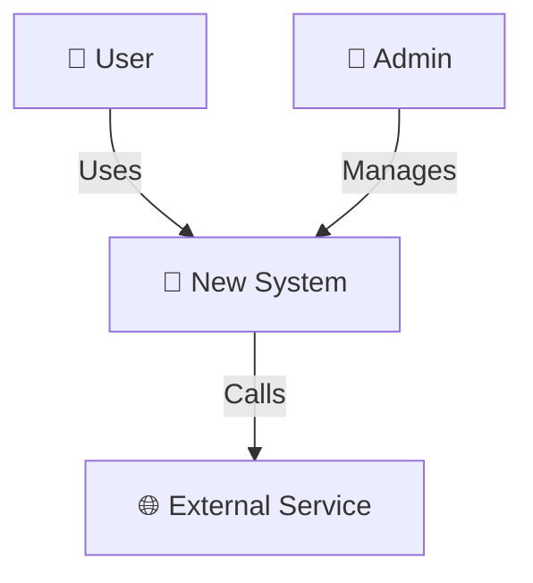
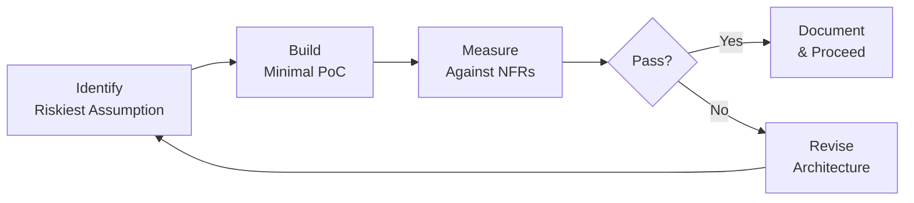

# Greenfield System Design

## When

New system, new major subsystem, or new domain service with no existing architecture.

---

## Phase 1 — Domain & Requirements Discovery

**Do:**
- Run Event Storming or lightweight domain discovery
- Identify NFRs: availability %, p99 latency, data retention
- Project scale: RPS, storage growth over 1–3 year horizon
- Identify compliance boundaries (GDPR, HIPAA, SOC2)

**Ask:**
- What are the explicit SLA/SLO expectations?
- Does the team have operational mastery of the chosen stack?
- What is the projected scale in 1–3 years?

---

## Phase 2 — C4 Context & Container Modeling

Draw C4 Level 1 (System Context) and Level 2 (Container).
Use templates from `../visualization/c4-mermaid-templates.md`.

**Do:**
- Map all human actors and external systems (Level 1)
- Identify deployable units and their technologies (Level 2)
- Show communication protocols between containers

---

## Phase 3 — Pattern Selection

1. Load `../patterns/INDEX.md`
2. Match project concerns to pattern tags (scaling, decoupling, consistency, etc.)
3. Load the relevant category file
4. Document chosen-pattern rationale in the active design; select an ADR only when
   the canonical ADR threshold in `.agents/rules/phased-delivery.md` is met.

**Potential ADR candidates (only at the canonical threshold):**
- Monolith vs microservices vs modular monolith
- Sync vs async communication
- Data store selection
- API protocol (REST, gRPC, GraphQL)

---

## Phase 4 — Architecture Spike

Build an isolated PoC to validate critical assumptions.

**Time-box:** Max 3 days per spike.

**Validate:**
- Latency under expected load
- Data consistency guarantees
- Integration with external services
- Operational complexity (deploy, monitor, debug)

---

## Phase 5 — Document & Conditional ADR

Produce these deliverables:

- [ ] C4 Context diagram (Level 1)
- [ ] C4 Container diagram (Level 2)
- [ ] Component diagram for critical services (Level 3, if multi-service)
- [ ] Data ownership table
- [ ] API contract strategy (format, source of truth, sync, drift detection)
- [ ] ADR for each consequential, hard-to-reverse pattern/technology choice with competing options
- [ ] Non-goals section (explicit out-of-scope)

**Data ownership table format:**

| Entity | Owned By | Schema Location | Access Pattern |
|---|---|---|---|
| [Entity] | [Service] | [file:line or table name] | [API only / direct DB / event] |

---

## Pitfalls

| Temptation | Mitigation |
|---|---|
| Premature microservice decomposition | Start modular monolith; split when evidence demands it |
| Choosing tech by hype | Evaluate alternatives; create an ADR only when the canonical threshold is met |
| Under-specifying NFRs | Phase 1 must produce measurable quality attributes |
| Skipping the spike | Phase 4 catches wrong assumptions early — 3 days saves 3 months |
| Designing for 10× current scale on day 1 | Design for 2× with clear scaling path; over-engineering kills velocity |

## Approvers

Principal/Staff Architect, Engineering Director, Security Lead, Product Manager.
