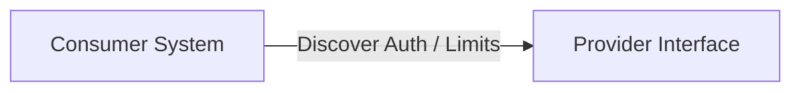
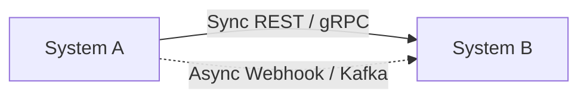
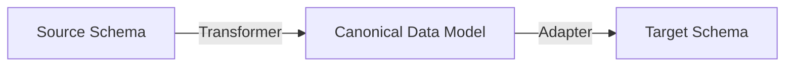
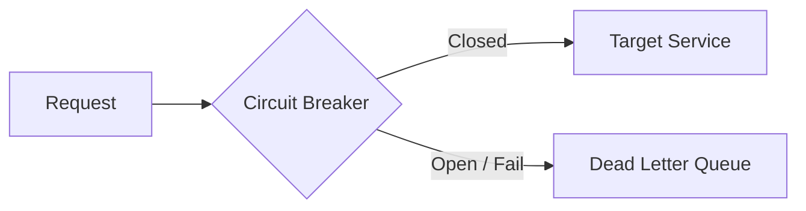
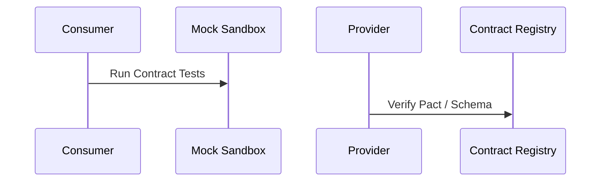

# System Integration Design

## When
Triggered when connecting internal systems, integrating third-party SaaS platforms, building partner ecosystems, or executing M&A technical integration. Use this workflow to design resilient cross-system integrations.

---

## Phase 1 — Interface Discovery

**Do:**
- Audit target APIs, authentication mechanisms (OAuth2, mTLS, API keys), and rate limits.
- Inspect provider schemas, SLA guarantees, and error response specs.
**Ask:**
- What are the rate limits, quota reset windows, and expected system availability SLAs?

---

## Phase 2 — Pattern Selection

**Do:**
- Evaluate synchronous (REST/gRPC) vs asynchronous (Webhooks/Kafka/ETL) interaction patterns.
- Define messaging protocol and backpressure handling mechanisms.
**Ask:**
- Can this integration tolerate event latency, or does the business demand instant consistency?

---

## Phase 3 — Data Contract & Mapping

**Do:**
- Establish canonical domain data models and document field-level mapping rules.
- Enforce strict JSON Schema / Protobuf definitions with backward compatibility rules.
**Ask:**
- How are breaking schema changes from third-party partners detected and managed?

---

## Phase 4 — Resilience Strategy

**Do:**
- Implement circuit breakers, exponential backoff retries, and Dead Letter Queues (DLQ).
- Design idempotent event handlers with unique deduplication tokens.
**Ask:**
- What is the operational fallback when the remote partner system experiences an outage?

---

## Phase 5 — Contract Testing

**Do:**
- Set up Consumer-Driven Contract testing (e.g., Pact) and sandbox environment verification.
- Automate integration test assertions against staging sandbox environments.
**Ask:**
- Are contract tests integrated into CI/CD pipelines to catch breaking changes before release?

---

## Deliverables
- [ ] Interface discovery document & API audit
- [ ] Integration pattern & protocol ADR
- [ ] Canonical data mapping schema & versioning rules
- [ ] Resilience configuration (Circuit breaker, Retry, DLQ specs)
- [ ] Consumer-driven contract test suite & sandbox validation

## Pitfalls
| Temptation | Mitigation |
|---|---|
| Tight sync coupling | Prefer async event streams/webhooks for non-blocking operations |
| Unversioned contracts | Enforce semver for API specs and strict canonical mapping |
| No partial failure design | Implement circuit breakers, retries, and DLQ replay capabilities |

## Approvers
Integration Architect, Security Architect, API Lead, External Partner
