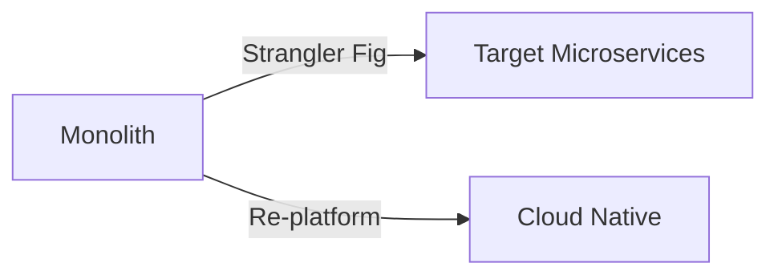
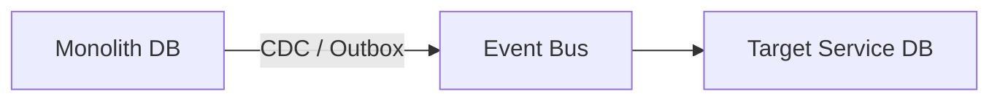
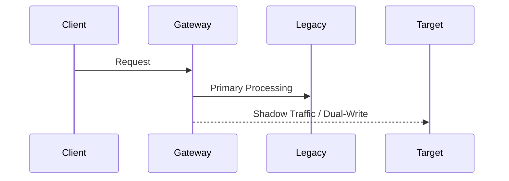
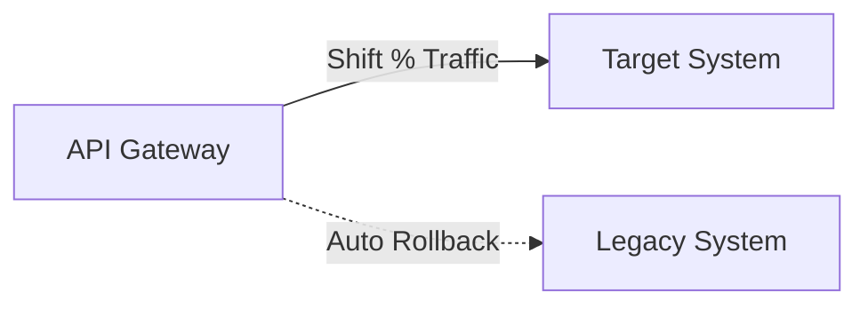
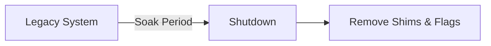

# Migration Planning

## When
Triggered when executing monolith-to-microservices decomposition, cloud platform migration, or database engine migration. Use this workflow to maintain system continuity and zero-downtime cutover.

---

## Phase 1 — Target Architecture Definition

**Do:**
- Evaluate migration patterns (Strangler Fig, Database-per-service, Re-platform vs Re-architect).
- Define target state architecture, success criteria, and non-negotiable NFRs.
**Ask:**
- What are the hard deadlines, legacy constraints, or compliance drivers for migration?

---

## Phase 2 — Domain Boundary Decoupling

**Do:**
- Map bounded contexts and define clear data ownership boundaries.
- Implement Change Data Capture (CDC) or Transactional Outbox pattern for event emission.
**Ask:**
- Which domain boundaries have clean separation with low direct database dependencies?

---

## Phase 3 — Coexistence & Dual-Running

**Do:**
- Configure feature flags, shadow traffic mirroring, and dual-writing logic.
- Set up continuous automated data reconciliation to detect divergence.
**Ask:**
- How will data divergence between legacy and target systems be flagged and repaired?

---

## Phase 4 — Cutover Execution

**Do:**
- Execute progressive traffic shifting via API Gateway or DNS routing.
- Continuously monitor latency, error rates, and p95/p99 SLO metrics during cutover.
**Ask:**
- What specific error or performance threshold automatically triggers an instant rollback?

---

## Phase 5 — Decommissioning

**Do:**
- Shut down legacy components after a successful stability soak period.
- Remove migration shims, temporary feature flags, and proxy redirect layers.
**Ask:**
- Have all downstream consumers successfully shifted off legacy migration shims?

---

## Deliverables
- [ ] Target architecture blueprint & pattern ADRs
- [ ] Bounded context definitions & CDC event schemas
- [ ] Dual-running proxy & reconciliation pipeline
- [ ] Traffic cutover runbook & automated rollback plan
- [ ] Legacy decommissioning sign-off & cleanup verification

## Pitfalls
| Temptation | Mitigation |
|---|---|
| Big Bang cutover | Use Strangler Fig with incremental percentage traffic shifts |
| Shared monolithic DB | Enforce database-per-service via CDC and event streaming |
| No rollback strategy | Define automated rollback criteria before shifting traffic |
| No data reconciliation | Implement continuous background diff tooling during dual-run |

## Approvers
Migration Lead, Data Engineering Lead, SRE, Product Stakeholders
