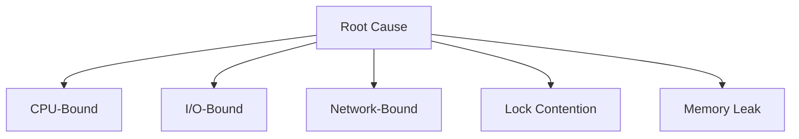
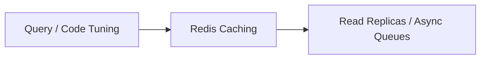
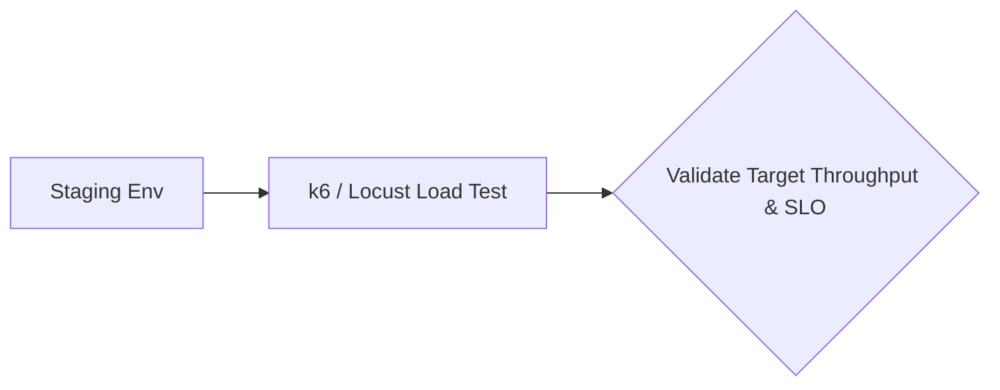
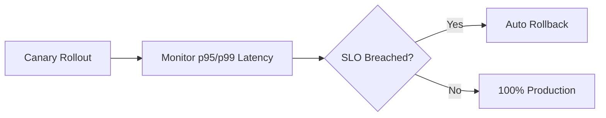

# Performance & Scalability Redesign

## When
Triggered when breaching latency SLOs, encountering DB connection exhaustion, preparing for peak traffic events, or addressing high cloud infrastructure bills. Use this workflow to systematically resolve bottlenecks.

---

## Phase 1 — Profiling & Diagnostics

**Do:**
- Collect flame graphs, distributed APM traces, DB slow query logs, and garbage collection metrics.
- Establish baseline latency (p50, p95, p99) and resource utilization metrics under production load.
**Ask:**
- What empirical diagnostic data isolates the exact component causing performance degradation?

---

## Phase 2 — Bottleneck Categorization

**Do:**
- Categorize bottlenecks into CPU-bound, I/O-bound, Network-bound, Lock Contention, or Memory Leaks.
- Trace resource starvation down to specific queries, inefficient loops, or thread pool blockages.
**Ask:**
- Is the system bottleneck constrained by database I/O, CPU compute limit, or lock contention?

---

## Phase 3 — Redesign Strategy

**Do:**
- Implement targeted fixes: query optimization, Redis caching, read replicas, sharding, or async queues.
- Restructure blocking calls into non-blocking asynchronous event processing.
**Ask:**
- Does caching solve the underlying bottleneck, or does it merely mask un-indexed or flawed queries?

---

## Phase 4 — Load Testing

**Do:**
- Execute realistic load and stress testing using k6 or Locust in staging environments.
- Verify target throughput (RPS), p95/p99 latency bounds, and failure modes under 2x-5x peak load.
**Ask:**
- Did staging load testing validate that target RPS and p99 SLO limits are satisfied?

---

## Phase 5 — Canary Deployment

**Do:**
- Perform progressive canary deployment with real-time automated telemetry monitoring.
- Configure automated deployment rollback upon p95/p99 latency degradation or error rate spikes.
**Ask:**
- Are automated canary evaluation metrics configured to instantly trigger a rollback upon breach?

---

## Deliverables
- [ ] Profiling baseline report (Flame graphs, APM, slow query logs)
- [ ] Bottleneck classification & root cause analysis
- [ ] Performance-redesign ADR only when the canonical ADR threshold is met
- [ ] Staging load test report (k6/Locust throughput & p95/p99 latency)
- [ ] Canary deployment pipeline & automated rollback rules

## Pitfalls
| Temptation | Mitigation |
|---|---|
| Guessing bottlenecks | Rely strictly on flame graphs, APM traces, and slow query log metrics |
| Caching over flawed queries | Fix database indexes and N+1 queries before introducing caching |
| Premature optimization | Measure baseline first; optimize only proven bottlenecks exceeding SLOs |

## Approvers
Performance Lead, DBA, Platform Architect
