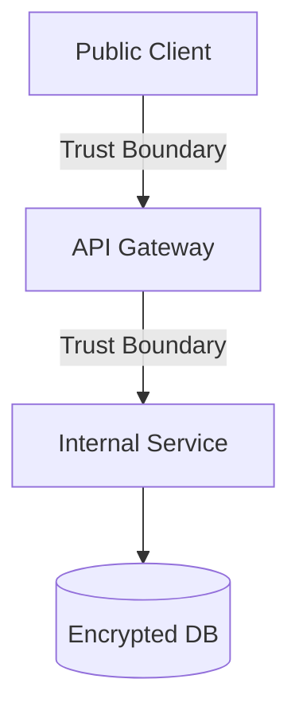
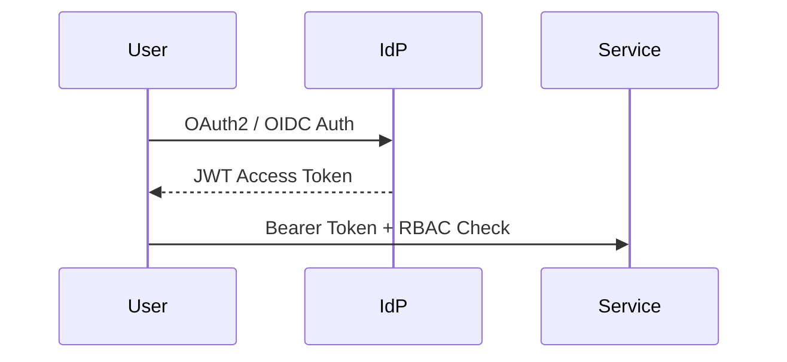
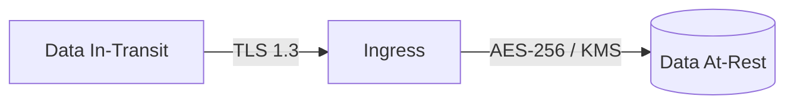
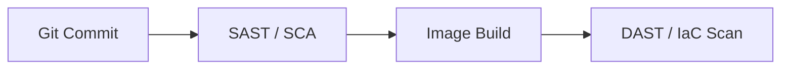
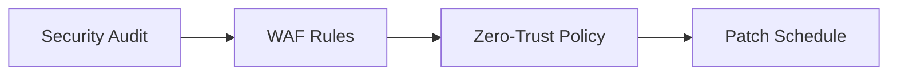

# Security Architecture Review

## When
Triggered when exposing public APIs, processing sensitive data (PII/PHI/PCI), establishing zero-trust access controls, or conducting compliance audits. Use this workflow to embed security controls into system architecture.

---

## Phase 1 — Threat Modeling

**Do:**
- Conduct STRIDE threat modeling on Data Flow Diagrams (DFD) with explicit trust boundaries.
- Map entry points, attack surfaces, privilege levels, and high-value data targets.
**Ask:**
- What are the explicit trust boundaries and potential threat vectors across component edges?

---

## Phase 2 — Control & IAM Audit

**Do:**
- Audit OAuth2/OIDC authentication protocols, RBAC/ABAC granularities, and token validation logic.
- Verify secret storage implementations (Vault/KMS) and secret injection mechanisms.
**Ask:**
- How are expired JWTs revoked, and are secrets stored strictly outside code repositories?

---

## Phase 3 — Data Protection

**Do:**
- Enforce TLS 1.3 for data in-transit and AES-256 encryption with KMS key rotation for data at-rest.
- Implement field-level encryption, data masking, and log sanitization for PII/PHI/PCI attributes.
**Ask:**
- Is sensitive PII/PHI data masked in logs and encrypted at-rest using managed KMS keys?

---

## Phase 4 — Automated Security Scanning

**Do:**
- Integrate SAST, DAST, Software Composition Analysis (SCA), and IaC policy checks into CI/CD pipelines.
- Define vulnerability severity thresholds (e.g., zero Critical/High CVEs allowed in release).
**Ask:**
- Are automated security gates blocking PR builds with unresolved critical vulnerabilities?

---

## Phase 5 — Mitigation Plan

**Do:**
- Formulate zero-trust network policies, WAF filtering rules, and patch management SLA schedules.
- Establish incident response runbooks and SIEM log aggregation streams.
**Ask:**
- Are automated patch schedules and zero-trust network policies enforced across environments?

---

## Deliverables
- [ ] DFD threat model & STRIDE risk matrix
- [ ] IAM protocol audit & secret storage verification
- [ ] Data encryption, key rotation, and masking specification
- [ ] Automated security scanning pipeline configuration (SAST/DAST/IaC)
- [ ] Security mitigation plan, WAF policy, & incident response runbook

## Pitfalls
| Temptation | Mitigation |
|---|---|
| Hardcoded secrets | Mandatory secret manager injection with pre-commit git secret blocking |
| Perimeter-only security | Implement Zero-Trust microsegmentation and mTLS between internal nodes |
| Security as afterthought | Perform STRIDE threat modeling before writing production code |

## Approvers
CISO, Security Architect, Compliance Officer
