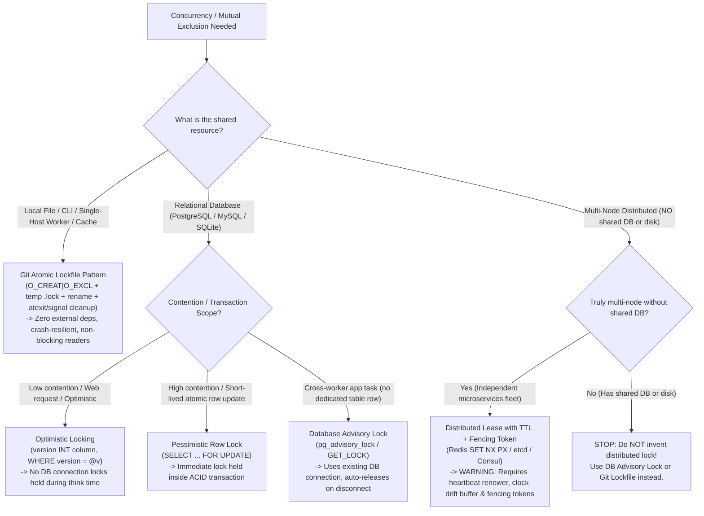
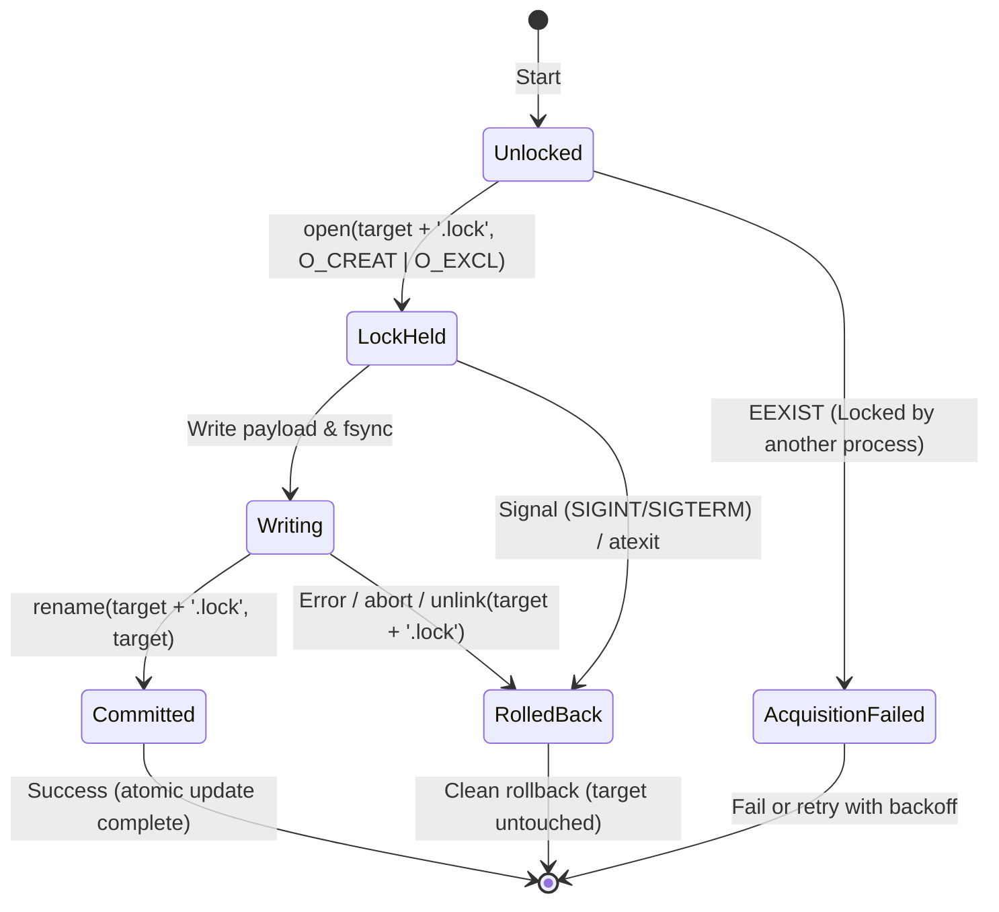

# Lock Implementation Patterns & Decision Framework

> Choose the simplest, most compatible locking strategy. Follow Git's proven lockfile pattern (`lockfile.h`) for local state instead of inventing complex locking schemes.

---

## 1. Quick Decision Framework: Locking Strategy

When you need mutual exclusion or concurrency control, use this decision tree before writing any code:



### Summary Comparison Table

| Strategy | Scope | Dependencies | Readers Block? | Crash Recovery | Best Used For |
|---|---|---|---|---|---|
| **Git Atomic Lockfile** | Single host, file, CLI, process | **None** (OS filesystem only) | **No** (atomic swap) | `atexit` + signals + stale PID check | CLI tools, background workers, local databases, config/index updates |
| **Optimistic Lock** | Relational DB row | Existing RDBMS | **No** (MVCC) | N/A (stateless version check) | Web apps, REST APIs, low-contention entities |
| **Pessimistic Row Lock** | Relational DB row | Existing RDBMS | Depends on isolation | Automatic on rollback / disconnect | Financial balances, inventory deduction inside transaction |
| **Database Advisory Lock** | Cross-process app task | Existing RDBMS | No (application-level) | Automatic on connection close | Cron jobs, background queues, leader election when DB exists |
| **Distributed Lease** | Multi-node cluster | Redis / etcd / Consul | App-defined | Lease TTL expiry | Multi-cloud microservices with **no** shared DB or disk |

---

## 2. Git Atomic Lockfile Pattern (`lockfile.h`)

Git manages index files, branch refs, and config files across concurrent CLI processes and background jobs without any central server or lock daemon. It uses the canonical lockfile pattern defined in Git's [`lockfile.h`](https://github.com/git/git/blob/master/lockfile.h).

### Core Mechanics

1. **Atomic Acquisition (`O_CREAT | O_EXCL`)**:
   - To update `data.json`, attempt to create `data.json.lock` using exclusive file creation flags (`O_CREAT | O_EXCL` in POSIX, `'wx'` in Node.js, `x` mode in Python).
   - If the file already exists (`EEXIST`), another process holds the lock. Acquisition fails immediately without race conditions (eliminating Time-Of-Check to Time-Of-Use / TOCTOU bugs).
2. **Write to Temporary Lockfile**:
   - The writer writes all new content directly into `data.json.lock`.
   - If writing fails or is aborted, the target file `data.json` remains completely untouched and uncorrupted.
3. **Atomic Swap (`rename(2)`)**:
   - Once writing and flushing (`fsync`) are complete, atomically rename `data.json.lock` to `data.json`.
   - On POSIX and modern Windows systems, `rename` within the same filesystem is atomic.
4. **Non-Blocking Readers**:
   - Readers never acquire locks and never block.
   - Because `rename` is atomic, readers always see either the complete old version or the complete new version. Readers **never** see partial, incomplete, or corrupted writes.
5. **Automatic Cruft Removal (Crash Safety)**:
   - Writers register `atexit` handlers and termination signal traps (`SIGINT`, `SIGTERM`, `SIGHUP`, `SIGQUIT`).
   - If the process exits or is terminated before commit, the lockfile is automatically unlinked, releasing the lock.

### Lockfile Lifecycle State Machine



---

## 3. Stale Lock Detection & Recovery

If a process is killed via `SIGKILL` (`kill -9`) or host power fails, userland signal handlers cannot run, leaving an orphaned `.lock` file.

### Metadata Protocol
Write lock ownership metadata into the `.lock` file immediately upon creation:
```json
{"pid": 42105, "created_at": 1727960000, "hostname": "worker-1"}
```

### Stale Lock Check Algorithm
When acquisition returns `EEXIST`:
1. **Read Lock Metadata**: Parse `pid` and `created_at` from `<file>.lock`.
2. **Check Process Liveness**:
   - On POSIX: Send signal 0 (`kill(pid, 0)`). If it returns `ESRCH` (No such process), the holding process is dead.
   - On Windows: Check `OpenProcess` with `PROCESS_QUERY_LIMITED_INFORMATION`.
3. **Check Lock Age (TTL)**:
   - If `now - created_at > max_stale_seconds` (e.g. 60s) AND process is confirmed dead, the lock is stale.
4. **Break Stale Lock**:
   - Unlink the stale `<file>.lock` and re-attempt acquisition with `O_CREAT | O_EXCL`.

---

## 4. Production Implementation Blueprints

### Python Blueprint

```python
import os
import signal
import sys
import time
from pathlib import Path
from typing import Optional

class GitLockFile:
    """Atomic write-lock following Git's lockfile.h pattern."""

    def __init__(self, target_path: str | Path, timeout: float = 0.0, stale_timeout: float = 60.0):
        self.target_path = Path(target_path).resolve()
        self.lock_path = self.target_path.with_name(f"{self.target_path.name}.lock")
        self.timeout = timeout
        self.stale_timeout = stale_timeout
        self.fd: Optional[int] = None
        self._is_committed = False

    def __enter__(self):
        self.acquire()
        return self

    def __exit__(self, exc_type, exc_val, exc_tb):
        if exc_type is not None or not self._is_committed:
            self.rollback()

    def acquire(self):
        start_time = time.monotonic()
        while True:
            try:
                # O_CREAT | O_EXCL guarantees atomic creation without TOCTOU race
                self.fd = os.open(
                    self.lock_path,
                    os.O_CREAT | os.O_EXCL | os.O_WRONLY,
                    0o644,
                )
                # Write metadata for stale lock recovery
                meta = f"{os.getpid()}:{int(time.time())}\n".encode("utf-8")
                os.write(self.fd, meta)
                self._register_cleanup()
                return
            except FileExistsError:
                if self._try_break_stale_lock():
                    continue
                if (time.monotonic() - start_time) >= self.timeout:
                    raise TimeoutError(f"Could not acquire lock on {self.target_path} within {self.timeout}s")
                time.sleep(0.05)

    def _is_pid_alive(self, pid: int) -> bool:
        try:
            os.kill(pid, 0)
            return True
        except OSError:
            return False

    def _try_break_stale_lock(self) -> bool:
        try:
            content = self.lock_path.read_text(encoding="utf-8").strip()
            if not content or ":" not in content:
                return False
            pid_str, ts_str = content.split(":", 1)
            pid, ts = int(pid_str), int(ts_str)
            if not self._is_pid_alive(pid) or (time.time() - ts > self.stale_timeout):
                self.lock_path.unlink(missing_ok=True)
                return True
        except Exception:
            return False
        return False

    def _cleanup_signal_handler(self, signum, frame):
        self.rollback()
        sys.exit(128 + signum)

    def _register_cleanup(self):
        for sig in (signal.SIGINT, signal.SIGTERM):
            try:
                signal.signal(sig, self._cleanup_signal_handler)
            except (ValueError, AttributeError):
                pass  # Ignore in non-main threads

    def commit(self):
        """Flush, close descriptor, and atomically rename lockfile over target."""
        if self.fd is None:
            raise RuntimeError("Lock is not held")
        os.fsync(self.fd)
        os.close(self.fd)
        self.fd = None
        # Atomic rename guarantees readers see complete old or new content
        os.replace(self.lock_path, self.target_path)
        self._is_committed = True

    def rollback(self):
        """Close descriptor and remove lockfile, leaving target untouched."""
        if self.fd is not None:
            os.close(self.fd)
            self.fd = None
        if self.lock_path.exists():
            try:
                self.lock_path.unlink()
            except OSError:
                pass
```

### TypeScript / Node.js Blueprint

```typescript
import * as fs from "node:fs";
import * as path from "node:path";
import * as process from "node:process";

export class GitLockFile {
  private readonly targetPath: string;
  private readonly lockPath: string;
  private fd: number | null = null;
  private isCommitted = false;

  constructor(targetPath: string) {
    this.targetPath = path.resolve(targetPath);
    this.lockPath = `${this.targetPath}.lock`;
  }

  public acquire(): void {
    try {
      // 'wx' flag: Open for writing, fails if path exists (O_CREAT | O_EXCL)
      this.fd = fs.openSync(this.lockPath, "wx", 0o644);
      fs.writeSync(this.fd, `${process.pid}:${Math.floor(Date.now() / 1000)}\n`);
      this.registerSignalCleanup();
    } catch (err: any) {
      if (err.code === "EEXIST") {
        throw new Error(`Lock already held on ${this.targetPath} by another process`);
      }
      throw err;
    }
  }

  public commit(): void {
    if (this.fd === null) throw new Error("Lock is not held");
    fs.fsyncSync(this.fd);
    fs.closeSync(this.fd);
    this.fd = null;
    // Atomic rename
    fs.renameSync(this.lockPath, this.targetPath);
    this.isCommitted = true;
  }

  public rollback(): void {
    if (this.fd !== null) {
      try { fs.closeSync(this.fd); } catch {}
      this.fd = null;
    }
    if (fs.existsSync(this.lockPath)) {
      try { fs.unlinkSync(this.lockPath); } catch {}
    }
  }

  private registerSignalCleanup(): void {
    const cleanup = () => {
      this.rollback();
      process.exit(1);
    };
    process.once("SIGINT", cleanup);
    process.once("SIGTERM", cleanup);
    process.once("exit", () => {
      if (!this.isCommitted) this.rollback();
    });
  }
}
```

### Go Blueprint

```go
package lockfile

import (
	"fmt"
	"os"
	"os/signal"
	"syscall"
)

type GitLockFile struct {
	targetPath string
	lockPath   string
	file       *os.File
	committed  bool
}

func New(targetPath string) *GitLockFile {
	return &GitLockFile{
		targetPath: targetPath,
		lockPath:   targetPath + ".lock",
	}
}

func (l *GitLockFile) HoldForUpdate() error {
	// O_CREATE|O_EXCL ensures atomic creation without TOCTOU race
	f, err := os.OpenFile(l.lockPath, os.O_CREATE|os.O_EXCL|os.O_RDWR, 0644)
	if err != nil {
		if os.IsExist(err) {
			return fmt.Errorf("lock already held on %s", l.targetPath)
		}
		return err
	}
	l.file = f
	fmt.Fprintf(f, "%d\n", os.Getpid())

	// Handle cleanup on interrupt
	sigChan := make(chan os.Signal, 1)
	signal.Notify(sigChan, syscall.SIGINT, syscall.SIGTERM)
	go func() {
		<-sigChan
		l.Rollback()
		os.Exit(1)
	}()

	return nil
}

func (l *GitLockFile) Commit() error {
	if l.file == nil {
		return fmt.Errorf("lock is not held")
	}
	if err := l.file.Sync(); err != nil {
		l.Rollback()
		return err
	}
	_ = l.file.Close()
	l.file = nil

	// Atomic rename commits changes and unlocks
	if err := os.Rename(l.lockPath, l.targetPath); err != nil {
		l.Rollback()
		return err
	}
	l.committed = true
	return nil
}

func (l *GitLockFile) Rollback() {
	if l.file != nil {
		_ = l.file.Close()
		l.file = nil
	}
	if !l.committed {
		_ = os.Remove(l.lockPath)
	}
}
```

### Rust Blueprint (RAII Drop Safety)

```rust
use std::fs::{self, File, OpenOptions};
use std::io::{self, Write};
use std::path::{Path, PathBuf};

pub struct GitLockFile {
    target_path: PathBuf,
    lock_path: PathBuf,
    file: Option<File>,
    committed: bool,
}

impl GitLockFile {
    pub fn new<P: AsRef<Path>>(target_path: P) -> Self {
        let target = target_path.as_ref().to_path_buf();
        let mut lock_name = target.file_name().unwrap().to_os_string();
        lock_name.push(".lock");
        let lock = target.with_file_name(lock_name);

        Self {
            target_path: target,
            lock_path: lock,
            file: None,
            committed: false,
        }
    }

    pub fn hold_for_update(&mut self) -> io::Result<&mut File> {
        // create_new(true) translates to O_CREAT | O_EXCL
        let mut f = OpenOptions::new()
            .read(true)
            .write(true)
            .create_new(true)
            .open(&self.lock_path)?;

        writeln!(f, "{}", std::process::id())?;
        self.file = Some(f);
        Ok(self.file.as_mut().unwrap())
    }

    pub fn commit(mut self) -> io::Result<()> {
        if let Some(f) = self.file.take() {
            f.sync_all()?;
            drop(f);
        }
        // Atomic rename replaces destination
        fs::rename(&self.lock_path, &self.target_path)?;
        self.committed = true;
        Ok(())
    }

    pub fn rollback(&mut self) {
        self.file.take();
        if !self.committed && self.lock_path.exists() {
            let _ = fs::remove_file(&self.lock_path);
        }
    }
}

// RAII automatic rollback on panic or early return
impl Drop for GitLockFile {
    fn drop(&mut self) {
        self.rollback();
    }
}
```

---

## 5. Anti-Patterns & Prohibited Shortcuts

| Shortcut / Temptation | Why It's Dangerous | Correct Path |
|---|---|---|
| **Check-then-create (TOCTOU)**: `if not exists(f): create(f)` | Race condition: two processes both observe false and overwrite each other's data. | Use atomic `O_CREAT \| O_EXCL` (`'wx'` / `create_new(true)`). |
| **In-place file mutation**: `open("data.json", "w").write(...)` | A crash or power drop leaves a truncated or half-written corrupted file. | Write to `<file>.lock` and atomically rename onto destination. |
| **Premature Redis/ZooKeeper distributed lock** | Adds operational overhead, network latency, and clock-drift failure modes for local state. | Use Git lockfile for local state; DB advisory lock if an RDBMS is present. |
| **Forgotten signal / exit cleanup** | Crash leaves an orphaned lockfile that permanently blocks all future operations. | Always register `atexit` and `SIGINT`/`SIGTERM` traps + stale PID recovery. |
| **Cross-filesystem rename**: lockfile in `/tmp`, target in `/var/data` | `rename(2)` across filesystem mount boundaries fails with `EXDEV`. | Always place the `.lock` file in the **same directory** as the target file. |
| **Unnecessarily blocking readers** | Using heavy read-write shared file locks causes reader starvation. | Git lockfile only blocks writers. Readers read atomically swapped target without locks. |
