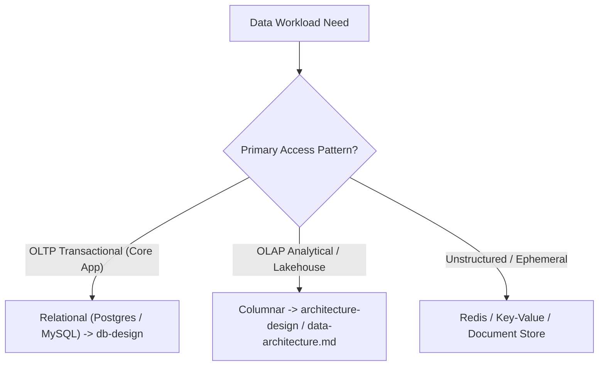

# Database Design (`db-design`)

Operational database engineering across the full lifecycle: schema modeling, indexing, constraints, concurrency, migrations, and strongly-typed repository mapping.

Progressive disclosure: this file is the decision gate and router. Deep technical guidelines live in `references/`.

| Concern | Load |
|---|---|
| Entity modeling, 1NF–3NF, PK/FK strategy | `references/schema-modeling.md` |
| Indexing, composite order, query tuning | `references/indexing-performance.md` |
| Integrity, structural constraints, enum storage, FK rules | `references/integrity-constraints.md` |
| State changes, soft deletes, audit history | `references/state-auditing-history.md` |
| Optimistic locking, MVCC, concurrency | `references/concurrency-locking.md` |
| Zero-downtime migrations (expand-contract) | `references/migrations-evolution.md` |
| Strongly-typed DTO / Repository mapping | `references/typed-mapping.md` |

---

## Gate 1 — Storage & Workload Check

If the task involves operational OLTP application state (user data, billing, orders, domain entities), proceed with `db-design`. If building analytical warehouses or streaming data pipelines, route to `architecture-design` (`data-architecture.md`).

---

## Gate 2 — Essential Database Design Checklist

Every database schema design delivered by an agent MUST pass these 7 gates:

1. **Primary Key Choice**: Use **UUIDv7** or **ULID** for distributed/API entities (time-sortable + B-tree index friendly); `BigInt` auto-increment for internal-only lookup tables. Never random UUIDv4 as PKs.
2. **Schema Normalization**: Design in **3NF** by default. Do not use JSONB/Document columns as a substitute for structured relational tables.
3. **Indexing Strategy**: Every foreign key and query predicate (`WHERE`, `JOIN`, `ORDER BY`) MUST be evaluated for index coverage. Composite indexes must follow the leftmost prefix rule.
4. **Data Integrity**: Enforce structural constraints at the database level (`NOT NULL`, `FOREIGN KEY ON DELETE RESTRICT/CASCADE`, `UNIQUE`). Use `CHECK` constraints selectively for stable physical invariants (e.g. non-negative amounts, start/end ordering), not as the default mechanism for ORM/application enums or mutable workflow states. For app-domain enums, prefer plain string storage plus application-level validation so rolling deploys, deprecated values, and rollbacks remain backward-compatible.
5. **State & History**: No naive `is_deleted` flags without partial indexes (`WHERE is_deleted = false`). Use append-only audit log tables or CDC for immutable historical tracking.
6. **Concurrency**: High-contention entities MUST include an optimistic locking column (`version INT DEFAULT 1`).
7. **Strongly-Typed Repository Mapping**: Query results MUST map to explicit DTOs/Entities (e.g. `@dataclass`, Pydantic `BaseModel`, TS `interface`, Go/Rust `struct`). Returning raw tuples or untyped dicts is forbidden.

### Artifact Level Calibration

The 7 gates check the **schema design**, but the depth of evidence required depends on the artifact being reviewed or produced:

| Artifact | What the gates check | What belongs elsewhere |
|---|---|---|
| **Engineering design doc (TRD)** | The design *specifies* PK strategy (e.g. "UUIDv7"), normalization level, audit model, concurrency approach, and typed contracts. ER diagram shows entities, relationships, key types. | Exact DDL, index definitions, migration scripts, repository method signatures — these are implementation details for the code phase. |
| **Implementation / migration script** | The code *enforces* all 7 gates in actual DDL: `CREATE TABLE` with `NOT NULL`, `FK`, `UNIQUE`, selective invariant `CHECK`, `CREATE INDEX`, `version` column, typed repository returns. ORM/application enums may intentionally remain plain string columns with app-level validation for compatibility-safe rollouts. | Design rationale, ADR, alternative analysis — these belong in the TRD. |
| **Code review (PR)** | The diff *implements* the gates correctly: no raw tuples, no missing indexes, no naive soft-delete, no missing FK. | Design-level questions — defer to TRD review. |

**Do not fail a design doc for not containing implementation DDL.** A TRD that specifies "UUIDv7 PK, 3NF, append-only audit with polymorphic target, optimistic locking on mutable entities, typed repository DTOs" has passed the gates at the design level. The exact `CREATE INDEX` statements belong in the migration script.

---

## Workflow Routing

| Scenario | Trigger | Action |
|---|---|---|
| **Greenfield DB Schema** | Designing a new database or service tables | Load `references/schema-modeling.md` + `references/integrity-constraints.md` |
| **Index & Query Tuning** | Slow queries, missing indexes, scaling | Load `references/indexing-performance.md` |
| **Audit & State Tracking** | Soft deletes, history, compliance, events | Load `references/state-auditing-history.md` |
| **Concurrency & Safety** | Race conditions, updates, versioning | Load `references/concurrency-locking.md` |
| **Schema Evolution** | Adding/modifying columns in production | Load `references/migrations-evolution.md` |
| **Data Access / ORM Layer** | Writing repositories, queries, DTOs | Load `references/typed-mapping.md` |

---

## Hard Rules

- **Illustration-first**: Include an ER diagram (`mermaid erDiagram`) for all schema proposals.
- **Explicit types over tuples**: DB repositories must NEVER return positional tuples or untyped dicts.
- **Zero-downtime migrations**: Schema changes on live databases must use the Expand-Contract pattern. Never run destructive `DROP COLUMN` without a prior contract phase.
- **Compatibility-first enum storage**: For application-domain enums/status fields in ORM-backed services, prefer plain string columns plus typed application mapping/validation. Do not default to DB `ENUM` types or allowed-value `CHECK` lists unless the value set is truly immutable and schema-coupled deployment is acceptable.
- **No unindexed JSONB queries**: If a JSONB field is queried in a `WHERE` clause, it MUST have a GIN index or expression index.

---

## Deliverables

- [ ] ER diagram (`mermaid erDiagram`) with explicit field types & nullability
- [ ] Primary key strategy specified (UUIDv7 / ULID / BigInt)
- [ ] Foreign keys and UNIQUE indices defined
- [ ] Any `CHECK` constraints are justified as stable invariants rather than default enum/status gates
- [ ] Enum/storage compatibility strategy documented for persisted app-domain states
- [ ] Index strategy documented with target query access patterns
- [ ] Migration strategy (Expand-Contract plan if modifying existing schema)
- [ ] Strongly-typed DTO / Repository interface definition

---

## References

- `references/INDEX.md` — Master index of DB design reference guides
- `references/schema-modeling.md` — Normalization, PK/FK strategies, entity modeling
- `references/indexing-performance.md` — B-Tree, composite indexes, partial indexes, GIN
- `references/integrity-constraints.md` — Database-level safety & constraints
- `references/state-auditing-history.md` — Soft deletes vs audit tables vs temporal logs
- `references/concurrency-locking.md` — Optimistic locking & isolation levels
- `references/migrations-evolution.md` — Zero-downtime schema evolution
- `references/typed-mapping.md` — Strongly-typed DTO / Repository return mapping
