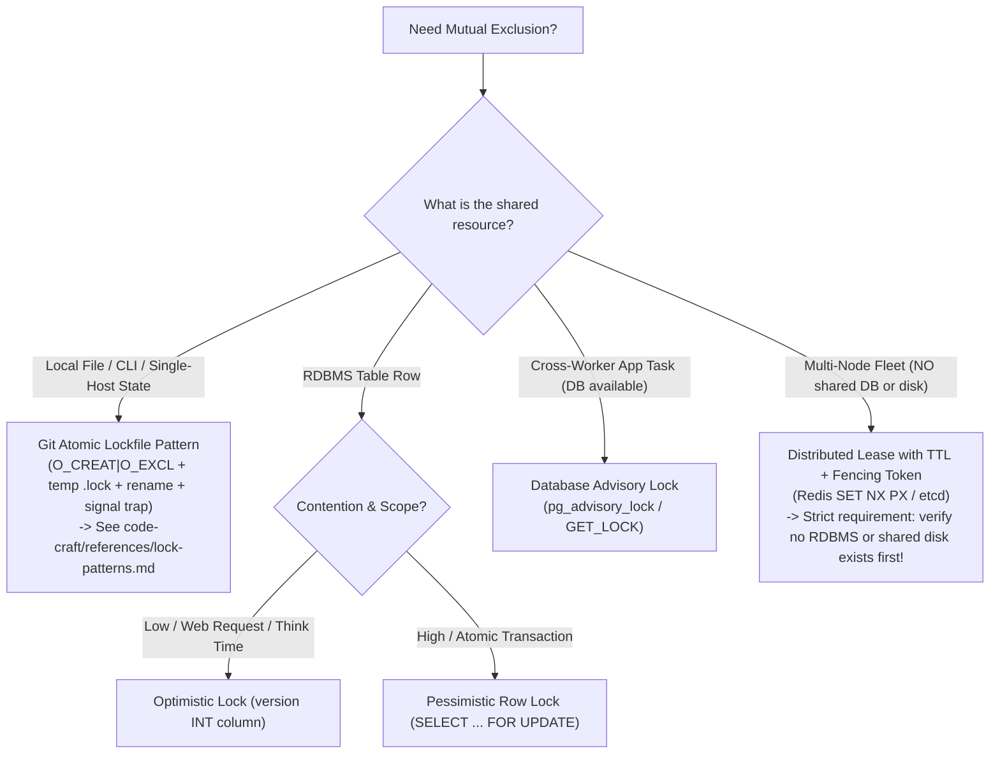

# Concurrency Control & Isolation Levels

## 1. Optimistic Locking (Recommended Default)

For high-contention domain entities (e.g. inventory balances, account balances, order status), use optimistic locking via a `version` column.

```sql
CREATE TABLE accounts (
    id UUID PRIMARY KEY,
    balance_cents BIGINT NOT NULL CHECK (balance_cents >= 0),
    version INT NOT NULL DEFAULT 1
);
```

### Application Lock Pattern
```sql
-- Read initial record
SELECT balance_cents, version FROM accounts WHERE id = '...';

-- Update with explicit version check
UPDATE accounts 
SET balance_cents = balance_cents - 1000, 
    version = version + 1 
WHERE id = '...' AND version = 1;

-- If rows_affected == 0, a concurrent update occurred! Raise OptimisticLockException & retry.
```

---

## 2. Pessimistic Row Locking (`FOR UPDATE`)

Use pessimistic row locking only for short-lived, high-stakes atomic operations:

```sql
BEGIN;
-- Lock target row until transaction completes
SELECT balance_cents FROM accounts WHERE id = '...' FOR UPDATE;

UPDATE accounts SET balance_cents = balance_cents - 1000 WHERE id = '...';
COMMIT;
```

---

## 3. Transaction Isolation Levels

| Isolation Level | Dirty Read | Non-Repeatable Read | Phantom Read | Use Case |
|---|---|---|---|---|
| **Read Committed** (Default) | Prevented | Allowed | Allowed | Standard web app transactions |
| **Repeatable Read** | Prevented | Prevented | Allowed | Financial audits / reporting batch reads |
| **Serializable** | Prevented | Prevented | Prevented | Strict sequential invariant enforcement |

---

## 4. Database Advisory Locks (Application Mutex via DB)

When you need mutual exclusion across multiple application workers (e.g. running a singleton cron job, batch sync, or migration) and an RDBMS is already available, **do not spin up Redis Redlock or ZooKeeper**. Use the database engine's built-in advisory locks:

### PostgreSQL Advisory Locks

```sql
-- Transaction-level: automatically released at COMMIT / ROLLBACK
SELECT pg_advisory_xact_lock(hashtext('nightly-settlement-job'));

-- Session-level: non-blocking try-lock (returns true if acquired, false otherwise)
SELECT pg_try_advisory_lock(123456789);
-- ... run protected operation ...
SELECT pg_advisory_unlock(123456789);
```

### MySQL Named Locks

```sql
-- Acquire lock with 5-second timeout (returns 1 on success, 0 on timeout)
SELECT GET_LOCK('nightly-settlement-job', 5);
-- ... run protected operation ...
SELECT RELEASE_LOCK('nightly-settlement-job');
```

**Key Advantages:**
- Reuses existing database connection infrastructure (zero extra services to monitor).
- If the worker process crashes or network drops, the database connection terminates and the lock is **automatically released** (zero stale lock hazard).

---

## 5. Quick Decision Framework: Choosing the Right Lock

Never invent complex locking schemes or reach for heavy distributed lock managers when a simpler pattern fits:



| Context | Recommended Pattern | Reference |
|---|---|---|
| **Local file, CLI, daemon, single-host worker** | **Git Atomic Lockfile** (`.lock` + rename + `atexit`/signals) | [Lock Patterns (`code-craft`)](../../code-craft/references/lock-patterns.md) |
| **Relational DB entity (general web app)** | **Optimistic Locking** (`version` column) | Section 1 above |
| **Relational DB entity (high-contention row)** | **Pessimistic Row Lock** (`FOR UPDATE`) | Section 2 above |
| **Cross-worker task / singleton job (DB present)** | **Database Advisory Lock** (`pg_advisory_lock`) | Section 4 above |
| **Multi-node distributed (NO shared DB/disk)** | **Distributed Lease with TTL** (Redis / etcd) | [Code Craft Lock Patterns](../../code-craft/references/lock-patterns.md) |

