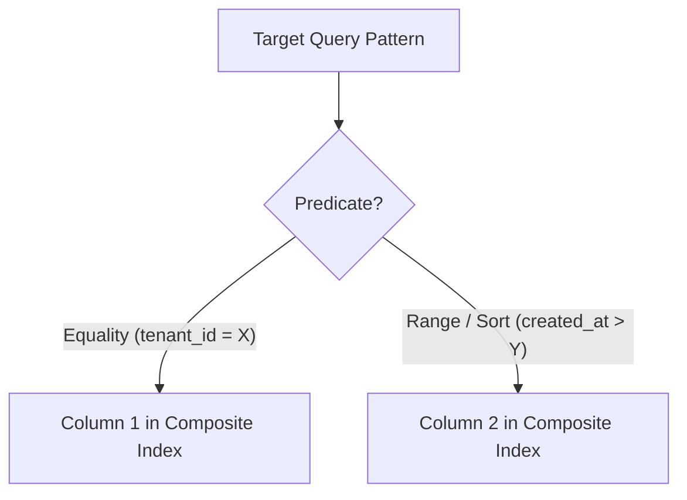

# Indexing Strategy & Query Performance

## 1. Index Selection & Leftmost Prefix Rule

Indexes are written to serve specific query patterns. Never add indexes randomly.



### Composite Index Column Order
For queries matching multiple columns (`WHERE tenant_id = 'abc' AND status = 'ACTIVE' ORDER BY created_at DESC`):
1. **Equality Columns First**: Put exact match columns (`tenant_id`, `status`) at the front of the index definition.
2. **Range & Sorting Columns Last**: Put range/ordering columns (`created_at`) at the end.
3. **Leftmost Prefix**: An index on `(tenant_id, status, created_at)` can serve queries filtering by `(tenant_id)` or `(tenant_id, status)`, but NOT queries filtering only by `(status)`.

---

## 2. Partial (Filtered) Indexes

Use partial indexes for queries that filter on specific low-cardinality status subsets:

```sql
-- Efficient partial index for active jobs
CREATE INDEX idx_pending_jobs ON jobs (created_at) WHERE status = 'PENDING';

-- Efficient partial index for non-deleted records
CREATE INDEX idx_active_users_email ON users (email) WHERE is_deleted = FALSE;
```

---

## 3. Covering Indexes (`INCLUDE`)

Eliminate table heap lookups by including non-predicate payload columns in the index:

```sql
-- Allows Index-Only Scan for user profile lookups
CREATE UNIQUE INDEX idx_users_email_covering ON users (email) INCLUDE (first_name, last_name, status);
```

---

## 4. JSONB & Text Search Indexing

- **GIN Indexes**: Use GIN indexes for JSONB containment (`@>`) or array operations:
  ```sql
  CREATE INDEX idx_users_metadata_gin ON users USING gin (metadata);
  ```
- **Expression Indexes**: If querying a specific JSON field frequently, index that specific path:
  ```sql
  CREATE INDEX idx_users_stripe_id ON users ((metadata->>'stripe_customer_id'));
  ```

---

## 5. Indexing Anti-Patterns
- **Over-indexing**: Creating indexes on high-churn tables without verifying query usage (degrades `INSERT`/`UPDATE` throughput).
- **Indexing Low-Cardinality Standalone Columns**: Standalone index on a boolean column (e.g. `is_active`) is ignored by the optimizer; use partial composite indexes instead.
