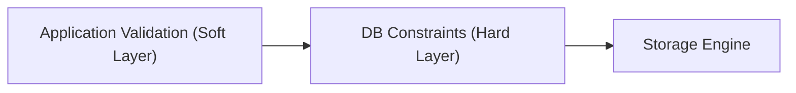

# Database Integrity & Constraints

## 1. Database-First Safety

Structural integrity MUST be guaranteed by the database engine, not just application code. Application bugs or direct DB access will bypass app-level checks. Mutable application-domain enum/status sets are a deliberate exception: keep those deployment-tolerant in storage and validate them in the application/ORM layer.



---

## 2. Essential Constraints Checklist

### A. Nullability (`NOT NULL`)
- Mark columns `NOT NULL` by default.
- Require explicit architecture justification for any column marked nullable.

### B. Foreign Key Constraints
- Enforce relational links explicitly:
  ```sql
  CONSTRAINT fk_orders_customer 
    FOREIGN KEY (customer_id) 
    REFERENCES customers(id) 
    ON DELETE RESTRICT
  ```

### C. `CHECK` Constraints
- Use for stable physical invariants and non-evolving numeric/date relationships at the table boundary:
  ```sql
  -- Ensure non-negative amounts
  CONSTRAINT chk_positive_amount CHECK (amount_cents >= 0),

  -- Ensure date ordering
  CONSTRAINT chk_valid_window CHECK (start_at <= end_at)
  ```
- Do **not** treat `CHECK` constraints as the default mechanism for application-domain enums or mutable workflow states in ORM-backed systems.
- Why: allowed-value `CHECK` lists couple schema rollout tightly to application rollout. They make backward-compatible deploys, rollbacks, and tolerance of deprecated/new DB values harder than plain-string storage with application validation.

### D. `UNIQUE` Constraints
- Enforce business uniqueness rules directly:
  ```sql
  -- Multi-tenant uniqueness
  CONSTRAINT uq_tenant_user_email UNIQUE (tenant_id, email)
  ```

---

## 3. Domain Custom Types & Enums

### Recommended default for ORM-backed application enums

- Prefer plain `VARCHAR` / string columns **without** allowed-value `CHECK` constraints for application-domain enums and statuses.
- Map them to typed enums in the application/ORM layer (for example `StrEnum` + type decorator / mapper) so the code remains expressive while the database stays deployment-tolerant.

Why this is the default:

- **Backward-compatible rolling deploys**: old code can still read rows containing newer enum values without schema mismatch failures.
- **Forward-tolerant reads are possible**: the DB will not reject newer values during rolling deploys; application mappers still need an explicit strategy for unknown/deprecated inbound values.
- **Safer rollbacks**: reverting application code does not require reverting DB enum definitions or `CHECK` lists first.
- **Deprecated-value tolerance**: historical rows can keep legacy values for audit/migration cleanup without violating schema constraints.
- **Single source of truth**: enum evolution lives in code review and typed mapping rather than duplicated SQL value lists.

Native database `ENUM` types are usually a poor fit for application-domain states because adding values often requires tightly coordinated schema changes. `VARCHAR + CHECK` avoids native-enum DDL pain but still has the same rollout-coupling problem for allowed values.

Recommended pattern:

```sql
CREATE TABLE orders (
    id UUID PRIMARY KEY,
    status VARCHAR(50) NOT NULL
);
```

Application layer responsibility:

- validate outbound writes against the supported enum set,
- decide how to handle unknown/deprecated inbound values,
- keep repository/DTO mapping strongly typed.

### Exceptions

DB-level allowed-value enforcement may still be appropriate when **all** of the following are true:

- the value set is genuinely stable or contractually immutable,
- schema-coupled deploy order is acceptable,
- historical/deprecated values do not need to remain queryable as-is,
- the team explicitly prefers DB rejection over rollout flexibility.

These cases should be treated as exceptions with explicit design justification, not the default recommendation.

Example exception:

```sql
CREATE TABLE settlement_batch (
    id UUID PRIMARY KEY,
    close_mode VARCHAR(16) NOT NULL,
    CONSTRAINT chk_close_mode CHECK (close_mode IN ('MANUAL', 'AUTOMATED'))
);
```

This kind of constraint is reasonable only if `close_mode` is contractually fixed, expected to never grow, and the team accepts schema-coupled deploy sequencing.
