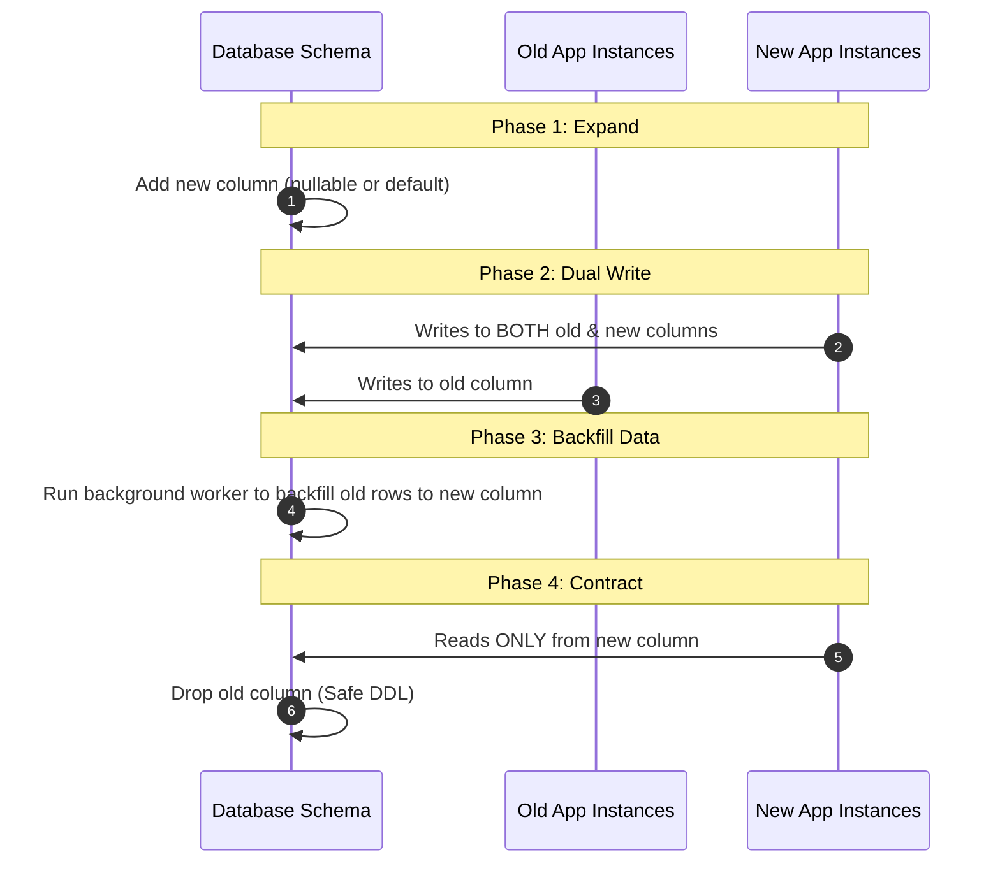

# Zero-Downtime Schema Migrations

## 1. The Expand-Contract (Parallel Change) Pattern

Never execute destructive DDL (`DROP COLUMN`, `RENAME COLUMN`, altering data types) in a single deployment. Zero-downtime database changes require a 4-phase rollout:



---

## 2. Non-Blocking DDL Guidelines (Postgres / MySQL)

- **Adding Columns**: Always add new columns as `NULLABLE` or with `DEFAULT` values that do not lock the table (Postgres 11+ handles defaults without rewriting the table).
- **Adding Indexes**: Always build indexes concurrently on live tables:
  ```sql
  CREATE INDEX CONCURRENTLY idx_users_phone ON users (phone);
  ```
- **Adding Foreign Keys**: Add foreign keys with `NOT VALID` first, then validate separately to avoid long table locks:
  ```sql
  ALTER TABLE orders ADD CONSTRAINT fk_orders_user 
    FOREIGN KEY (user_id) REFERENCES users(id) NOT VALID;
    
  ALTER TABLE orders VALIDATE CONSTRAINT fk_orders_user;
  ```
