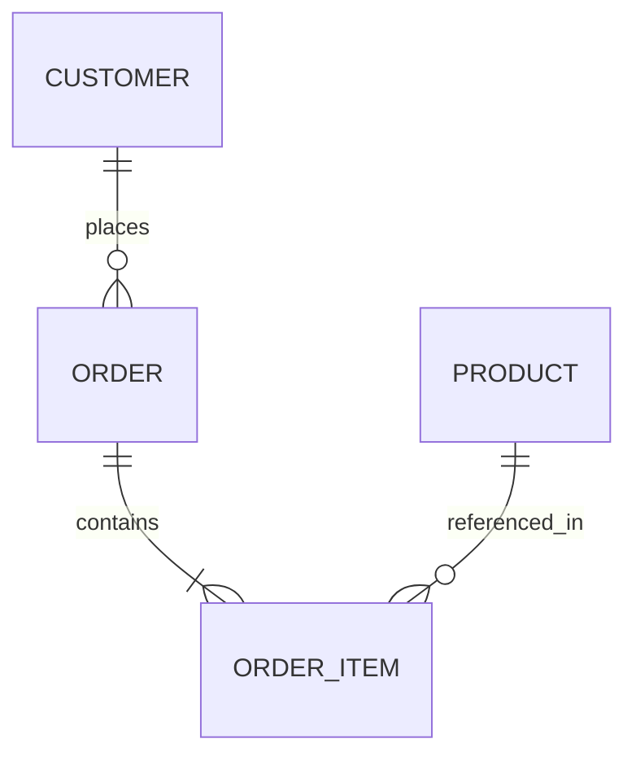

# Database Schema Modeling & Normalization

## 1. Normalization Rules (1NF – 3NF)

Every OLTP relational model MUST adhere to 3NF unless explicit performance benchmarking justifies denormalization.

### Normal Forms Checklist
- **1NF (First Normal Form)**: Atomic values per column. No comma-separated strings, raw lists, or array blobs in place of standard foreign keys.
- **2NF (Second Normal Form)**: All non-key attributes must depend on the *entire* primary key (no partial dependencies on composite keys).
- **3NF (Third Normal Form)**: No transitive dependencies (non-key attributes must depend ONLY on the primary key, not on other non-key attributes).

---

## 2. Primary Key Selection Matrix

| Primary Key Type | Use Case | Benefits | Drawbacks / Risks |
|---|---|---|---|
| **UUIDv7** (Recommended Default) | Distributed systems, public API IDs, multi-tenant DBs | Time-sortable, globally unique, index-friendly (preserves B-tree page locality), safe for public APIs | 16-byte storage (larger than 8-byte INT) |
| **ULID** | Public APIs, microservices requiring lexicographical sorting | 128-bit, URL-safe, time-ordered | Requires custom database type extension or binary(16) |
| **BigInt Auto-Increment** | Internal lookup tables, dimension tables, sequence-heavy DBs | Compact 8-byte storage, fast joins | Exposes sequence enumeration / table volume in APIs; bad for multi-region writes |
| **UUIDv4 (Random)** | **FORBIDDEN AS PK** | None for PKs | Causes massive B-tree index fragmentation and page thrashing under heavy write load |

---

## 3. Foreign Key Hygiene

- **Always Index Foreign Keys**: Every FK column MUST have an index to prevent full table scans during `JOIN` queries and `DELETE` parent table checks.
- **Explicit `ON DELETE` Policies**:
  - Use `ON DELETE RESTRICT` or `NO ACTION` by default to prevent accidental cascade deletions.
  - Use `ON DELETE CASCADE` only for weak dependent child entities (e.g. `order_items` belonging to `orders`).
  - Use `ON DELETE SET NULL` only when a reference is genuinely optional.

---

## 4. Anti-Patterns to Avoid

- **JSONB Dumping**: Avoid replacing relational schema tables with a single `data JSONB` column. JSONB is reserved for dynamic, unsearchable tenant/third-party metadata.
- **Polymorphic Foreign Keys**: Avoid `parent_id` + `parent_type` columns. Use concrete junction tables or exclusive foreign keys with `CHECK` constraints instead.
