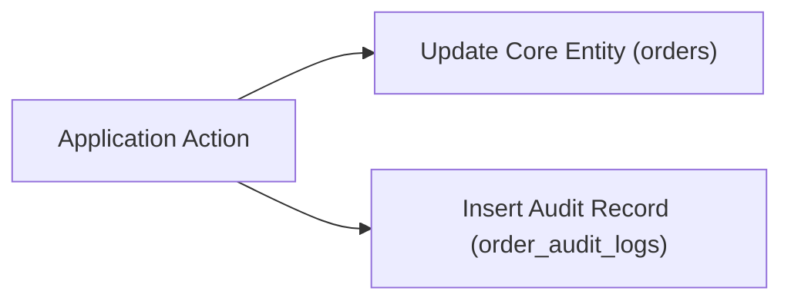

# State Auditing, History, & Soft Deletes

## 1. Soft Delete Patterns & Pitfalls

Naive `is_deleted BOOLEAN DEFAULT FALSE` columns introduce severe bugs:
- They break standard `UNIQUE` constraints (e.g. creating a new account with a previously soft-deleted email fails).
- They pollute every application query with `WHERE is_deleted = FALSE`.

```sql
-- CORRECT PATTERN: Partial Unique Index for Soft Deletes
CREATE TABLE users (
    id UUID PRIMARY KEY,
    email VARCHAR(255) NOT NULL,
    deleted_at TIMESTAMPTZ NULL
);

-- Unique index applies ONLY to active records
CREATE UNIQUE INDEX uq_active_user_email ON users (email) WHERE deleted_at IS NULL;
```

---

## 2. Immutable Audit Log Pattern

For compliance, financial, or sensitive domain entities, use append-only audit log tables:



```sql
CREATE TABLE order_audit_logs (
    id UUID PRIMARY KEY DEFAULT gen_random_uuid(),
    order_id UUID NOT NULL REFERENCES orders(id) ON DELETE CASCADE,
    actor_id UUID NOT NULL,
    action VARCHAR(50) NOT NULL, -- e.g. 'STATUS_CHANGED', 'REFUNDED'
    changes JSONB NOT NULL,     -- e.g. {"old_status": "PAID", "new_status": "REFUNDED"}
    created_at TIMESTAMPTZ NOT NULL DEFAULT clock_timestamp()
);

-- Audit table is INSERT-ONLY; revoke UPDATE and DELETE permissions from application DB role.
```

---

## 3. Change Data Capture (CDC) & Outbox Pattern

When audit logs or external event publishing (Kafka, RabbitMQ) are needed without double-write race conditions:
1. Write domain change + Outbox event within a single ACID transaction.
2. Read outbox table asynchronously via Debezium / CDC worker.
