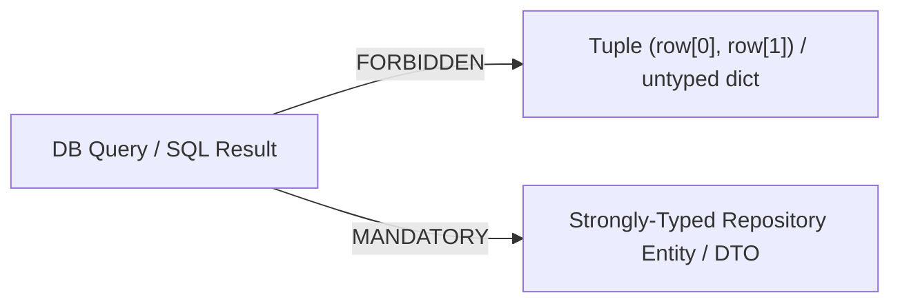

# Strongly-Typed Database Mapping & Repository Contracts

## 1. Type Erasure Anti-Pattern (FORBIDDEN)

Database queries MUST NOT return raw positional tuples or untyped dictionaries into application domain logic.



### Forbidden Examples
```python
# FORBIDDEN: Returning raw tuple
def get_user_summary(user_id: str) -> tuple[str, str, int]:
    return cursor.fetchone()  # ('usr_123', 'active', 42) -> Fragile positional coupling!

# FORBIDDEN: Returning untyped dictionary
def get_user_details(user_id: str) -> dict[str, Any]:
    return dict(cursor.fetchone())  # Erases type safety and field existence guarantees!
```

---

## 2. Mandatory Strongly-Typed Repository Pattern

All database interactions MUST map results into explicit, typed Data Transfer Objects (DTOs) or Domain Entities.

### Python Example (`dataclass` / Pydantic)
```python
from dataclasses import dataclass
from datetime import datetime
from uuid import UUID

@dataclass(frozen=True)
class UserRecordDTO:
    id: UUID
    email: str
    status: str
    account_count: int
    created_at: datetime

class UserRepository:
    def get_user_summary(self, user_id: UUID) -> UserRecordDTO:
        row = self.db.fetch_one("SELECT id, email, status, account_count, created_at FROM users WHERE id = %s", (user_id,))
        return UserRecordDTO(
            id=row[0],
            email=row[1],
            status=row[2],
            account_count=row[3],
            created_at=row[4]
        )
```

### TypeScript Example (`interface` / `type`)
```typescript
export interface UserRecordDTO {
  readonly id: string;
  readonly email: string;
  readonly status: 'ACTIVE' | 'SUSPENDED';
  readonly accountCount: number;
  readonly createdAt: Date;
}

export class UserRepository {
  async getUserSummary(userId: string): Promise<UserRecordDTO> {
    const row = await db.queryOne('SELECT ... WHERE id = $1', [userId]);
    return {
      id: row.id,
      email: row.email,
      status: row.status,
      accountCount: Number(row.account_count),
      createdAt: new Date(row.created_at),
    };
  }
}
```

---

## 3. Benefits of Typed Repository Contracts
- **IDE Autocomplete & Refactoring**: Renaming a field automatically updates all consumers across the codebase.
- **Static Type Checking**: `mypy`, `pyright`, `tsc`, `go vet`, and `rustc` catch missing fields and type mismatches at build time.
- **Domain Invariant Enforcement**: DTO constructors/validators enforce nullability and type casting at the database boundary before invalid state enters business logic.
