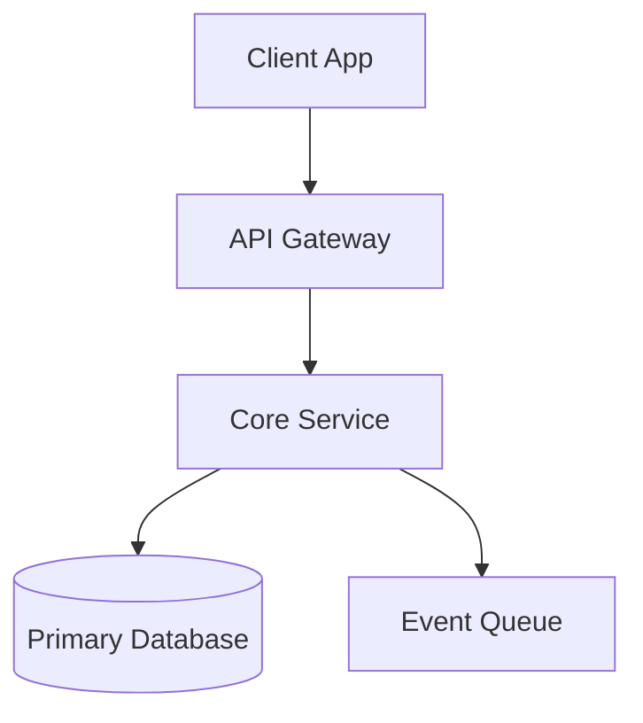

# Canonical Documentation Templates

Standard scannable templates designed to prevent AI-generated discursive prose and walls of text.

---

## Template 1: Technical Guide / How-To (`docs/guides/<topic>.md`)

```markdown
# <Guide Title>

| Metadata | Value |
|---|---|
| **Objective** | What the reader will achieve after following this guide |
| **Prerequisites** | Tools, permissions, or dependencies required before starting |
| **Estimated Time** | e.g., 10 minutes |

---

## 1. Quick Start / Overview
> [!NOTE]
> 1–2 sentences explaining what this system does and the primary mental model.

```bash
# The single command to get running immediately (if applicable)
```

---

## 2. Step-by-Step Procedure

### Step 1: <Action-Oriented Title>
- **Goal**: One-sentence purpose of this step.
- **Action**:

```<lang>
# Exact code / config to write or run
```

- **Verification**: Run `<command>` and verify output matches `<expected output>`.

### Step 2: <Action-Oriented Title>
...

---

## 3. Common Failure Modes & Troubleshooting

| Symptom / Error | Likely Cause | Solution |
|---|---|---|
| `Connection refused: 5432` | Postgres container not healthy | Run `docker-compose up -d db` |
| `JWT expired` | Clock drift on host | Synchronize host clock via NTP |

---

## 4. Deep Details & References
- For production clustering and failover configuration: [`details/clustering.md`](details/clustering.md)
- Related specifications: [`../architecture/auth-system.md`](../architecture/auth-system.md)
```

---

## Template 2: Architectural / System Overview (`docs/architecture/<system>.md`)

```markdown
# System Architecture: <System Name>

| Property | Value |
|---|---|
| **Domain Boundary** | e.g., Payment Processing & Settlement |
| **Primary Invariant** | Non-negotiable safety or integrity rule |
| **Key Consumers** | Services or callers that interact with this system |

---

## 1. High-Level Topology



---

## 2. Component Catalog

| Component | Responsibility | Data Owned | Upstream / Downstream |
|---|---|---|---|
| `OrderService` | State machine for order lifecycle | `orders`, `order_items` | API Gateway → `PaymentService` |
| `PaymentService`| External PSP integration | `payment_transactions` | `OrderService` → Stripe |

---

## 3. Core Decisions & Trade-Offs

| Decision | Chosen Approach | Alternative Rejected | Rationale |
|---|---|---|---|
| Persistence | Postgres JSONB | Mongo DB | ACID transactions needed across relational metadata |
| Sync vs Async | SQS Event Queue | Direct HTTP | Decouple order checkout from webhook delivery latency |

---

## 4. Invariants & Guardrails
- **Idempotency**: All mutating operations must carry an `Idempotency-Key` header.
- **Zero Global State**: Components must receive configuration via dependency injection.
```

---

## Template 3: Section Index (`docs/<section>/INDEX.md`)

```markdown
# <Section Name> Index

This directory documents the `<Section Name>` subsystem. Load entries based on the reader journey below.

---

## Topic Catalog

| Topic | Summary | When to Read |
|---|---|---|
| [`overview.md`](overview.md) | High-level mental model and architecture | Starting on this subsystem for the first time |
| [`getting-started.md`](getting-started.md) | Local environment setup and test runner | Setting up development workflow |
| [`api-reference.md`](api-reference.md) | Endpoints, query parameters, and DTO schemas | Integrating caller applications or endpoints |

---

## Maintenance Rules
- Entries exceeding 12 KB must be sharded to `details/<leaf>.md`.
- Keep this index table strictly under 40 rows.
```

---

## Template 4: Deep Leaf Detail (`docs/<section>/details/<leaf>.md`)

```markdown
# Deep Detail: <Topic / Edge Case Name>

> Parent Entry: [← Back to <Parent Topic>](../<parent>.md)

| Scope | Value |
|---|---|
| **Focus** | Deep dive into <specific concern> |
| **Audience** | Engineers debugging or implementing <advanced feature> |

---

## 1. Mechanism & Nuance
1–2 sentences explaining the internal mechanic.

```<lang>
// Concrete implementation snippet or complex schema
```

---

## 2. Parameter Matrix / Full Schema

| Field | Type | Constraint | Description |
|---|---|---|---|
| `retry_interval_ms` | `number` | `100 <= x <= 10000` | Exponential backoff seed |
| `dead_letter_arn` | `string` | Valid AWS ARN | Target queue for failed executions |
```
