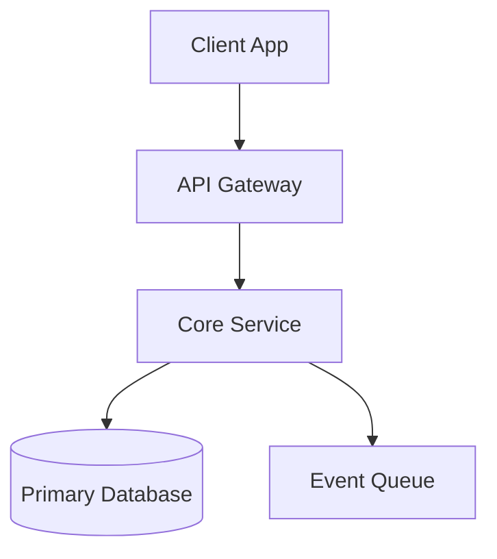

# Canonical Documentation Templates

Standard scannable templates designed to prevent AI-generated discursive prose and walls of text.

**Choose format first:** [Document format selection](../../../rules/document-formats.md) governs saved output. For Typst, start with [the native starter](typst-workflow.md#2-author-once-compile-directly) and translate the information structures below into native headings/tables/callouts; the Markdown examples and `.md` paths are only for required Markdown consumers.

| Document structure | Default source | Key sections |
|---|---|---|
| Technical guide / how-to | `docs/guides/<topic>.typ` | Reader contract, quick start, procedure, verification, failures, references |
| System overview | `docs/architecture/<system>.typ` | Boundary, topology image, components, trade-offs, invariants |
| Section index | `docs/<section>/index.typ` | Topic catalog and reader journeys; required repository README/index stays Markdown |
| Deep detail | `docs/<section>/details/<leaf>.typ` | Scope, parent context, mechanism, full schema; include in the distributed PDF when needed |
| Code module README | `<module>/README.md` | Required repository-rendered entry point: purpose, flow, usage, public surface, invariants |

---

## Template 1: Technical Guide / How-To (`docs/guides/<topic>.md`)

```markdown
# <Guide Title>

| Metadata | Value |
|---|---|
| **Objective** | What the reader will achieve after following this guide |
| **Prerequisites** | Tools, permissions, or dependencies required before starting |
| **Estimated Time** | e.g., 10 minutes |

---

## 1. Quick Start / Overview
> [!NOTE]
> 1–2 sentences explaining what this system does and the primary mental model.

```bash
# The single command to get running immediately (if applicable)
```

---

## 2. Step-by-Step Procedure

### Step 1: <Action-Oriented Title>
- **Goal**: One-sentence purpose of this step.
- **Action**:

```<lang>
# Exact code / config to write or run
```

- **Verification**: Run `<command>` and verify output matches `<expected output>`.

### Step 2: <Action-Oriented Title>
...

---

## 3. Common Failure Modes & Troubleshooting

| Symptom / Error | Likely Cause | Solution |
|---|---|---|
| `Connection refused: 5432` | Postgres container not healthy | Run `docker-compose up -d db` |
| `JWT expired` | Clock drift on host | Synchronize host clock via NTP |

---

## 4. Deep Details & References
- For production clustering and failover configuration: [`details/clustering.md`](details/clustering.md)
- Related specifications: [`../architecture/auth-system.md`](../architecture/auth-system.md)
```

---

## Template 2: Architectural / System Overview (`docs/architecture/<system>.md`)

```markdown
# System Architecture: <System Name>

| Property | Value |
|---|---|
| **Domain Boundary** | e.g., Payment Processing & Settlement |
| **Primary Invariant** | Non-negotiable safety or integrity rule |
| **Key Consumers** | Services or callers that interact with this system |

---

## 1. High-Level Topology


```mermaid
flowchart TD
    Client[Client App] --> Gateway[API Gateway]
    Gateway --> Service[Core Service]
    Service --> DB[(Primary Database)]
    Service --> Queue[Event Queue]
```

---

## 2. Component Catalog

| Component | Responsibility | Data Owned | Upstream / Downstream |
|---|---|---|---|
| `OrderService` | State machine for order lifecycle | `orders`, `order_items` | API Gateway → `PaymentService` |
| `PaymentService`| External PSP integration | `payment_transactions` | `OrderService` → Stripe |

---

## 3. Core Decisions & Trade-Offs

| Decision | Chosen Approach | Alternative Rejected | Rationale |
|---|---|---|---|
| Persistence | Postgres JSONB | Mongo DB | ACID transactions needed across relational metadata |
| Sync vs Async | SQS Event Queue | Direct HTTP | Decouple order checkout from webhook delivery latency |

---

## 4. Invariants & Guardrails
- **Idempotency**: All mutating operations must carry an `Idempotency-Key` header.
- **Zero Global State**: Components must receive configuration via dependency injection.
```

---

## Template 3: Section Index (`docs/<section>/INDEX.md`)

```markdown
# <Section Name> Index

This directory documents the `<Section Name>` subsystem. Load entries based on the reader journey below.

---

## Topic Catalog

| Topic | Summary | When to Read |
|---|---|---|
| [`overview.md`](overview.md) | High-level mental model and architecture | Starting on this subsystem for the first time |
| [`getting-started.md`](getting-started.md) | Local environment setup and test runner | Setting up development workflow |
| [`api-reference.md`](api-reference.md) | Endpoints, query parameters, and DTO schemas | Integrating caller applications or endpoints |

---

## Maintenance Rules
- Entries exceeding 12 KB must be sharded to `details/<leaf>.md`.
- Keep this index table strictly under 40 rows.
```

---

## Template 4: Deep Leaf Detail (`docs/<section>/details/<leaf>.md`)

```markdown
# Deep Detail: <Topic / Edge Case Name>

> Parent Entry: [← Back to <Parent Topic>](../<parent>.md)

| Scope | Value |
|---|---|
| **Focus** | Deep dive into <specific concern> |
| **Audience** | Engineers debugging or implementing <advanced feature> |

---

## 1. Mechanism & Nuance
1–2 sentences explaining the internal mechanic.

```<lang>
// Concrete implementation snippet or complex schema
```

---

## 2. Parameter Matrix / Full Schema

| Field | Type | Constraint | Description |
|---|---|---|---|
| `retry_interval_ms` | `number` | `100 <= x <= 10000` | Exponential backoff seed |
| `dead_letter_arn` | `string` | Valid AWS ARN | Target queue for failed executions |
```

---

## Template 5: Code Module README (`<module-path>/README.md`)

Use this template for packages, libraries, subsystems, and code modules. Targets the human engineer mental model: explaining purpose, usage, and boundaries without low-level execution minutiae or commit chatter.

```markdown
# Module: <Module Name>

| Property | Value |
|---|---|
| **Role / Purpose** | 1–2 sentences explaining what capability this module provides and why it exists |
| **Owner / Boundary** | e.g., Domain Core / Infrastructure Adapter / Shared Utility |
| **Primary Entrypoint** | e.g., `index.ts`, `mod.rs`, or `client.py` |

---

## 1. Purpose & Mental Model
> [!NOTE]
> High-level conceptual explanation of what problem this module solves. Keep jargon minimal.


```mermaid
flowchart LR
    Caller[Caller Component] --> Interface[Module Public API]
    Interface --> CoreLogic[Domain Logic]
    CoreLogic --> Downstream[Storage / Adapter]
```

---

## 2. Quick Start / Consumer Usage

```<lang>
// Concise, working example of how a consumer imports and uses the primary API
import { createModuleClient } from './index';

const client = createModuleClient({ timeoutMs: 5000 });
const result = await client.process(payload);
```

---

## 3. Public Surface & Key Abstractions

| Exported Symbol | Type | Responsibility |
|---|---|---|
| `<ClientService>` | Class / Interface | Primary orchestration facade |
| `<InputDTO>` | Data Contract | Strongly-typed boundary payload |
| `<ModuleError>` | Error Variant | Typed domain error for caller handling |

> [!IMPORTANT]
> Internal helpers, sub-functions, and private adapters are hidden details and must not be documented in the public surface table.

---

## 4. Architectural Invariants & Guardrails
- **Dependency Direction**: This module depends only on `<Dependencies>`. It must never import from `<Caller Layer>`.
- **Side Effect Boundaries**: Pure functions isolate domain business rules; all I/O is routed through injected ports.
- **Error Handling**: Throws only typed `<ModuleError>` exceptions; never leaks raw database or HTTP network errors to callers.
```
