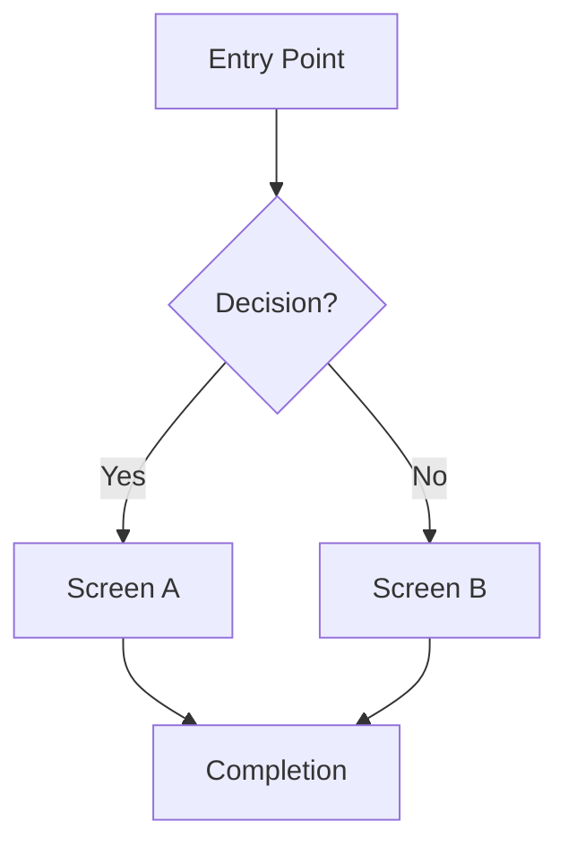

# UX-SPEC.md Template

This template is used to create `UX-SPEC.md` during the ui-ux skill workflow. Copy this template to the project (root or alongside feature code) and fill in each section during the corresponding phase. The completed file becomes the source of truth for Phase 6 (Implement).

## Placement Guidance

The file **must** be named exactly `UX-SPEC.md` — no feature suffixes or aliases.

- **Project root**: for app-wide design work or design system creation
- **`docs/ux/`**: for projects with multiple features needing separate specs (each in its own subdirectory, still named `UX-SPEC.md`)
- **Alongside feature code**: for single-feature work in a larger codebase

---

````markdown
# UX Specification: [Feature Name]

> Status: Draft | In Review | Approved | Implemented
> Created: [date]
> Last updated: [date]

---

## 1. Discovery (Phase 1)

### Target User
- **Persona**: [Who is the primary user?]
- **Context of use**: [Device, environment, time pressure, expertise level]
- **Mental model**: [What prior experience/system shapes their expectations?]

### Goals & Success
- **Primary goal**: [What the user wants to achieve]
- **Success metric**: [How we know the design works — quantitative if possible]
- **Definition of done**: [When is this feature "complete"?]

### Constraints
- **Technical**: [APIs, data schemas, performance requirements]
- **Business**: [Brand, regulatory, timeline]
- **Design system**: [Existing components to reuse, style constraints]

### Scope
- **In scope**: [What we're building]
- **Out of scope**: [What we're explicitly NOT building]

### Open Questions
- [ ] [Any unresolved questions from discovery]

---

## 2. User Journey (Phase 2)

### Journey Map

| Phase | User Action | User Goal | Emotion | Pain Point | Opportunity |
|---|---|---|---|---|---|
| Discover | [How user finds the feature] | [What they want] | [Expected feeling] | [Current friction] | [Our solution] |
| Engage | [First interaction] | | | | |
| Execute | [Core task] | | | | |
| Complete | [Task completion] | | | | |
| Return | [Re-engagement] | | | | |

### User Flow



### Screen Inventory

| # | Screen | Purpose | Key Components | Entry Points |
|---|---|---|---|---|
| 1 | [Screen name] | [What it does] | [Components needed] | [How user arrives] |

---

## 3. Layout (Phase 3)

### Screen: [Screen Name]

**Information Hierarchy** (most → least important):
1. [Primary content / action]
2. [Secondary content]
3. [Tertiary / supporting content]

**Layout Structure**:
- Desktop (≥1024px): [e.g., sidebar + main content, 12-col grid]
- Tablet (768–1023px): [e.g., collapsible sidebar, 8-col grid]
- Mobile (<768px): [e.g., single column stack, bottom nav]

**Navigation & Wayfinding**:
- [How does the user know where they are?]
- [How do they get to related sections?]

**Content Regions**:

Describe the layout architecture in prose alongside the wireframe SVG. Note the grid (e.g., 12-column), gutters, and how regions collapse or reorder at each breakpoint. Reserve ASCII art only for trivial one- or two-region splits where SVG adds no clarity.

```xml
<svg xmlns="http://www.w3.org/2000/svg" viewBox="0 0 720 480" width="720" height="480"
     role="img" aria-label="Wireframe: [Screen Name] — desktop/tablet/mobile layout">
  <title>Wireframe: [Screen Name]</title>
  <defs>
    <style>
      rect { fill: #f4f4f4; stroke: #aaa; stroke-width: 1.5; }
      text { font: 13px/1.4 system-ui, sans-serif; fill: #333; }
      .label { font-weight: 600; }
      .note  { font-size: 11px; fill: #666; font-style: italic; }
    </style>
  </defs>

  <!-- Desktop layout (≥1024px) — occupies left two-thirds of canvas -->
  <text x="10" y="18" class="note">Desktop (≥1024px)</text>

  <!-- Header / Nav -->
  <rect x="10" y="24" width="460" height="44"/>
  <text x="20" y="51" class="label">Header / Nav</text>

  <!-- Sidebar -->
  <rect x="10" y="76" width="110" height="300"/>
  <text x="20" y="110" class="label">Sidebar</text>

  <!-- Main Content -->
  <rect x="128" y="76" width="342" height="300"/>
  <text x="138" y="100" class="label">Main Content</text>

  <!-- Primary Action -->
  <rect x="138" y="108" width="322" height="50"/>
  <text x="148" y="138" class="label">Primary Action</text>

  <!-- Content Region -->
  <rect x="138" y="166" width="322" height="192"/>
  <text x="148" y="188" class="label">Content Region</text>

  <!-- Footer -->
  <rect x="10" y="384" width="460" height="36"/>
  <text x="20" y="407" class="label">Footer</text>

  <!-- Responsive annotations -->
  <line x1="500" y1="24" x2="500" y2="420" stroke="#ccc" stroke-dasharray="4 3"/>

  <!-- Tablet layout (768–1023px) — right column, condensed -->
  <text x="510" y="18" class="note">Tablet (768–1023px)</text>
  <rect x="510" y="24" width="200" height="36"/>
  <text x="520" y="47" class="label">Header / Nav</text>
  <rect x="510" y="68" width="60" height="240" stroke-dasharray="4 2"/>
  <text x="516" y="90" class="note">Sidebar&#10;(collapsible)</text>
  <rect x="578" y="68" width="132" height="240"/>
  <text x="584" y="90" class="label">Main Content</text>
  <rect x="510" y="316" width="200" height="30"/>
  <text x="520" y="336" class="label">Footer</text>

  <!-- Mobile annotation -->
  <text x="510" y="370" class="note">Mobile (&lt;768px):</text>
  <text x="510" y="386" class="note">Single column; sidebar</text>
  <text x="510" y="401" class="note">becomes bottom nav or</text>
  <text x="510" y="416" class="note">hamburger drawer.</text>
</svg>
```

> **Authoring guidance**: Replace `[Screen Name]` in `<title>` and `aria-label`. Adjust region dimensions to match actual content hierarchy. Describe breakpoint behavior in the prose above the SVG — e.g., which columns collapse, which elements reorder, and whether navigation moves to a bottom bar or drawer on mobile. Use ASCII only for a trivial two-region split (e.g., header + body) where SVG adds no clarity.

(Repeat for each screen in the inventory)

---

## 4. State Matrix (Phase 4)

### Component: [Component Name]

| State | Visual Treatment | Behavior | Content |
|---|---|---|---|
| Default | [Baseline appearance] | [Normal interactions] | [Default content] |
| Hover | [Visual change] | [Tooltip / preview] | |
| Focus | [Focus ring style] | [Keyboard behavior] | |
| Disabled | [Dimmed appearance] | [No interaction] | [Why disabled?] |
| Loading | [Skeleton / spinner] | [Disabled inputs] | [Placeholder shapes] |
| Empty | [Illustration + CTA] | [Guide to first action] | [Helpful message] |
| Error | [Error styling] | [Recovery action] | [Error message text] |
| Success | [Confirmation] | [Next step / dismiss] | [Success message] |

(Repeat for each interactive component)

---

## 5. Visual Design (Phase 5)

### Taste Sliders
- **DESIGN_VARIANCE**: [1-10] — [rationale]
- **MOTION_INTENSITY**: [1-10] — [rationale]
- **VISUAL_DENSITY**: [1-10] — [rationale]

### Design System
- **DESIGN.md**: [exists / created / N/A]
- **Key tokens applied**:
  - Colors: [primary, secondary, accent — with token names]
  - Typography: [heading font, body font — with token names]
  - Spacing: [base grid — with token names]
  - Radius: [corner rounding — with token names]

### Motion Design
- [List key animations/transitions and their purpose]
- [Link to motion tokens if MOTION_INTENSITY > 3]

### Accessibility Targets
- WCAG level: [AA / AAA]
- Contrast ratio targets: [text, non-text]
- Touch targets: [minimum size, e.g., 44×44px]

---

## 6. Implementation Notes

### Component Reuse
- [List existing project components that should be used]
- [List new components that need to be created]

### Technical Decisions
- [Any implementation-specific notes for the developer/agent]

---

## Verification Checklist (Phase 7)

- [ ] All screens from inventory are implemented
- [ ] User flow matches the flow diagram
- [ ] All states from state matrix are handled
- [ ] All colors reference DESIGN.md tokens (no hardcoded hex)
- [ ] All spacing uses design system scale (no magic numbers)
- [ ] Responsive behavior matches layout spec at all breakpoints
- [ ] WCAG AA contrast verified
- [ ] Keyboard navigation works for all interactive elements
- [ ] Focus visible on all focusable elements
- [ ] `prefers-reduced-motion` respected
- [ ] Loading states show skeletons/spinners as specified
- [ ] Error states show recovery actions
- [ ] Empty states show helpful content + CTA
````

## Section Completion Rules

| Section | Filled During | Gate |
|---|---|---|
| Discovery | Phase 1 | Must be written before Phase 2 starts |
| User Journey + Flow | Phase 2 | Must be written before Phase 3 starts |
| Layout | Phase 3 | Must be written before Phase 4 starts |
| State Matrix | Phase 4 | Must be written before Phase 5 starts |
| Visual Design | Phase 5 | Must be written before Phase 6 starts |
| Implementation Notes | Phase 6 | Filled during implementation |
| Verification Checklist | Phase 7 | All boxes must be checked or justified |
