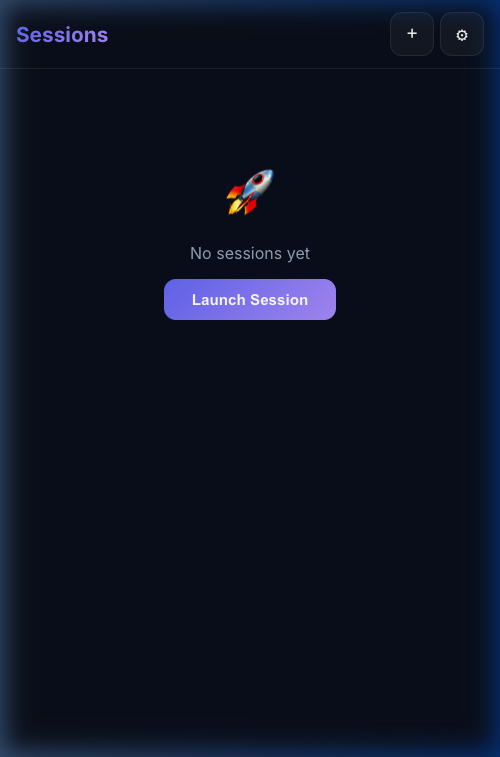

# AG Session Manager — User Manual

> Mobile command center for Antigravity AI coding sessions.
> Start sessions, browse projects, chat with AI — all from your phone.

---

## Quick Start

```bash
cd .innoobwetrust/ag-session-manager
./start.sh
```

The server prints a QR code and an **auth token** — you'll need both.

### 🔐 First-Time Login

On first launch, the server auto-generates a secure auth token and prints it:

```text
🔑 Auth token: aB3x...your-token-here
   Persisted: ~/.config/ag-session-manager/auth_token
```

Open the app on your phone — you'll see a **login screen**. Paste the token
from the terminal and tap **Unlock**. The token is saved in your browser, so
you only need to do this once per device.

---

## ⚡ Quick Playground Chat (Most Common Use Case)

Spin up a throwaway Antigravity session in one tap. No directory picking needed.

### Step 1: Tap "⚡ Quick Playground"

Open the app. You see the dashboard with two buttons:

- **⚡ Quick Playground** — launches immediately in a temp directory
- **Choose Directory...** — opens the directory browser (for project-specific work)

**Tap ⚡ Quick Playground.** That's it — a session starts instantly.



> [!NOTE]
> The dashboard screenshot above may show the older "Launch Session" button.
> After this update, it now shows "⚡ Quick Playground" as the primary action.

### Step 2: Chat with Antigravity

You're taken directly to the **Session View**:

- **Chat mirror** — a live view of the Antigravity UI (via CDP)
- **Message input** — type and tap **↑** to send
- **Mode controls** — switch between **Fast** and **Planning** modes
- **+ Chat** — start a new conversation within the same session
- **■** — stop the AI mid-response

> [!TIP]
> It takes a few seconds for the CDP connection to establish. You'll see
> a "Connecting..." spinner briefly.

### Step 3: Stop When Done

Tap **← back** to return to the Dashboard. Tap **Stop** on the session card.
The playground temp directory is cleaned up automatically by your OS.

---

## 📂 Project-Specific Sessions

When you need Antigravity to work on an actual project, use the directory browser:

1. From the Dashboard, tap **Choose Directory...** (or the **+** button)
2. The **New Session** view shows:
   - **Favorites** — bookmarked directories for quick access
   - **Browse** — your filesystem roots

3. **Tap folders** to drill down. Breadcrumbs at the top show your path
   and let you jump back. Each directory has a **Select** button.

   Directory entries show:
   - 📁 Folders with a green **git badge** if it's a git repo
   - Files with type icons (📜 JS · 🐍 Python · 🦀 Rust · 📝 Markdown)

4. Tap **Select** on your target directory. A bar slides up at the bottom:

   ```text
   /path/to/your/project                    [ Launch ]
   ```

5. Tap **Launch** — the session starts in that directory.

### Chat and Session Controls

Once in the session view, you get the same controls as playground mode:

- **Send messages** — type in the input field and tap ↑
- **Stop generation** — tap ■ to interrupt mid-response
- **Switch modes** — tap Fast or Planning
- **New Chat** — tap "+ Chat" to start a fresh conversation

### Stopping Sessions

1. Tap **← back** to return to the Dashboard
2. Find the session card (shows 🟢 **running**)
3. Tap **Stop** and confirm the prompt

The session stops and Antigravity closes. That's it!

---

## 📂 Managing Multiple Sessions

You can run several Antigravity sessions simultaneously, each in a different
project directory. From the Dashboard, tap **+** to launch another session.
Each gets its own CDP debug port (9000, 9001, 9002, ...).

**Dashboard features:**
- Session cards show the **project name**, **status badge**, **port**, and **uptime**
- Tap a card to open the session view and interact with the chat
- Each session is independent — switching sessions is instant

**Session status badges:**
| Badge | Meaning |
|-------|---------|
| 🟢 running | Antigravity is running and CDP is connected |
| 🟡 starting | Antigravity is launching, CDP not yet connected |
| ⚪ stopped | Session has been stopped |
| 🔴 error | Antigravity crashed or CDP failed |

---

## ⭐ Favorite Directories

If you frequently work in the same directories, bookmark them as favorites to
skip browsing every time.

**To add a favorite:**
1. In the directory browser, navigate to your project
2. Use the API: `POST /api/dirs/favorites` with `{"path": "/your/project"}`

Favorites appear as chips at the top of the New Session view. Tap one to
instantly select that directory.

---

## ⚙️ Settings

Tap the **⚙** button in the header to see:
- **Server Info** — Status, uptime, active session count
- **Network** — All detected interfaces with their IPs and types
- **About** — Version number

The Network section is especially useful to find the right IP to connect from
your phone. It shows each interface name, type label (lan/tailscale/loopback),
and IP address.

```text
┌─ Server Info ──────────────────────┐
│ Status                          ok │
│ Uptime                         12m │
│ Sessions                         0 │
└────────────────────────────────────┘
┌─ Network ──────────────────────────┐
│ lo0 (loopback)         127.0.0.1   │
│ en0 (lan)              192.168.x.x │
│ utun4 (tailscale)      100.x.x.x   │
└────────────────────────────────────┘
┌─ About ────────────────────────────┐
│ AG Session Manager v1.0.0          │
│ Mobile command center for          │
│ Antigravity AI sessions            │
└────────────────────────────────────┘
```

---

## 🔒 Security

Auth is **always required** — no anonymous access, even on your home network.

- **Auth token**: Auto-generated on first startup, persisted at
  `~/.config/ag-session-manager/auth_token` (file permissions: `0600`)
- **Network-level**: Binds on your LAN and Tailscale IPs only — not exposed to
  the public internet
- **HTTPS** (optional): Place `server.cert` and `server.key` in the `certs/`
  folder for encrypted connections

**How the token works:**

1. Server generates a random token on first run (or reads `AUTH_TOKEN` from `.env`)
2. Token is printed to the terminal with 🔑 emoji
3. Your phone's browser stores it after login
4. All API calls include the token in the `Authorization: Bearer` header

> [!TIP]
> To reset the token, delete `~/.config/ag-session-manager/auth_token` and restart.

---

## 🛠️ Configuration

Edit `.env` (created from `.env.example` on first run):

```bash
# Server port (default: 3000)
PORT=3000

# Directories the browser can access (default: $HOME)
# Comma-separated paths
BROWSE_ROOTS=/Users/me/projects,/Users/me/work

# Override the auto-generated token (optional)
# AUTH_TOKEN=your-custom-token

# CDP debug port range start (default: 9000)
CDP_PORT_START=9000
```

> [!TIP]
> Set `BROWSE_ROOTS` to your actual project directories to avoid browsing through
> your entire home folder each time.

---

## 📱 Tips for Phone Usage

- **Bookmark the URL** — Add `http://<your-ip>:3000` to your phone's home screen
- **QR code** — The terminal shows a QR code on startup; scan it from your phone
- **Tailscale** — Access from anywhere via your Tailscale IP (e.g., `100.x.x.x`)
- **Landscape mode** — The session view works well in landscape for wider chat
- **Quick dispose** — Most playground sessions can just be stopped and forgotten.
  The session entry stays in the list (marked stopped) but takes no resources.
