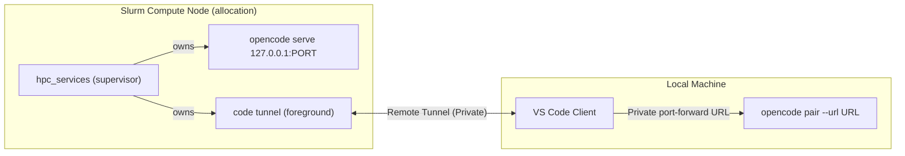

# `hpc_services` — HPC Compute Job Services

| Property          | Value                                                                                                                                                                                                      |
| ----------------- | ---------------------------------------------------------------------------------------------------------------------------------------------------------------------------------------------------------- |
| **Objective**     | Launch and supervise preauthenticated OpenCode and VS Code tunnel services foreground inside an owned Slurm compute allocation.                                                                            |
| **Prerequisites** | RUNNING Slurm job, current host in authoritative NodeList; Python 3.8+, `opencode` V2, `code`, `scontrol` on PATH; pre-bound VS Code file-keychain account; OpenCode cleanly stopped with pairing enabled. |
| **Boundaries**    | One active launcher per shared HPC HOME; no install, restart, or login; no local or login-node bypass; owned-process cleanup only.                                                                         |



## Usage

```
hpc_services [--port PORT] [--name NAME] [--cli-data-dir PATH]
hpc_services --help
```

### Options

| Option           | Default             | Constraint                  | Description                                          |
| ---------------- | ------------------- | --------------------------- | ---------------------------------------------------- |
| `--port`         | `4096`             | Integer 1–65535             | OpenCode loopback listen port                        |
| `--name`         | `hpc-<user>`        | ASCII `[A-Za-z0-9_-]{1,20}` | VS Code tunnel name; derived from sanitized username |
| `--cli-data-dir` | `$HOME/.vscode/cli` | Existing pre-bound path     | VS Code CLI keychain data directory                  |
| `--help`         | —                   | —                           | Print usage; no preflight or services started        |

**Name derivation:** `hpc-` + current username lowercased and stripped to `[a-z0-9_-]`, total truncated to 20 characters.

### Exit codes and signals

| Trigger                                             | Exit code                                             |
| --------------------------------------------------- | ----------------------------------------------------- |
| `--help`                                            | `0`                                                   |
| Invalid arguments, preflight refusal, child failure | `1`                                                   |
| SIGINT (Ctrl+C)                                     | `130`                                                 |
| SIGTERM (`scancel`)                                 | `143`                                                 |
| SIGHUP                                              | `129`                                                 |
| SIGKILL                                             | Untrappable — scheduler containment only (unverified) |

---

## One-time account binding

Run this **once per keychain directory** on an allocated compute node before your first launch.

```sh
# 1. Obtain a compute allocation (adjust account/partition/resources to your site)
srun --pty bash -l

# 2. Bind your VS Code account interactively (complete browser prompt, then Ctrl+C)
VSCODE_CLI_USE_FILE_KEYCHAIN=1 code tunnel --accept-server-license-terms

# 3. Verify binding
code --cli-data-dir "$HOME/.vscode/cli" tunnel user show
```

The `code-tunnel` alias (`.sh.d/aliases.sh`) also sets `VSCODE_CLI_USE_FILE_KEYCHAIN=1`. If using a non-default directory, pass `--cli-data-dir PATH` consistently.

> [!NOTE]
> Cross-machine token portability is **unverified**; do not copy keychain files between machines. The launcher never reads, copies, or logs credentials.

---

## Launching

### Step 1 — Enter a compute allocation

`hpc_services` requires a `RUNNING` Slurm job where the current host is in the authoritative `NodeList`. Login nodes and login-host `salloc` sessions are refused.

### Step 2 — Run `hpc_services`

```sh
# Shell function (autoloaded via .shrc → func.sh)
hpc_services

# With custom port or name
hpc_services --port 4096 --name my-session

# Batch script — direct Python, no shell function loading required
/usr/bin/env python3 "$HOME/.sh.d/utils/hpc_services.py" --port 4096
```

**Do not background** the launcher (`&`, `nohup`, service install); it must stay foreground. When both services are ready (within 60 seconds):

```
Services ready. Connect via VS Code and forward port 4096 with Private visibility.
Pair only in the private VS Code remote terminal while this allocation remains alive.
```

### Step 3 — Connect via VS Code

- **Open Remote Explorer** → Connect to Tunnel → select your bound account and tunnel name.
- **Forward the port:** VS Code → Ports tab → add port `4096` (or your chosen port) → set visibility to **Private**.
- **Copy the Private forwarded URL** (HTTPS `devtunnels.ms` address).

### Step 4 — Pair with OpenCode

In the **VS Code remote terminal on the same allocated node** — not your local machine, not after the allocation ends:

```sh
opencode pair --url '<PASTE-PRIVATE-FORWARDED-URL>'
```

Open the one-time link. `--url` sets the link base URL and suppresses broad-binding messages.

> [!WARNING]
> Run `opencode pair` **only while the launcher and Slurm job are still alive**. Pair may attempt to ensure the managed service is running; calling it after the allocation exits is unsupported.

---

## Preflight refusals

The launcher refuses with **exit 1** before starting any service if:

| Condition                                            | Reason                                     |
| ---------------------------------------------------- | ------------------------------------------ |
| Not Linux or Python < 3.8                            | Platform or interpreter requirement        |
| `SLURM_JOB_ID` missing or non-numeric                | Not inside a Slurm compute job             |
| Job not `RUNNING`, wrong uid, or ambiguous result    | Ownership or identity mismatch             |
| Current host not in authoritative `NodeList`         | Login-node or unallocated host             |
| `$HOME` missing or not absolute                      | Shared absolute HOME required              |
| `$HOME/.cache/hpc-services/launcher.lock` contention | Another launcher holds the lease           |
| Lease directory or file insecure or symlinked        | Tampered shared filesystem object          |
| OpenCode service registration exists (any state)     | Stale or remote registration — no takeover |
| OpenCode service not exactly `stopped`               | Must be cleanly stopped first              |
| OpenCode version not V2.x.x                          | V2 required                                |
| OpenCode pairing disabled                            | Enable pairing before launching            |
| VS Code service manager installed                    | Conflicts with foreground mode             |
| VS Code tunnel already active                        | Existing tunnel present                    |
| VS Code account not bound                            | Complete one-time binding first            |
| Port out of range 1–65535                            | Invalid port value                         |
| `127.0.0.1:PORT` already in use                      | Choose a different port                    |
| `scontrol`, `opencode`, or `code` not on PATH        | Install the missing executable             |

---

## Stopping

- **Ctrl+C** (SIGINT 130), `scancel` / SIGTERM (143), or SIGHUP (129) terminate both owned services and exit with the mapped code.
- **Any owned service exits** — including exit 0 — is treated as failure; the launcher stops the other and exits 1. There is no restart.
- **SIGKILL** cannot run cleanup handlers; scheduler containment handles remaining processes — **unverified** locally.

### Shared-HOME lease

An `flock` advisory lock on `$HOME/.cache/hpc-services/launcher.lock` is held throughout the session. A second `hpc_services` invocation from any node sharing the same HOME is refused (exit 1). Cooperative locking — shared-HOME FS coherence is a **required prerequisite**, not a guarantee; the lease cooperates between `hpc_services` instances and does not govern external services.

---

## File locations

| Path                                      | Purpose                                                        |
| ----------------------------------------- | -------------------------------------------------------------- |
| `.sh.d/utils/hpc_services.py`             | Python 3 supervisor — stdlib only, no packages                 |
| `.sh.d/func.sh`                           | Shell wrapper `hpc_services()` autoloaded via `.shrc`          |
| `$HOME/.cache/hpc-services/launcher.lock` | Advisory shared-HOME lease (mode 0600, owner-only)             |
| `$HOME/.vscode/cli`                       | Default VS Code CLI data / keychain directory                  |
| `$HOME/.local/state/opencode/`            | OpenCode XDG state — checked for registrations, never modified |

---

## Evidence caveats (C1)

In-memory mock tests are **authored** to cover guard/parsing, incumbent/dependency refusals, owned start/readiness/hold/signal, and bounded cleanup logic. Test **presence is not execution PASS** — zero bodies have run against live services; even mock GREEN cannot prove C1 live properties.

The following remain **UNVERIFIED** even after mock PASS:

- **Slurm** actual job-group/cgroup cancellation (`scancel`)
- **Cross-node FS locking** coherence on shared HOME
- **VS Code token** refresh and cross-node credential portability
- **Private port-forwarding** visibility enforcement
- **OpenCode pairing** one-time link delivery

All safety guards remain in force regardless of local evidence.

---

## `dev_workspace_config` — pure configuration planner (Phase 01)

Stdlib-only Python 3.8+ policy module; **not a launcher**. It performs no
filesystem, environment, process, Docker or logging access and never changes
repository configuration. Its paths are lexical: a later caller must establish
canonical paths, private ownership/permissions and absence of symlink escapes.

| API                                                       | Contract                                                                                                                                                                                                                          |
| --------------------------------------------------------- | --------------------------------------------------------------------------------------------------------------------------------------------------------------------------------------------------------------------------------- |
| `plan_configuration(request, cli_json, source_text)`      | Returns a frozen `ConfigPlan` containing complete deterministic JSON and exact config/override arguments. Original input requires the plain CLI `configuration` envelope and original JSONC text; neither is read by this module. |
| `validate_runtime_metadata(request, document_json, kind)` | Checks every image/Feature metadata object or the complete merged configuration, using the shared admission policy. Missing evidence is refused; empty arrays never authorize creation.                                           |
| `validate_management_env(text)`                           | Returns names only in source order for the Docker-compatible `KEY=value` subset; quotes, dollars, spaces and additional equals signs are literal, not standard-dotenv expansion.                                                  |

`ConfigRequest` supplies paths, network, default image, optional management
env-file path and frozen `ResourceLimits`. Defaults are **2 CPUs, 4 GiB memory,
4 GiB total memory+swap, 512 PIDs and 256 MiB tmpfs**. The generated configuration
binds only the repository to a validated workspace target and supplies exact
resource/network controls. The optional management file is the sole read-only
extra mount and `--env-file` input; it remains container-visible, so this is
not total secret isolation. No environment-file values are embedded in a plan.

Supported input is one image or modern/legacy Dockerfile configuration, with
in-repository build paths rebased absolutely. Supported OCI Features, options,
order, customizations and container hooks are preserved, including shell text
such as `&`, `&&` and `nohup`; those hooks remain trusted repository code.
Compose, local Features, host initialization, runtime user controls, unknown
settings, host-env substitutions, external mounts, ports, privilege controls
and unmanaged runtime args are refused rather than overwritten or executed.
Source scanning conservatively rejects host-env tokens even in JSONC comments.

Refusals expose only `ConfigError.code`, a policy-controlled `field` and fixed
`remediation`; arbitrary keys, input values and exception text are not echoed.
Plan repr suppresses the serialized payload. Management env files reject
duplicates, host imports and reserved workspace/auth/execution-control names.

Pure-policy verification (independent fixtures; bytecode disabled):

```sh
PYTHONDONTWRITEBYTECODE=1 python3 -m unittest discover -s .sh.d/utils/tests -p 'test_dev_workspace_config.py' -v
```

The 62-test suite passes without live tools. This evidence does **not** establish
installed CLI compatibility, safe metadata extraction, image Docker properties,
Feature graph provenance, immutable image identity, actual Docker isolation,
persistence or tunnel supervision. `metadata_validation_required` is always
true: separately approved build/inspect/admission and runner work must precede
any creation or start. Existing Slurm behavior is unchanged.

---

## `dev_workspace` — private configuration preparation (Phase 02)

Python 3.8+ stdlib command, **prepare only, not a launcher**. It uses the accepted
Phase 01 planner unchanged and never writes repository configuration, reads
dotenv/auth/OpenCode state, creates a network or contacts Docker.

```sh
python3 ~/.sh.d/utils/dev_workspace.py prepare /absolute/physical/repo \
  --cli /path/to/devcontainer.js \
  --management-root /absolute/physical/private/prepare-root
```

`--cli` is required; each named option occurs at most once. Without an explicit
management root, the effective user's passwd HOME supplies
`.local/state/dev-workspaces-prepare`. Its parent must already exist and be
safe; only the final root and workspace directories are created. `--help`
performs no preparation IO. Exit codes: 0 success/help, 2 invalid arguments,
1 refusal, 130 interruption.

| Public API                                               | Contract                                                                                                                               |
| -------------------------------------------------------- | -------------------------------------------------------------------------------------------------------------------------------------- |
| `PrepareRequest(repo_root, cli_script, management_root)` | Frozen explicit physical paths; no construction IO.                                                                                    |
| `prepare_workspace(request)`                             | Returns frozen `PrepareResult` with external path, full SHA-256 workspace ID, optional original path and metadata validation required. |
| `PrepareError(code)`                                     | Fixed category/remediation, never rejected paths or captured output.                                                                   |
| `main(argv=None)`                                        | Prepare-only argument handling and exact two-line success output.                                                                      |

The two supported original locations are `.devcontainer/devcontainer.json` and
`.devcontainer.json`; ambiguity, symlinks, nonregular files, invalid UTF-8 and
sources over 1 MiB are refused. No original config means no child invocation.
Supported image/Dockerfile inputs, OCI Features and container hooks use Phase
01 policy. Host initialization and environment references are refused; raw
host-env tokens are rejected before probing, including tokens in comments.

Node discovery is exclusively `/opt/homebrew/bin/node`, resolved once to its
validated physical executable. No PATH search, Bun invocation, install, version
probe or fallback occurs. The explicit CLI script is securely opened without
following links, descriptor/path identity is compared, and retained identity
is checked again before the plain `read-configuration` probe. Its environment
contains only fixed PATH/locale and private HOME/TMPDIR. One owned process
session has a 20-second deadline, 1 MiB stdout and 256 KiB stderr limits, with
bounded TERM/KILL/reap cleanup; captured values are never printed.

Preparation directories require current UID and exactly 0700; managed files
require current UID, exactly 0600, regular type and one hardlink. Root ancestors
and tool paths must be physical and trusted. Existing state is never repaired
or adopted: an exact protected `prepare-owner.json` marker binds each full-hash
namespace to its repository. `prepare.lock` holds a nonblocking lease across
capture, probe, planning and publication. Source drift and directory/lease
substitution refuse publication. Unknown files remain untouched.

Publication writes an exclusive private same-directory temporary file, fsyncs
it, atomically replaces only the marker-bound `devcontainer.json`, then fsyncs
the directory. Prepublication failures preserve the prior config. A durability
failure after replacement reports uncertainty: the new file may exist, with
no destructive rollback. Marked incomplete state can be retried explicitly;
unmarked/corrupt state requires operator inspection. Probe directories are
removed only when empty, never recursively cleaned.

Refusal categories distinguish input/tool/ancestor violations (`UNSAFE_PATH`)
from existing owned-root/managed-object violations (`UNSAFE_STATE`). Other
fixed categories cover ambiguity, busy leases, probe failure/deadline/output
limits, source drift, policy refusal and write uncertainty.

Independent mocked verification, without live CLI or Docker:

```sh
PYTHONDONTWRITEBYTECODE=1 python3 -m unittest discover -s .sh.d/utils/tests -p 'test_dev_workspace.py' -v
```

The 66-method suite passes. This certifies fixture-based preparation behavior,
not installed CLI provenance/compatibility, real process containment or runtime
isolation. Success prints the private path followed by:
`NOT launch authorization: image/Feature metadata and runtime admission remain required.`
Preparation markers are not Docker ownership/admission records. Build/create/up,
auth, dotenv integration, lifecycle and supervision remain separately scoped.

---

## Phase 03 migration — pinned bunx preparation

This section supersedes Phase 02's explicit CLI/Node selection, deadline and
transient probe-directory descriptions; prior evidence above is historical.

```sh
python3 ~/.sh.d/utils/dev_workspace.py prepare /absolute/physical/repo \
  --management-root /absolute/physical/private/prepare-root
```

`PrepareRequest(repo_root, management_root)` now has two fields. `cli_script`
and `--cli` are removed; old arguments return exit 2 with fixed migration
guidance. Result fields, default management root, error categories and exact
two-line nonauthorization output remain unchanged. Help and no-config prepare
do not discover tooling, spawn a child or initialize resolver directories.

For an existing source, ordinary launcher PATH discovers `bunx` exactly once.
The absolute discovered spelling remains argv[0], while its validated physical
regular executable is supplied as subprocess `executable`, preserving Bun's
multicall identity. Both locations must be outside the repository and managed
root; identity/executability are checked before spawn. Normal tool symlinks,
shared-volume modes and Homebrew ancestors are explicitly trusted here only.
Private-state ownership, exact permissions and ancestor checks are unchanged.

The sole invocation is `bunx --silent --package @devcontainers/cli@0.89.0
devcontainer read-configuration`, followed by the existing workspace/config
and error-log flags. There is no fallback, explicit Node discovery, `--bun`,
version override, repository host hook or launch operation. Default bunx may
use Node via its shebang. Missing tooling/runtime or resolver failures refuse
without publishing a new config or disclosing captured diagnostics.

The fresh child environment contains only PATH (discovered bunx directory plus
`/opt/homebrew/bin:/usr/bin:/bin`), private workspace HOME, workspace
`resolver-tmp` TMPDIR, workspace `bun-install-cache` BUN_INSTALL_CACHE_DIR,
and LANG/LC_ALL `C.UTF-8`. Cwd is private, stdin is disabled and the child owns
a new process session. The deadline is 120 seconds; capture remains bounded
to 1 MiB stdout, 256 KiB stderr and 1280 KiB combined. Existing two-second TERM
and two-second KILL/reap group-disappearance checks remain unchanged.

Resolver directories require current UID, 0700 and no symlink at their named
top-level boundary under the held workspace lease. They persist, including
nonempty TMPDIR contents: no recursive deletion, tree walk, permission repair
or global-cache cleanup occurs. Resolver contents are not individually
certified preparation records or launch authorization.

Package fetch/cache side effects are user-approved. The pin fixes CLI 0.89.0,
not its transitive dependency closure. User-selected bunx, Node-resolving child
PATH and fetched package code are trusted host tooling, **not a sandbox**:
environment scrubbing does not prevent tool code from reading user files.
The cache variable documents download-cache placement; HOME/TMPDIR request
workspace locality, not proven confinement of every resolver internal path.
Live fetch, pin/cache and runtime compatibility smoke remain separately
authorized evidence gaps; no real bunx, network, install or Docker was run.

Independent blind mocked verification: **81 tests passed**. Test source was
not read by the implementer. Source/publication/privacy/private-state and
owned cleanup protections remain covered; independent source review is still
the parent session's acceptance gate.
